# The nCine Job System

## A Little Primer on Concurrency and Parallelism in C++

### Angelo "encelo" Theodorou

<RenderWhen context="print">
  <template #fallback>

<div class="abs-tr mx-16 my-6 flex gap-2">
  <LightOrDark>
    <template #dark>
      <a href="nCine_JobSystem.pdf" target="_blank" alt="PDF Slides Export"
      class="text-xl slidev-icon-btn opacity-50 !border-none !hover:text-white">
        <carbon-document-pdf />
      </a>
    </template>
    <template #light>
      <a href="nCine_JobSystem_light.pdf" target="_blank" alt="PDF Slides Export"
      class="text-xl slidev-icon-btn opacity-50 !border-none !hover:text-white">
        <carbon-document-pdf />
      </a>
    </template>
  </LightOrDark>
</div>

  </template>
</RenderWhen>

<div class="abs-tr m-6 flex gap-2">
  <a href="https://github.com/encelo/nCine_JobSystem_Presentation" target="_blank" alt="Slides GitHub"
    class="text-xl slidev-icon-btn opacity-50 !border-none !hover:text-white">
    <carbon-presentation-file />
  </a>
</div>

<div class="absolute right-30 bottom-0 flex gap-2">
  <a href="https://github.com/nCine/nCine" target="_blank" alt="nCine GitHub"
    class="text-xl slidev-icon-btn opacity-50 !border-none !hover:text-white">
    <carbon-logo-github />
  </a>
</div>

<div class="absolute right-20 bottom-0.25 flex gap-2">
  <a href="https://ncine.github.io" target="_blank" alt="nCine Website"
    class="text-xl slidev-icon-btn opacity-50 !border-none !hover:text-white">
    
  </a>
</div>

<div class="absolute right-10 bottom-0 flex gap-2">
  <a href="https://twitter.com/nCine2d" target="_blank" alt="nCine Twitter"
    class="text-xl slidev-icon-btn opacity-50 !border-none !hover:text-white">
    <carbon-logo-twitter />
  </a>
</div>

<div class="absolute right-0 bottom-0 flex gap-2">
  <a href="https://discord.com/invite/495ab6Y" target="_blank" alt="nCine Discord"
    class="text-xl slidev-icon-btn opacity-50 !border-none !hover:text-white">
    <carbon-logo-discord />
  </a>
</div>

<div class="absolute left-1/24 top-1/15">
<figure class="w-35">

</figure>
</div>

<div class="absolute left-1/24 top-10/15">
<figure class="w-35">

<figcaption><a href="https://ncine.github.io/">https://ncine.github.io/</a></figcaption>
</figure>
</div>

<!-- Using https://qr-code-styling.com/ for QR code generation. -->

---
routeAlias: toc
---

## Table of Contents

<Toc maxDepth=1 />

---
layout: section
---

# Introduction 📖

## Before Starting…

---

## What Is the nCine?

<div grid="~ cols-4 gap-x-5">

<div class="col-span-3">

- A portmanteau of "Encelo" and "engine" (like Linux 🐧)
- Cross-platform 2D framework for games, tools, and prototypes
  - PC (Linux, Windows, macOS), Android, Web (Emscripten)
- Distributed as a static or dynamic library with a clean API and callback system
- Written in C++11, with Lua bindings for scripting
- Strong emphasis on performance and optimization
- Source available on GitHub under the MIT license [<carbon-logo-github />](https://github.com/ncine/nCine)
- A _learning platform_, both for me and for anyone exploring engine programming
- It has accompanied me through most of my career
  - While living across Italy 🇮🇹, the UK 🇬🇧, Sweden 🇸🇪, and Spain 🇪🇸
  - While working in indie, mobile, and AAA companies

<Admonition type="info">
For more background, check out this other presentation!<br/>
<a href="https://encelo.github.io/nCine_14Years_Presentation/">14 Years of Developing nCine</a>
</Admonition>

</div>

<div>
<figure class="w-50">

<figcaption>
The nCine mug <span style="font-style: normal;">☕</span>
</figcaption>
</figure>
</div>

</div>

---

## Some nCine Projects

- A few examples of games, prototypes, and tools built with the nCine

<div grid="~ cols-2">

<div>
<figure class="w-[75%]">

<figcaption>
<a href="https://github.com/SpookyGhost2D/SpookyGhost"><strong>SpookyGhost</strong></a>, a procedural sprite animation tool
</figcaption>
</figure>
</div>

<div>
<figure class="w-[75%]">

<figcaption>
<a href="https://github.com/Fahien/ncJump"><strong>ncJump</strong></a>, a platform game using Box2D physics by <a href="https://github.com/Fahien">Fahien</a>
</figcaption>
</figure>
</div>

</div>

<div grid="~ cols-2">

<div>
<figure class="w-[75%]">

<figcaption>
<a href="https://github.com/deathkiller/jazz2-native"><strong>Jazz² Resurrection</strong></a>, a reimplementation of Jazz Jackrabbit 2 by <a href="https://github.com/deathkiller">DeathKiller</a>
</figcaption>
</figure>
</div>

<div>
<figure class="w-[75%]">

<figcaption>
<a href="https://github.com/Jugilus/JugimapFramework"><strong>ncJugiMapFrameworkDemo</strong></a>, a demo for <a href="https://jugimap.com">JugiMap</a> integration framework by <a href="https://github.com/Jugilus">Jugilus</a>
</figcaption>
</figure>
</div>

</div>

---

## Why a Job System?

<br/>

- When dual- and quad-core processors first appeared…
  - The easiest approach was to assign fixed responsibilities to specific cores
  - But this approach didn't scale as core counts increased

<div grid="~ cols-2">

<div>
<figure>

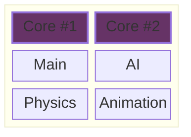

<figcaption>
Example of one responsibility per core,<br/> on a dual-core machine
</figcaption>
</figure>
</div>

<div>
<figure>

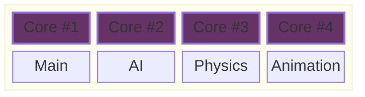

<figcaption>
Example of one responsibility per core,<br/> on a quad-core machine
</figcaption>
</figure>
</div>

</div>
<figure>

- The modern approach is to divide work into smaller chunks
  - Each chunk (or job) can then be executed by any available core

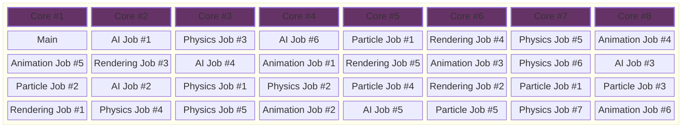

<figcaption>
Example of a modern job system, on an octa-core machine
</figcaption>
</figure>

---

## So Many Questions! 🤯

<div style="font-size: medium;">
<v-clicks at="-0">

- What is a **job system**?
  - A job system splits work into small tasks that can run concurrently on different **threads** 🧵
- Threads, as in multi-threading?
  - Exactly, multiple worker threads process jobs, work is balanced with **work stealing**
- Stealing sounds bad… what do they steal?
  - Jobs from other threads' queues (usually designed to be **lock-free**) 🔓
  - When jobs are available, a **semaphore** wakes the worker threads 🚦
- Lock-free?
  - Algorithms that avoid blocking and **mutexes** to protect data
  - Instead, they use special instructions like **compare-and-swap**
- Compare-and-swap?
  - One of the core building blocks of **atomic** operations
- Atomic operations?
  - Instructions that let multiple threads safely access the same memory without stepping on each other's toes
- And semaphores you mentioned earlier?
  - A **synchronization** primitive, the job system uses a faster **user space** version

</v-clicks>
</div>

<br/>
<v-click>
<div class="absolute left-2/3 top-5/12">
<Admonition type="info">
Don't worry, we will explore each layer step by step, with diagrams and simple code examples.
</Admonition>
</div>
</v-click>

---
layout: section
---

# Threads 🧵

## How to Create Them and Some Examples

---

## What Are Threads?

- A **core** is a physical processing unit within the CPU
- A **thread** is a logical unit of execution that runs on a single core
  - All threads share the same virtual address space (they see the same memory)
  - They are "lightweight process" that live in the same kernel process
  - **Processes**, on the other hand, have isolated memory spaces
- Why do they matter?
  - Single-core performance does not scale indefinitely
  - CPUs are increasingly parallel (more cores per chip)
  - A job system helps distribute work efficiently among threads

---

## How to Create Threads

- We ask the kernel to create a new thread:
  - POSIX Threads (or pthreads) API for Linux, BSD, macOS: `pthread_create()`
  - Windows API: `_beginthreadex()`
- We wait for it to complete:
  - pthreads: `pthread_join()`
  - Windows API: `WaitForSingleObject()`
- Then we clean it up:
  - pthreads: `pthread_detach()`, `pthread_exit()`
  - Windows API: `CloseHandle()`
- The nCine `Thread` class provides a unified, platform-agnostic API for threads
- Since C++11, the STL offers the [`std::thread`](https://en.cppreference.com/w/cpp/thread/thread.html) class

<Admonition type="tip">
To avoid the kernel's create/destroy bookeeping overhead, we will see later the concept of a <strong>thread pool</strong>.
</Admonition>

---

## The nCine's `Thread` Class (1/3)

<figure>

```cpp
void Thread::run(ThreadFunctionPtr threadFunction, void *threadArg)
{
    threadInfo_->tid = &tid_;
    threadInfo_->threadFunction = threadFunction;
    threadInfo_->threadArg = threadArg;
    const int retValue = pthread_create(&pthid_, nullptr, wrapperFunction, threadInfo_.get());
    FATAL_ASSERT_MSG_X(!retValue, "Error in pthread_create(): %d", retValue);
}
```

<figcaption>
Creating a thread using POSIX threads (<a href="https://github.com/nCine/nCine/blob/master/src/threading/PosixThread.cpp"><code>src/threading/PosixThread.cpp</code>🔗</a>)
</figcaption>
</figure>

<figure>

```cpp
void Thread::run(ThreadFunctionPtr threadFunction, void *threadArg)
{
    threadInfo_->tid = &tid_;
    threadInfo_->threadFunction = threadFunction;
    threadInfo_->threadArg = threadArg;
    handle_ = reinterpret_cast<HANDLE>(_beginthreadex(nullptr, 0, wrapperFunction, threadInfo_.get(), 0, nullptr));
    FATAL_ASSERT_MSG(handle_, "Error in _beginthreadex()");
}
```

<figcaption>
Creating a thread on Windows (<a href="https://github.com/nCine/nCine/blob/master/src/threading/WindowsThread.cpp"><code>src/threading/WindowsThread.cpp</code>🔗</a>)
</figcaption>
</figure>

---

## The nCine's `Thread` Class (2/3)

- Both APIs have a similar interface
  - Each needs a function for the thread to execute
  - The user can pass a pointer to custom data
  - Both returns a system thread identifier to the user  (`pthid_` and `handle_`)
- The function can access the custom data
  - `using ThreadFunctionPtr = void (*)(void *);`
- Indirection step: `wrapperFunction()` calls the user specified `threadFunction()`
  - It initializes the thread ID (`Thread::tid_`) first, then call the user function
  - The reason is simple: only the newly created thread itself can query its own ID

---

## The nCine's `Thread` Class (3/3)

<div grid="~ cols-2 gap-x-5">

<div>
<figure>

```cpp
bool Thread::join()
{
  bool success = false;
  const int retValue = pthread_join(pthid_, nullptr);
  success = (retValue == 0);
  pthid_ = 0;
  return success;
}

bool Thread::detach()
{
  bool success = false;
  const int retValue = pthread_detach(pthid_);
  success = (retValue == 0);
  pthid_ = 0;
  return success;
}
```

<figcaption>
Joining and detaching a POSIX thread (<a href="https://github.com/nCine/nCine/blob/master/src/threading/PosixThread.cpp"><code>src/threading/PosixThread.cpp</code>🔗</a>)
</figcaption>
</figure>
</div>

<div>
<figure>

```cpp
bool Thread::join()
{
  bool success = false;
  DWORD retValue = WaitForSingleObject(handle_, INFINITE);
  if (retValue != WAIT_FAILED)
  {
    retValue = CloseHandle(handle_);
    success = (retValue != 0);
    handle_ = 0;
  }
  return success;
}

bool Thread::detach()
{
  bool success = false;
  const BOOL retValue = CloseHandle(handle_);
  success = (retValue != 0);
  handle_ = 0;
  return success;
}
```

<figcaption>
Joining and detaching a Windows thread (<a href="https://github.com/nCine/nCine/blob/master/src/threading/WindowsThread.cpp"><code>src/threading/WindowsThread.cpp</code>🔗</a>)
</figcaption>
</figure>
</div>

</div>

---

## ncTracer (2019)

- Raytracing and path tracing are what we call "_embarrassingly parallel_" problems
  - You can simply divide the rendered image into tiles and assign each to a different thread
- **ncTracer** is a straightforward CPU-only, multi-threaded path tracer built on my <a href="https://github.com/encelo/pmTracer">pmTracer</a> library
- 📜 Reference: <a href="https://web.archive.org/web/20210506181127/http://www.raytracegroundup.com/">_Ray Tracing from the Ground Up_</a>, Kevin Suffern, 2007

<figure class="w-[65%]">

<figcaption>
The classic Cornell box scene as rendered by <a href="https://github.com/encelo/ncTracer">ncTracer</a>
</figcaption>
</figure>

---

## But It's Not Always This Simple (1/3)

<br/>

### Non-determinism

<div grid="~ cols-2 gap-x-10">

<div>
🧵 <em>Thread A</em>

```cpp
printf("Yes");
```

</div>

<div>
🧵 <em>Thread B</em>

```cpp
printf("No");
```

</div>

</div>

<figcaption>
What will be printed? "Yes No" or "No Yes"?
</figcaption>

- The two threads run concurrently, and their execution order depends on the **kernel scheduler**
- Even on a single-core machine 🤯 (for example, with [time-sharing](https://en.wikipedia.org/wiki/Time-sharing))

<br/>

### Concurrent Writes

```cpp
unsigned int x = 0; // accessible by both threads
```

<div grid="~ cols-2 gap-x-10">

<div>
🧵 <em>Thread A</em>

```cpp
x = 5;
printf("%u", x);
```

</div>

<div>
🧵 <em>Thread B</em>

```cpp
x = 7;
```

</div>

</div>

<figcaption>
What will the final value of <code>x</code> be? What will be printed?
</figcaption>

- It depends on the order in which statements are executed: the **execution path**

---

## But It's Not Always This Simple (2/3)

<br/>

### Concurrent Updates (1)

```cpp
unsigned int count = 0; // accessible by both threads
```

<div grid="~ cols-2 gap-x-10">

<div>
🧵 <em>Thread A</em>

```cpp
count += 1;
```

</div>

<div>
🧵 <em>Thread B</em>

```cpp
count += 1;
```

</div>

</div>

<figcaption>
How many times will <code>count</code> be updated?
</figcaption>

- At first glance, both execution paths seem to yield the same result: two increments

<br/>

- Unfortunately, the increment operation is not **atomic**, and in machine code it's closer to this

<div grid="~ cols-2 gap-x-10">

<div>
🧵 <em>Thread A</em>

```cpp
unsigned int tempA = count;
count = tempA + 1;
```

</div>

<div>
🧵 <em>Thread B</em>

```cpp
unsigned int tempB = count;
count = tempB + 1;
```

</div>

</div>

<figcaption>
It should be clear to see why the result is non-deterministic
</figcaption>

- 📜 Reference: [_The Little Book of Semaphores_](https://greenteapress.com/wp/semaphores/), Allen B. Downey, 2016, pp. 4–6

---

## But It's Not Always This Simple (3/3)

<br/>

<div grid="~ cols-3 gap-x-5">

<div>

- Execution path: $a_1 < a_2 < b_1$

<figure>

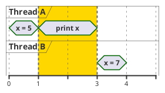

<figcaption>
Printed value: 5
</figcaption>
</figure>
</div>

<div>

- Execution path: $b_1 < a_1 < a_2$

<figure>

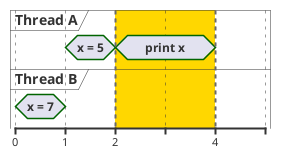

<figcaption>
Printed value: 5
</figcaption>
</figure>
</div>

<div>

- Execution path: $a_1 < b_1 < a_2$

<figure>

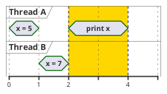

<figcaption>
Printed value: 7
</figcaption>
</figure>
</div>

</div>

<div grid="~ cols-2 gap-x-5">

<div>

- Execution path: $a_1 < a_2 < b_1 < b_2$

<figure>

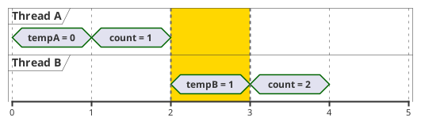

<figcaption>
<code>count</code> equals 2
</figcaption>
</figure>
</div>

<div>

- Execution path: $a_1 < b_1 < a_2 < b_2$

<figure>

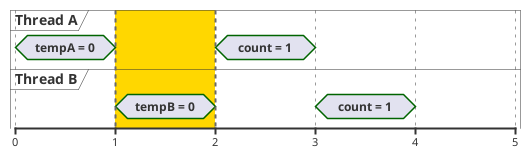

<figcaption>
<code>count</code> equals 1
</figcaption>
</figure>
</div>

</div>

---
layout: section
---

# Threads Synchronization ⏱️

## Mutexes, Semaphores, Condition Variables

---

## Welcome to the World of Concurrency 🔀

- **Concurrency** is the ability of a system to manage multiple tasks by interleaving their execution
  - It may manifest together with **parallelism**, where multiple tasks are executed simultaneously
- Software **synchronization** defines how events are ordered and related in time
  - Synchronization primitives help manage access to shared resources
  - But their misuse might cause other issues ([deadlocks](https://en.wikipedia.org/wiki/Deadlock_(computer_science)), [starvation](https://en.wikipedia.org/wiki/Starvation_(computer_science)), [priority inversion](https://en.wikipedia.org/wiki/Priority_inversion))
- Concurrent execution is **non-deterministic**, which makes debugging notoriously difficult
- The opposite model is **serial execution** (neither concurrent, nor parallel)
  - One statement after another, as we intuitively imagine code running

<div grid="~ cols-4 gap-x-5">

<div>
<figure>

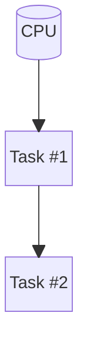

<figcaption>
Not concurrent and not parallel
</figcaption>
</figure>
</div>

<div>
<figure>

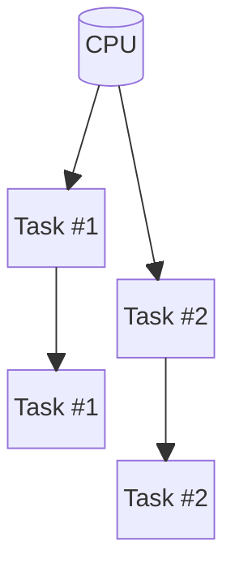

<figcaption>
Concurrent but not parallel
</figcaption>
</figure>
</div>

<div>
<figure>

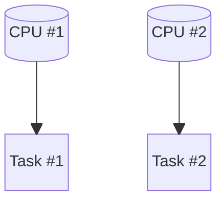

<figcaption>
Not concurrent but parallel
</figcaption>
</figure>
</div>

<div>
<figure>

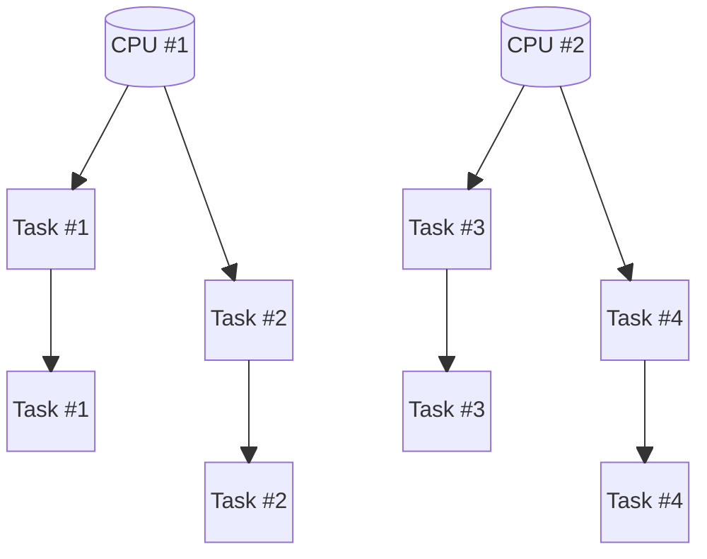

<figcaption>
Concurrent and parallel
</figcaption>
</figure>
</div>

</div>

---

## The Basic Synchronization Primitive

- Let's go back to the last example: incrementing the `count` variable
  - The unexpected results stem from threads interleaving their operations
  - Can we enforce either order $a_1 < a_2 < b_1 < b_2$ or $b_1 < b_2 < a_1 < a_2$? 🤔
  - In other words, can we make access to `count` strictly serial?
- The straightforward answer is to use a **mutex** (short for mutual exclusion)
  - The region of code protected from concurrent access is called a **critical section**
  - The threads that cannot obtain the lock are put to sleep in a kernel queue
  - When the lock is released, one or more sleeping threads wake and compete to acquire it

<Admonition type="tip">
We will see later a more efficient way of safely incrementing an integer variable.
</Admonition>

---

## Increment Example Revised

<br/>

### Concurrent Updates (2)

```cpp
ncine::Mutex mutex;
unsigned int count = 0; // accessible by both threads
```

<div grid="~ cols-2 gap-x-10">

<div>
🧵 <em>Thread A</em>

```cpp
mutex.lock();
// Critical section
count += 1;
mutex.unlock();
```

</div>

<div>
🧵 <em>Thread B</em>

```cpp
mutex.lock();
// Critical section
count += 1;
mutex.unlock();
```

</div>

</div>

<figcaption>
The operation is now effectively atomic and <code>count</code> will always be incremented exactly twice
</figcaption>

<div grid="~ cols-2 gap-x-5">

<div>

- Execution path: $a_1 < b_1$

<figure>

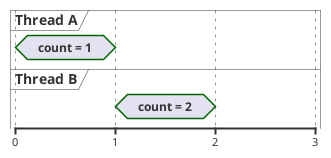

<figcaption>
<code>count</code> equals 2
</figcaption>
</figure>
</div>

<div>

- Execution path: $b_1 < a_1$

<figure>

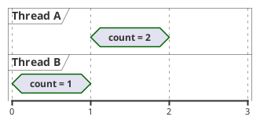

<figcaption>
<code>count</code> equals 2
</figcaption>
</figure>
</div>

</div>

---

## The nCine's `Mutex` Class (1/2)

<figure>

```cpp
Mutex::Mutex()
{
    pthread_mutex_init(&mutex_, nullptr);
}

Mutex::~Mutex()
{
    pthread_mutex_destroy(&mutex_);
}
```

<figcaption>
Creating a mutex using POSIX threads (<a href="https://github.com/nCine/nCine/blob/master/src/threading/PosixThreadSync.cpp"><code>src/threading/PosixThreadSync.cpp</code>🔗</a>)
</figcaption>
</figure>

<figure>

```cpp
Mutex::Mutex()
{
    InitializeCriticalSection(&handle_);
}

Mutex::~Mutex()
{
    DeleteCriticalSection(&handle_);
}
```

<figcaption>
Creating a critical section on Windows (<a href="https://github.com/nCine/nCine/blob/master/src/threading/WindowsThreadSync.cpp"><code>src/threading/WindowsThreadSync.cpp</code>🔗</a>).<br/>
A <strong>Critical Section</strong> is lighter than a <strong>Mutex Object</strong> because it synchronizes only threads within the same process.
</figcaption>
</figure>

---

## The nCine's `Mutex` Class (2/2)

<div grid="~ cols-2 gap-x-10">

<div>
<figure>

```cpp
void Mutex::lock()
{
    pthread_mutex_lock(&mutex_);
}

void Mutex::unlock()
{
    pthread_mutex_unlock(&mutex_);
}

bool Mutex::tryLock()
{
    const bool acquired =
        (pthread_mutex_trylock(&mutex_) == 0);
    return acquired;
}
```

<figcaption>
Locking and unlocking a mutex using POSIX threads (<a href="https://github.com/nCine/nCine/blob/master/src/threading/PosixThreadSync.cpp"><code>src/threading/PosixThreadSync.cpp</code>🔗</a>)
</figcaption>
</figure>
</div>

<div>
<figure>

```cpp
void Mutex::lock()
{
    EnterCriticalSection(&handle_);
}

void Mutex::unlock()
{
    LeaveCriticalSection(&handle_);
}

bool Mutex::tryLock()
{
    const bool acquired =
        (TryEnterCriticalSection(&handle_) != 0);
    return acquired;
}
```

<figcaption>
Entering and leaving a critical section on Windows (<a href="https://github.com/nCine/nCine/blob/master/src/threading/WindowsThreadSync.cpp"><code>src/threading/WindowsThreadSync.cpp</code>🔗</a>)
</figcaption>
</figure>
</div>

</div>

---

## Semaphores 🚦

- A mutex works like a key, only one thread can hold it at a time 🔑
  - But sometimes, we want multiple threads to hold that key simultaneously
- For this purpose we need a semaphore
  - A semaphore doesn't track _who_ holds it
    - Unlike a mutex, where only the thread that locked it can unlock it
  - Instead, it simply signals the availability of a resource
- A semaphore supports two operations and has an internal counter
  - The counter is initialized to the number of available "tokens"
  - A thread calls `wait()` to try to acquire a token, if none are available, it waits
  - A thread calls `signal()` (or `post()`) to release a token
  - The kernel queues waiting threads and wakes them when a token becomes available

<Admonition type="info">
Sometimes you will see <code>V()</code> and <code>P()</code> for <code>signal()</code> and <code>wait()</code>, from the original Dutch words.
</Admonition>

---

## The Binary Semaphore

- A binary semaphore has only one token and behaves much like a mutex
  - Its internal counter is initialized with `1`
  - The first thread to call `wait()` proceeds (counter becomes `0`)
  - Any other thread must wait until the first one signals
- Setting the counter to $n$ allows up to $n$ threads to enter the critical section simultaneously
  - This is known as the _multiplex pattern_ (📜 [_The Little Book of Semaphores_](https://greenteapress.com/wp/semaphores/), Downey, 2016, pp. 19-21)

<br/>

### Concurrent Updates (3)

```cpp
ncine::Semaphore semaphore(1); // initial value of 1
unsigned int count = 0; // accessible by both threads
```

<div grid="~ cols-2 gap-x-10">

<div>
🧵 <em>Thread A</em>

```cpp
semaphore.wait();
// Critical section
count += 1;
semaphore.signal();
```

</div>

<div>
🧵 <em>Thread B</em>

```cpp
semaphore.wait();
// Critical section
count += 1;
semaphore.signal();
```

</div>

</div>

<figcaption>
The operation is still atomic and <code>count</code> will always be incremented exactly twice
</figcaption>

---

## The nCine's `Semaphore` Class (1/2)

<div grid="~ cols-2 gap-x-5">

<div>
<figure>

```cpp
// Delegating constructor (C++11)
Semaphore::Semaphore()
    : Semaphore(0)
{
}

Semaphore::Semaphore(unsigned int initialCount)
{
    sem_init(&sem_, 0, initialCount);
}

Semaphore::~Semaphore()
{
    sem_destroy(&sem_);
}
```

<figcaption>
Creating a semaphore using POSIX threads (<a href="https://github.com/nCine/nCine/blob/master/src/threading/PosixThreadSync.cpp"><code>src/threading/PosixThreadSync.cpp</code>🔗</a>)
</figcaption>
</figure>
</div>

<div>
<figure>

```cpp
// Delegating constructor (C++11)
Semaphore::Semaphore()
    : Semaphore(0)
{
}

Semaphore::Semaphore(unsigned int initialCount)
{
    // Setting `LONG_MAX` as the maximum value,
    // effectively unlimited for typical uses
    handle_ = CreateSemaphore(nullptr, initialCount,
                              LONG_MAX, nullptr);
}

Semaphore::~Semaphore()
{
    CloseHandle(handle_);
}
```

<figcaption>
Creating a semaphore on Windows (<a href="https://github.com/nCine/nCine/blob/master/src/threading/WindowsThreadSync.cpp"><code>src/threading/WindowsThreadSync.cpp</code>🔗</a>)
</figcaption>
</figure>
</div>

</div>

---

## The nCine's `Semaphore` Class (2/2)

<div grid="~ cols-2 gap-x-5">

<div>
<figure>

```cpp
void Semaphore::wait()
{
    sem_wait(&sem_);
}

void Semaphore::signal()
{
    sem_post(&sem_);
}

bool Semaphore::tryWait()
{
    return (sem_trywait(&sem_) == 0);
}
```

<figcaption>
Semaphore operations using POSIX threads (<a href="https://github.com/nCine/nCine/blob/master/src/threading/PosixThreadSync.cpp"><code>src/threading/PosixThreadSync.cpp</code>🔗</a>)
</figcaption>
</figure>
</div>

<div>
<figure>

```cpp
void Semaphore::wait()
{
    WaitForSingleObject(handle_, INFINITE);
}

void Semaphore::signal()
{
    ReleaseSemaphore(handle_, 1, nullptr);
}

bool Semaphore::tryWait()
{
    const DWORD result = WaitForSingleObject(handle_, 0);
    return (result == WAIT_OBJECT_0);
}
```

<figcaption>
Semaphore operations on Windows (<a href="https://github.com/nCine/nCine/blob/master/src/threading/WindowsThreadSync.cpp"><code>src/threading/WindowsThreadSync.cpp</code>🔗</a>)
</figcaption>
</figure>
</div>

</div>

---

## Real-World Synchronization Problems

- Let's look at two classic synchronization problems that frequently arise in concurrent software
  - They demonstrate the real power of semaphores in coordinating and signalling threads

<br/>

- **Producer-Consumer** problem
  - Some threads create items and add them to a data structure (producers)
  - Some threads remove items from the structure to process them (consumers)
  - Access to the structure must be exclusive while an item is added or removed
  - If a consumer tries to remove an item from an empty structure, it should wait until a producer adds one
  - If a producer tries to add an item to a full structure, it should wait until a consumer removes one

<br/>

- **Readers-Writer** problem
  - Multiple threads try to access a shared resource, some as readers, others as writers
  - No thread may access the resource for either reading or writing while another thread is writing to it
  - At the same time, we want to allow multiple readers to access the resource concurrently

---

## Producer-Consumer Problem

```cpp
ncine::Array<Event> events;
ncine::Semaphore mutex(1); // to access the array
ncine::Semaphore items(0); // how many events are in the array
ncine::Semaphore spaces(events.capacity()); // how much space is left in the array
```

<div grid="~ cols-2 gap-x-10">

<div>

```cpp
void producer()
{
    event = waitForEvent();

    spaces.wait(); // wait if full
    mutex.wait(); // accessing the array
    events.pushBack(event);
    mutex.signal();
    // One less item can be stored in the array
    items.signal();
}
```

</div>

<div>

```cpp
void consumer()
{
    items.wait(); // wait if empty
    mutex.wait(); // accessing the array
    Event event = events.pop();
    mutex.signal();
    // One more item can be stored in the array
    spaces.signal();

    process(event);
}
```

</div>

</div>

<figcaption>
We wait until the array has space or data before producing or consuming events
</figcaption>

---

## Readers-Writers Problem

```cpp
int readCount = 0; // number of readers currently accessing the resource
ncine::Semaphore resource(1); // controls access (read/write) to the resource. Binary semaphore.
ncine::Semaphore rmutex(1); // for syncing changes to shared variable `readCount`
ncine::Semaphore serviceQueue(1); // FAIRNESS: preserves request ordering (FIFO signalling)
```

<div grid="~ cols-2 gap-x-10">

<div>

```cpp
void reader()
{
  serviceQueue.wait(); // wait in line
  rmutex.wait(); // exclusive access to counter
  readCount++; // update count of active readers
  if (readCount == 1) // first reader?
    resource.wait(); // block writers
  serviceQueue.signal(); // serve next in line
  rmutex.signal(); // release access to counter

  // Critical section: reading is performed

  rmutex.wait(); // exclusive access to counter
  readCount--; // update count of active readers
  if (readCount == 0) // last reader?
    resource.signal(); // resource available
  rmutex.signal(); // release access to counter
}
```

</div>

<div>

```cpp
void writer()
{
    serviceQueue.wait(); // wait in line
    resource.wait(); // exclusive access
    serviceQueue.signal(); // serve next in line

    // Critical section: writing is performed

    resource.signal(); // resource available
}
```

</div>

</div>

<figcaption>
Multiple readers can access the resource simultaneously, but only one writer at a time may update it
</figcaption>

---

## The Barrier Concept 🧱

<div grid="~ cols-3 gap-x-5">

<div>
<figure>

```cpp
int count = NUMBER_OF_THREADS;
ncine::Semaphore mutex(1);
ncine::Semaphore barrier(0);

// Rendezvous point
mutex.wait();
count--;
mutex.signal();

if (count == 0)
    barrier.signal();

barrier.wait();
barrier.signal();

// Critical point
```

<figcaption>
A working barrier solution with semaphores
</figcaption>
</figure>
</div>

<div class="col-span-2">

- All threads must reach the barrier first
  - Then they can proceed to the critical point
- When limited to only two threads, the problem is called "_rendezvous_"
- The wait and a signal in rapid succession is a "_turnstile_" pattern
  - It allows one thread to pass at a time

<Admonition type="info">
Shaders expose a similar barrier concept for GPU wavefronts.<br/>
Check HLSL wave intrinsics or GLSL subgroup operations.
</Admonition>
</div>

</div>

- 📜 Reference: [_The Little Book of Semaphores_](https://greenteapress.com/wp/semaphores/), Allen B. Downey, 2016, pp. 29
- Each thread will decrement the `count` (L7), then wait on the barrier semaphore (L13)
  - The last thread to decrement `count` will signal the barrier (L11), releasing one thread
  - This thread will then signal the barrier again (L14), releasing the next thread and so on

---

## Condition Variables

- Sometimes threads must wait for a condition while holding a mutex (`wait()`)
  - The mutex ensures the condition isn't changed by another thread while being checked
- If the condition isn't met, `wait()` atomically releases the mutex and adds the thread to a kernel queue
  - Releasing the mutex allows other threads to acquire it and potentially satisfy the condition
  - When the thread is woken, `wait()` reacquires the mutex before returning
- A different thread can signal that the condition is now satisfied and wake one waiting thread (`signal()`)
  - Or it can signal and wake all threads currently waiting in the queue (`broadcast()`)
- Multiple condition variables can share the same mutex
- Condition variables are _not_ functionally equivalent to semaphores
  - But any problem that can be solved with semaphores can also be solved with CVs and mutexes
  - Condition variables and mutexes can also be used to implement a semaphore

<Admonition type="info">
Condition variables don't have an internal counter and only work with threads in the same process.
</Admonition>

---

## Producer-Consumer Problem (2)

```cpp
ncine::Array<Event> events;
ncine::Mutex mutex;
ncine::CondVariable emptyCV;
ncine::CondVariable fullCV;
```

<div grid="~ cols-2 gap-x-10">

<div>

```cpp
void producer()
{
    event = waitForEvent();

    mutex.lock();
    while (events.size() == events.capacity())
        fullCV.wait(&mutex);

    // Critical section
    events.pushBack(event);

    emptyCV.signal(&mutex);
    mutex.unlock();
}
```

</div>

<div>

```cpp
void consumer()
{
    mutex.lock();
    while (events.isEmpty())
        emptyCV.wait(&mutex);

    // Critical section
    Event event = events.pop();

    fullCV.signal(&mutex);
    mutex.unlock();
}
```

</div>

</div>

<figcaption>
We use condition variables to wait until the array has space or data before producing or consuming events
</figcaption>

- Multiple threads can check these conditions, because waiting on a CV automatically releases the mutex
- A signalled thread wakes up and competes to reacquire the mutex before proceeding

---

## The nCine's `CondVariable` Class

<div grid="~ cols-2 gap-x-10">

<div>
<figure>

```cpp
CondVariable::CondVariable()
{
    pthread_cond_init(&cond_, nullptr);
}
CondVariable::~CondVariable()
{
    pthread_cond_destroy(&cond_);
}

void CondVariable::wait(Mutex &mutex)
{
    pthread_cond_wait(&cond_, &(mutex.mutex_));
}

void CondVariable::signal()
{
    pthread_cond_signal(&cond_);
}

void CondVariable::broadcast()
{
    pthread_cond_broadcast(&cond_);
}
```

<figcaption>
POSIX implementation of condition variable initialization and operations (<a href="https://github.com/nCine/nCine/blob/master/src/threading/PosixThreadSync.cpp"><code>src/threading/PosixThreadSync.cpp</code>🔗</a>)
</figcaption>
</figure>
</div>

<div>
<figure>

```cpp
CondVariable::CondVariable()
{
    InitializeConditionVariable(&handle_);
}

void CondVariable::wait(Mutex &mutex)
{
    SleepConditionVariableCS(&handle_,
                             &mutex.handle_, INFINITE);
}

void CondVariable::signal()
{
    WakeConditionVariable(&handle_);
}

void CondVariable::broadcast()
{
    WakeAllConditionVariable(&handle_);
}
```

<figcaption>
Windows implementation of condition variable initialization and operations (<a href="https://github.com/nCine/nCine/blob/master/src/threading/WindowsThreadSync.cpp"><code>src/threading/WindowsThreadSync.cpp</code>🔗</a>)
</figcaption>
</figure>
</div>

</div>

---

## Implementing Semaphores With Condition Variables

<div grid="~ cols-3 gap-x-5">

<div>
<figure>

```cpp
class SemaphoreCV
{
public:
  SemaphoreCV()
    : value_(0) {}
  SemaphoreCV(int value)
    : value_(value) {}

  void wait();
  void signal();

private:
  int value_;
  unsigned int wakeUps_ = 0;
  ncine::Mutex mutex_;
  ncine::CondVariable condVar_;
};
```

<figcaption>
The <code>SemaphoreCV</code> class definition
</figcaption>
</figure>
</div>

<div>
<figure>

```cpp
void SemaphoreCV::wait()
{
  mutex_.lock();
  value_--;

  if (value_ < 0)
  {
    do {
      condVar_.wait(mutex_);
    } while (wakeUps_ < 1);
    wakeUps_--;
  }
  mutex_.unlock();
}
```

<figcaption>
Waiting on a semaphore implemented with a condition variable
</figcaption>
</figure>
</div>

<div>
<figure>

```cpp
void SemaphoreCV::signal()
{
   mutex_.lock();
  value_++;

  if (value_ <= 0)
  {
    wakeUps_++;
    condVar_.signal();
  }
  mutex_.unlock();
}
```

<figcaption>
Signalling a semaphore implemented with a condition variable
</figcaption>
</figure>
</div>

</div>

- 📜 Reference: [_The Little Book of Semaphores_](https://greenteapress.com/wp/semaphores/), Allen B. Downey, 2016, pp. 261-267

<div grid="~ cols-2 gap-x-5">

<div>
<Admonition type="warning">
Without the while loop, it would be possible for a thread to signal and then run around and catch its own signal.
</Admonition>
</div>

<div>
<Admonition type="tip">
We will see later another way to implement semaphores.
</Admonition>
</div>

</div>

---
layout: section
---

# Atomics ☢️

## What They Are and How to Use Them

---

## What Are Atomics?

- All synchronization primitives we've seen so far block threads
  - Waiting threads sleep in a kernel-managed queue
  - This involves context switches and system calls, which are relatively slow
- What if we could synchronize access without blocking or sleeping?
  - What kind of basic operation would we need for that?
- Enter **atomics**: the smallest form of lock
  - Integer variables that support atomic read/modify/write operations
  - No kernel, no queues, just special indivisible hardware instructions
  - Foundation for [non-blocking algorithms](https://en.wikipedia.org/wiki/Non-blocking_algorithm) (like **lock-free** and **wait-free** ones)

---

## The Atomic Increment

- [Fetch-and-add](https://en.wikipedia.org/wiki/Fetch-and-add) is a CPU instruction
  - It atomically increments the contents of a memory location by a specified value

<br/>

### Concurrent Updates (4)

```cpp
nctl::Atomic32 atomic; // Atomic classes are part of the nCine Template Library (nCTL)
```

<div grid="~ cols-2 gap-x-10">

<div>
🧵 <em>Thread A</em>

```cpp
atomic.fetchAdd(1);
```

</div>

<div>
🧵 <em>Thread B</em>

```cpp
atomic.fetchAdd(1);
```

</div>

</div>

<figcaption>
Because the operation is atomic, the variable is guaranteed to be incremented exactly twice
</figcaption>

<div grid="~ cols-2 gap-x-5">

<div>

- Execution path: $a_1 < b_1$

<figure>

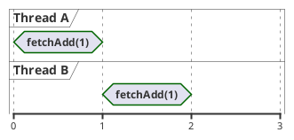

<figcaption>
The variable equals 2
</figcaption>
</figure>
</div>

<div>

- Execution path: $b_1 < a_1$

<figure>

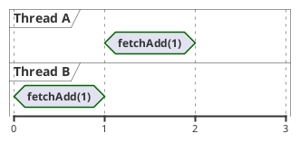

<figcaption>
The variable equals 2
</figcaption>
</figure>
</div>

</div>

---

## Atomic Instructions

- We saw the increment instruction, but a variable can also be decremented atomically
- Bitwise _AND_, _OR_, _XOR_ operations can also be performed atomically
  - Useful for manipulating bit flags (test, set, clear)
- But the king of all instructions is [Compare-and-swap](https://en.wikipedia.org/wiki/Compare-and-swap) (sometimes Compare-and-exchange)
  - All the others can be implemented in terms of it

<div grid="~ cols-2 gap-x-5">

<div>
<figure>

```cpp
// Pseudo implementation of the CAS instruction logic
int CAS(int *dest, int oldValue, int newValue)
{
    const int oldDestValue = *dest;
    if (oldDestValue == oldValue)
        *dest = newValue;
    return oldDestValue;
}
```

<figcaption>
It atomically writes the new value at the specified memory address, but only if it contained the expected old value
</figcaption>
</figure>
</div>

<div>
<figure>

```cpp
// Alternative version of the CAS instruction logic
bool CAS(int *dest, int *oldValue, int newValue)
{
    if (*dest == *oldValue)
    {
        *dest = newValue;
        return true;
    }
    else
    {
        *oldValue = *dest;
        return false;
    }
}
```

<figcaption>
This version returns a <code>bool</code> and writes the previous memory value in the expected variable
</figcaption>
</figure>
</div>

</div>

---

## Load-Link / Store-Conditional

- Some architectures, such as ARM, provide _load-link_ and _store-conditional_ instead of a single CAS instruction
  - Load-link loads a value and marks the address as being "observed"
  - Store-conditional tries to store a new value
  - SC succeeds only if the address has not been modified since the LL
- An LL/SC pair is stronger than separating a load from a later CAS
  - Consider a naïve "read, do work, then CAS"
    - It cannot detect when another thread changes the value and later restores the original one
  - LL/SC detects _any_ intervening modification, even if the value ends up the same
    - This behaviour avoids the [ABA problem](https://en.wikipedia.org/wiki/ABA_problem) without extra tagging (sequence numbers or version counters)

<br/>
<Admonition type="info">
We will revisit the ABA problem later with the help of diagrams.
</Admonition>

---

## A Simple CAS Example

- Suppose we want to perform an initialization only once
  - We guard it with an atomic integer variable set to `0`
  - Threads attempt to change it to `1`, but only if its previous value was `0`
  - The first thread succeeds and performs the initializations (as `0` is the current value of the variable)
  - The rest fail to perform the swap (as `0` is _not_ the current value of the variable)

<figure>

```cpp
nctl::Atomic32 initialized = 0;

void initializeOnce()
{
    int32_t expected = 0;
    if (initialized.cmpExchange(expected, 1))
    {
        // Only one thread gets here
        printf("Performing initialization...\n");
    }
}
```

<figcaption>
Using the CAS instruction, only one thread can ever perform the initialization
</figcaption>
</figure>

---

## Atomic Increment With CAS

- We read the current counter value and try to increment it by 1
- CAS can fail if another thread increments the counter after we read it
  - On failure, `oldValue` is updated with the latest value
- Note: This example uses the alternative CAS form we saw earlier
  - The one that returns a `bool` and updates `oldValue` by reference
  - It allows us to use a `while` loop as in the example

<figure>

```cpp
nctl::Atomic32 counter = 0;

void increment()
{
    int32_t oldValue = counter.load();
    int32_t newValue;
    do {
        newValue = oldValue + 1;
        // Try to replace oldValue with newValue
    } while (!counter.cmpExchange(oldValue, newValue));
}
```

<figcaption>
A function that atomically increments a counter using a CAS loop
</figcaption>
</figure>

---

## Memory Reordering (1/4)

<br/>

```cpp
nctl::Atomic32 x = 0;
nctl::Atomic32 y = 0;
```

<div grid="~ cols-2 gap-x-10">

<div>
🧵 <em>Thread A</em>

```cpp
x.store(1, nctl::MemoryModel::RELAXED);
int32_t r1 = y.load(nctl::MemoryModel::RELAXED);
printf("A: r1 = %d\n", r1);
```

</div>

<div>
🧵 <em>Thread B</em>

```cpp
y.store(1, nctl::MemoryModel::RELAXED);
int32_t r2 = x.load(nctl::MemoryModel::RELAXED);
printf("B: r2 = %d\n", r2);
```

</div>

</div>

<figcaption>
It is actually possible that one thread or both will print a value of <code>0</code>.<br/>
For one or both threads, the CPU might execute the load operation before the store one.
</figcaption>

- The compiler and the CPU may reorder read/write instructions to optimize performance
  - A processor can delay a store past any load from a different memory location
  - Single-threaded programs never notice this, but multi-threaded ones can
  - In multi-threaded code, we must explicitly define which reorders are allowed
- The `RELAXED` property only guarantees atomicity, but no reordering constraints

---

## Memory Reordering (2/4)

- Let's try to fix the reordering with acquire and release semantics
- 📜 Reference: [_Acquire and Release Semantics_](https://preshing.com/20120913/acquire-and-release-semantics/), Jeff Preshing, 2012

```cpp
nctl::Atomic32 x = 0;
nctl::Atomic32 y = 0;
```

<div grid="~ cols-2 gap-x-10">

<div>
🧵 <em>Thread A</em>

```cpp
x.store(1, nctl::MemoryModel::RELEASE);
int32_t r1 = y.load(nctl::MemoryModel::ACQUIRE);
printf("A: r1 = %d\n", r1);
```

</div>

<div>
🧵 <em>Thread B</em>

```cpp
y.store(1, nctl::MemoryModel::RELEASE);
int32_t r2 = x.load(nctl::MemoryModel::ACQUIRE);
printf("B: r2 = %d\n", r2);
```

</div>

</div>

<figcaption>
Acquire/release restricts reordering, but it still doesn't guarantee that both threads will see the other's store in this symmetric pattern
</figcaption>

- **Acquire semantics** apply to operations that read from shared memory (read/modify/write or loads)
  - A read-acquire operation won't be reordered with any read or write that _follows_ it in program order
- **Release semantics** apply to operations that write to shared memory (read/modify/write or stores)
  - A write-release operation won't be reordered with any read or write that _precedes_ it in program order

<Admonition type="warning">
Unfortunately, the example is still <em>not</em> fixed, but we will fix it in a moment.
</Admonition>

---

## Memory Reordering (3/4)

<br/>

<div grid="~ cols-4 gap-x-5">

<div>
<figure>

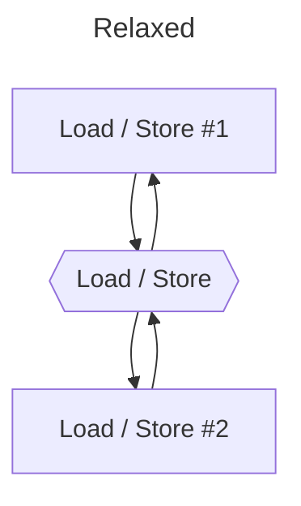

<figcaption class="left">
Relaxed semantics, reordering is possible.
</figcaption>
</figure>
</div>

<div>
<figure>

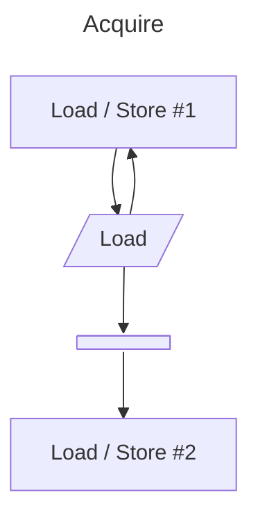

<figcaption class="left">
Acquire semantics, no reordering <strong>after</strong> the load operation.
</figcaption>
</figure>
</div>

<div>
<figure>

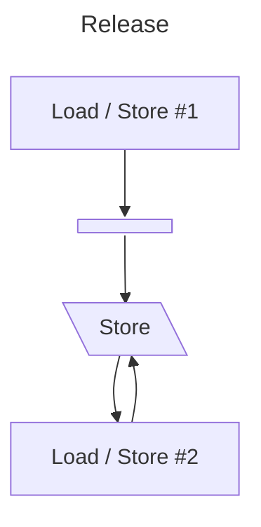

<figcaption class="left">
Release semantics, no reordering <strong>before</strong> the store operation.
</figcaption>
</figure>
</div>

<div>
<figure>

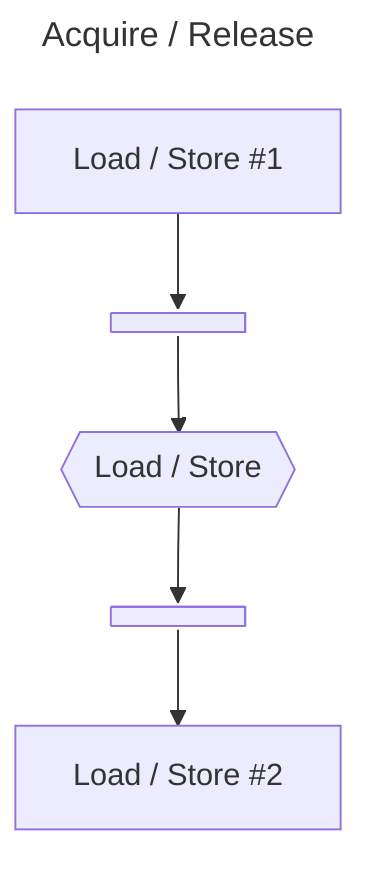

<figcaption class="left">
Acquire/Release semantics, no reordering <strong>after</strong> or <strong>before</strong> the load/store operation.
</figcaption>
</figure>
</div>

</div>

---

## Memory Reordering (4/4)

- Let's fix the example once and for all with fences

```cpp
nctl::Atomic32 x = 0;
nctl::Atomic32 y = 0;
```

<div grid="~ cols-2 gap-x-10">

<div>
🧵 <em>Thread A</em>

```cpp
x.store(1, nctl::MemoryModel::RELAXED);
nctl::AtomicFences::threadFence(
    nctl::MemoryModel::RELEASE);
int32_t r1 = y.load(nctl::MemoryModel::ACQUIRE);
printf("A: r1 = %d\n", r1);
```

</div>

<div>
🧵 <em>Thread B</em>

```cpp
y.store(1, nctl::MemoryModel::RELAXED);
nctl::AtomicFences::threadFence(
    nctl::MemoryModel::RELEASE);
int32_t r2 = x.load(nctl::MemoryModel::ACQUIRE);
printf("B: r2 = %d\n", r2);
```

</div>

</div>

<figcaption>
The two fences guarantee that both threads print a value of <code>1</code>
</figcaption>

<div grid="~ cols-30 gap-x-0">

<div class="col-span-23">

- Fences only order operations inside the same thread
  - They also make previous writes globally visible
- To fix the symmetric example, the fence must create a real cross-thread ordering
  - Each thread _publishes_ its store before running the acquire load
  - Each acquire load then _observes_ the other thread's published store
- A stricter alternative uses sequentially consistent loads and stores (`SEQ_CST`)

</div>

<div class="col-span77">

```mermaid {look: 'handDrawn', scale: 0.43}
flowchart LR
    subgraph A["Thread A"]
        A_pub["<code>x.store(1)</code> + <code>RELEASE</code><br/>(<em>publish</em>)"]
        A_obs["<code>y.load(ACQUIRE)</code><br/>(<em>observe</em>)"]
        A_pub --> A_obs
    end

    subgraph B["Thread B"]
        B_pub["<code>y.store(1)</code> + <code>RELEASE</code><br/>(<em>publish</em>)"]
        B_obs["<code>x.load(ACQUIRE)</code><br/>(<em>observe</em>)"]
        B_pub --> B_obs
    end

    A_pub --> B_obs
    B_pub --> A_obs
```

</div>

</div>

---

## The nCine's `Atomic` classes

- It provides three different implementations
  - GCC/Clang intrinsics: `__atomic_load_n()`, `__atomic_store_n()`, `__atomic_fetch_add()`
  - Windows interlocked functions: `ReadAcquire()`, `WriteRelease()`, `InterlockedExchangeAdd()`
  - C++11 atomics: `atomic<T>::load()`, `atomic<T>::store()`, `atomic<T>::fetch_add()`
- GCC intrinsics on Linux and Android, interlocked functions on Windows, C++11 atomics on macOS
- Supports signed and unsigned 32- and 64-bit integers: `Atomic32`, `AtomicU32`, `Atomic64`, `AtomicU64`

<figure>

```cpp
class Atomic32
{
  public:
    uint32_t load(MemoryModel memModel) const;
    void store(uint32_t value, MemoryModel memModel);
    uint32_t fetchAdd(uint32_t value, MemoryModel memModel);
    uint32_t fetchSub(uint32_t value, MemoryModel memModel);
    uint32_t fetchAnd(uint32_t value, MemoryModel memModel);
    uint32_t fetchOr(uint32_t value, MemoryModel memModel);
    uint32_t fetchXor(uint32_t value, MemoryModel memModel);
    bool cmpExchange(uint32_t &cmpValue, uint32_t newValue, MemoryModel memModel);
};
```

<figcaption>
Some of the methods offered by the <code>nctl::Atomic32</code> class (<a href="https://github.com/nCine/nCine/blob/master/include/nctl/Atomic.h"><code>include/nctl/Atomic.h</code>🔗</a>)
</figcaption>
</figure>

---
layout: section
---

# User Space Synchronization ⌚

## Fast Semaphores and Futexes

---

## BeOS' Benaphore

- 📜 Reference: [_Be Engineering Insights: Benaphores_](https://www.haiku-os.org/legacy-docs/benewsletter/Issue1-26.html#Engineering1-26), Benoit Schillings, 1996, Issue 1-26

```cpp
long benaphore_atom;
sem_id benaphore_sem;

long init_benaphore()
{
    benaphore_lock = 0;
    benaphore_sem = create_sem("benaphore", 0);

    if (benaphore_sem < B_NO_ERROR)
        return B_ERROR;
    else
        return B_NO_ERROR;
}
```

<div grid="~ cols-2 gap-x-5">

<div>

```cpp
void acquire_benaphore()
{
   long previous_value;
   previous_value = atomic_add(&benaphore_atom, 1);

   if (previous_value > 0)
      acquire_sem(benaphore_sem);
}
```

</div>

<div>

```cpp
void release_benaphore()
{
  long previous_value;
  previous_value = atomic_add(&benaphore_atom, -1);

  if (previous_value > 1)
    release_sem(benaphore_sem);
}
```

</div>

</div>

<figcaption>
A benaphore combines an atomic counter with a semaphore for efficient low-contention locking
</figcaption>

---

## Fast User Space Mutex (Futex)

- Atomics let us arbitrate access to shared resources entirely in **user space**
- Extremely fast when contention is low, no system calls are needed
- When multiple threads compete for the resource, kernel intervention is required
- The kernel manages a queue of sleeping threads, everything else remains in user space
- This hybrid mechanism is exactly what a [futex](https://en.wikipedia.org/wiki/Futex) provides:
  - A futex is just an integer in user space memory, accessed with atomics
  - The kernel steps in only to sleep or wake threads when necessary
- Used internally by Linux for mutexes, condition variables, and semaphores
- Used internally by Windows for critical sections and condition variables

---

## A Mutex Implemented With Futexes

<br/>

<div grid="~ cols-2 gap-x-5">

<div>

```cpp
class Mutex
{
  public:
    Mutex() : val(0) {}
    void lock()
    {
        int c;
        if ((c = cmpxchg(val, 0, 1)) != 0)
        {
            if (c != 2)
                c = xchg(val, 2);
            while (c != 0)
            {
                futex_wait(&val, 2);
                c = xchg(val, 2);
            }
        }
    }
```

</div>

<div>

```cpp
    void unlock()
    {
        if (atomic_dec(val) != 1)
        {
            val = 0;
            futex_wake(&val, 1);
        }
    }

  private:
    int val;
};
```

</div>

</div>

<figcaption>
Implementing a mutex on Linux with the <code>futex_*</code> API.<br/>
When <code>val</code> is 0, the mutex is unlocked, with 1 it is locked with no waiters, with 2 it is locked with one or more waiters.
</figcaption>

- 📜 Reference: [_Futexes Are Tricky_](https://dept-info.labri.fr/~denis/Enseignement/2008-IR/Articles/01-futex.pdf), Ulrich Drepper, 2004

---

## The nCine's `UserSemaphore` Class (1/2)

<figure>

```cpp
void UserSemaphore::wait()
{
    const int32_t c = count_.fetchSub(1, nctl::MemoryModel::ACQUIRE);
    if (c <= 0)
    {
        while (true)
        {
            const int32_t expected = count_.load(nctl::MemoryModel::RELAXED);
            if (expected >= 0) break;
            futexWait(reinterpret_cast<int *>(&count_), expected);
        }
    }
}

void UserSemaphore::signal()
{
    const int32_t c = count_.fetchAdd(1, nctl::MemoryModel::RELEASE);
    if (c < 0)
        futexWake(reinterpret_cast<int *>(&count_), 1);
}
```

<figcaption>
Waiting and signalling a user semaphore on Linux (<a href="https://github.com/nCine/nCine/blob/master/src/threading/PosixThreadSync.cpp"><code>src/threading/PosixThreadSync.cpp</code>🔗</a>)
</figcaption>
</figure>

- macOS implementation uses a [Dispatch Semaphore](https://developer.apple.com/documentation/dispatch/dispatch-semaphore)
- Futexes on macOS can be used through [os_unfair_lock](https://developer.apple.com/documentation/os/os_unfair_lock) or by including `sys/ulock.h`

---

## The nCine's `UserSemaphore` Class (2/2)

<figure>

```cpp
void UserSemaphore::wait()
{
    const int32_t c = count_.fetchSub(1, nctl::MemoryModel::ACQUIRE);
    if (c <= 0)
    {
        int32_t expected = c - 1;
        while (count_.load(nctl::MemoryModel::RELAXED) < 0)
        {
            WaitOnAddress(&count_, &expected, sizeof(expected), INFINITE);
            expected = count_.load(nctl::MemoryModel::RELAXED);
        }
    }
}

void UserSemaphore::signal()
{
    const int32_t c = count_.fetchAdd(1, nctl::MemoryModel::RELEASE);
    if (c < 0)
        WakeByAddressSingle(&count_);
}
```

<figcaption>
Waiting and signalling a user semaphore on Windows (<a href="https://github.com/nCine/nCine/blob/master/src/threading/WindowsThreadSync.cpp"><code>src/threading/WindowsThreadSync.cpp</code>🔗</a>)
</figcaption>
</figure>

- Windows also provides `WaitForMultipleObjects()`, a concept recently added to Linux via `futex2` API
- The new API is exposed in the `NTSYNC` kernel driver to improve Wine/Proton game performance

---
layout: section
---

# Using the Job System 🗜️

## The API From a User Perspective

---

## Creating Jobs

<div grid="~ cols-6 gap-x-5">

<div class="col-span-5">
<figure>

```cpp
const unsigned int NumElements = 1024;
uint64_t theBuffer[NumElements];

struct JobData
{
  uint64_t *buffer = nullptr;
  uint32_t first = 0;
  uint32_t count = 0;
};

void writeZeroJob(ncine::JobId job, const void *jobData)
{
  const JobData *data = static_cast<const JobData *>(jobData);
  for (uint32_t i = data->first; i < data->first + data->count; i++)
    data->buffer[i] = 0;
}

void runJob()
{
  JobData jobData = { theBuffer, 0, NumElements };
  nc::JobHandle job = nc::JobHandle::createJob(writeZeroJob, &jobData, sizeof(jobData));
  job.submit();
  job.wait();
}
```

<figcaption>
The job user data structure, job function, and the <code>JobHandle</code> wrapper API
</figcaption>
</figure>
</div>

<div>
<figure>

```mermaid {look: 'handDrawn', scale: 0.50}
stateDiagram-v2
    [*] --> JobStart
    JobStart : Create Job

    JobSubmit : Submit Job
    JobStart --> JobSubmit

    state fork_state <<fork>>
    JobSubmit --> fork_state

    fork_state --> JobRun1 : Indices [0, 1024)
    JobRun1 : Run Job 1<br/><strong>Thread #0</strong>

    state join_state <<join>>
    JobRun1 --> join_state

    join_state --> JobEnd
    JobEnd : Wait for Job to Finish
    JobEnd --> [*]
```

<figcaption>
A single job zeroing the entire buffer
</figcaption>
</figure>
</div>

</div>

---

## Can We Do Better? 🤔

- Single job 1️⃣
  - We have declared a `JobData` structure with the data to pass to the job
  - We have declared a `writeZeroJob` as the function that the job will execute
  - In the main function we have created a single job, passing the data it needs
  - We have then submitted it to the system, and then blocked execution until it completed
  - A single thread processed the whole buffer, no parallellism at all
- Multiple jobs 🔢
  - For more threads to help processing the buffer in parallel, we need more jobs
  - Each job will work over a different slice of the same buffer
  - But how many jobs? Choosing the number is tricky.
    - Too many, and system overhead will dominate
    - Too few, and load balancing will be poor

---

## Creating Children Jobs

<div grid="~ cols-4 gap-x-5">

<div class="col-span-3">
<figure>

```cpp
void runJob()
{
    const unsigned char numThreads = theServiceLocator().jobSystem().numThreads();
    const unsigned int numJobs = numThreads * 8;
    const unsigned int elementsPerJob = NumElements / numJobs;

    nc::JobHandle parentJob = nc::JobHandle::createJob(nullptr);
    for (uint32_t first = 0; first < NumElements; first += elementsPerJob)
    {
        const uint32_t count = nctl::min(NumElements - first, elementsPerJob);
        JobData jobData = { theBuffer, first, count };
        nc::JobHandle childJob =
            parentJob.createChildJob(writeZeroJob, &jobData, sizeof(jobData));
        childJob.submit();
    }
    parentJob.submit();
    parentJob.wait();
}
```

<figcaption>
Creating multiple children jobs under a single parent
</figcaption>
</figure>
</div>

<div>
<figure>

```mermaid {look: 'handDrawn', scale: 0.40}
stateDiagram-v2
    [*] --> JobStart
    JobStart : Create Parent Job

    JobChildren : Create Children Jobs
    JobStart --> JobChildren

    JobSubmit : Submit Jobs
    JobChildren --> JobSubmit

    state fork_state <<fork>>
    JobSubmit --> fork_state

    fork_state --> JobRun1 : Indices [0, 256)
    JobRun1 : Run Job 1<br/><strong>Thread #0</strong>
    fork_state --> JobRun2 : Indices [256, 512)
    JobRun2 : Run Job 2<br/><strong>Thread #1</strong>
    fork_state --> JobRun3 : Indices [512, 768)
    JobRun3 : Run Job 3<br/><strong>Thread #2</strong>
    fork_state --> JobRun4 : Indices [768, 1024)
    JobRun4 : Run Job 4<br/><strong>Thread #3</strong>

    state join_state <<join>>
    JobRun1 --> join_state
    JobRun2 --> join_state
    JobRun3 --> join_state
    JobRun4 --> join_state

    join_state --> JobEnd
    JobEnd : Wait for Job to Finish
    JobEnd --> [*]
```

<figcaption>
Four children jobs, each zeroing a 1/4 disjoint buffer slice
</figcaption>
</figure>
</div>

</div>

- We have created multiple jobs, each working on a different buffer slice
- What's more important, we have created children jobs, with a common parent
- Children jobs allow a single wait point at the parent, simplifying synchronization

---

## The `JobId` API

<figure>

```cpp
void runJob()
{
    const unsigned char numThreads = nc::theServiceLocator().jobSystem().numThreads();
    const unsigned int numJobs = numThreads * 8;
    const unsigned int elementsPerJob = NumElements / numJobs;

    nc::JobId parentId = jobSystem.createJob(nullptr);
    for (uint32_t first = 0; first < NumElements; first += elementsPerJob)
    {
        const uint32_t count = nctl::min(NumElements - first, elementsPerJob);
        JobData jobData = { theBuffer, first, count };
        nc::JobId childId = jobSystem.createJobAsChild(
            parentId, writeZeroJob, &jobData, sizeof(jobData));
        jobSystem.submit(childId);
    }
    jobSystem.submit(parentId);
    jobSystem.wait(parentId);
}
```

<figcaption>
Creating multiple children jobs using the <code>JobId</code> API
</figcaption>
</figure>

- The `JobHandle` is just a convenient wrapper class around a `JobId`

<Admonition type="info">
We will see later what is inside a <code>JobId</code>.
</Admonition>

---

## `ParallelFor` Construct

<div grid="~ cols-3 gap-x-5">

<div class="col-span-2">
<figure>

```cpp
const unsigned int CountSplitterValue = 256;

void writeZeroFunc(uint64_t *data, unsigned int count)
{
    for (uint32_t i = 0; i < count; i++)
        data[i] = 0;
}

void runJob()
{
    nc::JobHandle job = nc::JobHandle::createParallelForJob(
        theBuffer, NumElements, writeZeroFunc,
        nc::CountSplitter(CountSplitterValue));
    job.submit();
    job.wait();
}
```

<figcaption>
The <code>ParallelFor</code> construct and its data function
</figcaption>
</figure>
</div>

<div>
<figure>

```mermaid {look: 'handDrawn', scale: 0.35}
stateDiagram-v2
    [*] --> JobStart
    JobStart : Create ParallelFor Job

    JobSubmit : Submit Job
    JobStart --> JobSubmit

    state fork_state <<fork>>
    JobSubmit --> fork_state

    ParallelForStart : Create Parallel Jobs
    fork_state --> ParallelForStart

    ParallelForSubmit : Submit Parallel Jobs
    ParallelForStart --> ParallelForSubmit

    ParallelForSubmit --> JobRun1 : Indices [0, 256)
    JobRun1 : Run Job 1<br/><strong>Thread #0</strong>
    ParallelForSubmit --> JobRun2 : Indices [256, 512)
    JobRun2 : Run Job 2<br/><strong>Thread #1</strong>
    ParallelForSubmit --> JobRun3 : Indices [512, 768)
    JobRun3 : Run Job 3<br/><strong>Thread #2</strong>
    ParallelForSubmit --> JobRun4 : Indices [768, 1024)
    JobRun4 : Run Job 4<br/><strong>Thread #3</strong>

    state join_state <<join>>
    JobRun1 --> join_state
    JobRun2 --> join_state
    JobRun3 --> join_state
    JobRun4 --> join_state

    join_state --> JobEnd
    JobEnd : Wait for Job to Finish
    JobEnd --> [*]
```

<figcaption>
<code>ParallelFor</code> creates four children jobs
</figcaption>
</figure>
</div>

</div>

- The parallel job we created will spawn additional jobs autonomously
  - Each will process a slice of the entire buffer
  - The splitter [policy classes](https://en.wikipedia.org/wiki/Modern_C%2B%2B_Design#Policy-based_design) regulate slice creation (number of elements or data size)
  - It only works as a parallel version of a `for` loop over array elements

---

## Continuation Jobs

<div grid="~ cols-4 gap-x-5">

<div class="col-span-3">
<figure>

```cpp
void incrementOneJob(nc::JobId job, const void *jobData)
{
  const JobData *data = static_cast<const JobData *>(jobData);
  for (uint32_t i = data->first; i < data->first + data->count; i++)
    data->buffer[i] += 1;
}
void runJob()
{
    // [Omitted: ...]
    for (uint32_t first = 0; first < NumElements; first += elementsPerJob)
    {
        const uint32_t count = nctl::min(NumElements - first, elementsPerJob);
        JobData jobData = { theBuffer, first, count };
        nc::JobHandle childJob =
            parentJob.createChildJob(writeZeroJob, &jobData, sizeof(jobData));
        childJob.createContinuationJob(incrementOneJob, &jobData, sizeof(jobData));
        childJob.submit();
    }
    // [Omitted: ...]
}
```

<figcaption>
Creating multiple children jobs, with a continuation job each
</figcaption>
</figure>
</div>

<div>
<figure>

```mermaid {look: 'handDrawn', scale: 0.40}
stateDiagram-v2
    [*] --> JobStart
    JobStart : Create Parent Job

    JobChildren : Create Children Jobs
    JobStart --> JobChildren

    JobSubmit : Submit Jobs
    JobChildren --> JobSubmit

    state fork_state <<fork>>
    JobSubmit --> fork_state

    fork_state --> JobRun1A : Indices [0, 256)
    JobRun1A : Run Job 1A<br/><strong>Thread #0</strong>
    fork_state --> JobRun2A : Indices [256, 512)
    JobRun2A : Run Job 2A<br/><strong>Thread #1</strong>
    fork_state --> JobRun3A : Indices [512, 768)
    JobRun3A : Run Job 3A<br/><strong>Thread #2</strong>
    fork_state --> JobRun4A : Indices [768, 1024)
    JobRun4A : Run Job 4A<br/><strong>Thread #3</strong>

    JobRun1A --> JobRun1B : Indices [0, 256)
    JobRun1B : Run Job 1B<br/><strong>Thread #0</strong>
    JobRun2A --> JobRun2B : Indices [256, 512)
    JobRun2B : Run Job 2B<br/><strong>Thread #1</strong>
    JobRun3A --> JobRun3B : Indices [512, 768)
    JobRun3B : Run Job 3B<br/><strong>Thread #2</strong>
    JobRun4A --> JobRun4B : Indices [768, 1024)
    JobRun4B : Run Job 4B<br/><strong>Thread #3</strong>

    state join_state <<join>>
    JobRun1B --> join_state
    JobRun2B --> join_state
    JobRun3B --> join_state
    JobRun4B --> join_state

    join_state --> JobEnd
    JobEnd : Wait for Job to Finish
    JobEnd --> [*]
```

<figcaption>
Four children jobs with continuations.<br/>
</figcaption>
</figure>
</div>

</div>

- A continuation job is executed at the end of the job that contains it
- It's another way of introducing a dependency, but without an explicit wait

<!-- strong>Note</strong>: Each "<em>B</em>" job starts only after its corresponding "<em>A</em>" finishes, though "<em>A</em>" jobs may finish at different times. -->

---

## Batch Submission

<div grid="~ cols-4 gap-x-5">

<div class="col-span-3">
<figure>

```cpp
nctl::Array<nc::JobId> jobIds;

void runJob()
{
    // [Omitted: ...]
    jobIds.setCapacity(numJobs);
    nc::JobId parentId = jobSystem.createJob(nullptr);
    for (uint32_t first = 0; first < NumElements; first += elementsPerJob)
    {
        const uint32_t count = nctl::min(NumElements - first, elementsPerJob);
        JobData jobData = { theBuffer, first, count };
        nc::JobId childId = jobSystem.createJobAsChild(
            parentId, writeZeroJob, &jobData, sizeof(jobData));
        jobIds.pushBack(childId);
    }
    // Submitting all IDs in `jobIds` array at once
    jobSystem.submit(jobIds.data(), jobIds.size());

    jobSystem.submit(parentId);
    jobSystem.wait(parentId);
}
```

<figcaption>
Submitting multiple children jobs at once using the <code>JobId</code> API
</figcaption>
</figure>
</div>

<div>
<Admonition type="info">
We will see later why batch submission can be faster.
</Admonition>
</div>

</div>

- Batch submission can improve performance when submitting many jobs at once

---
layout: section
---

# Benchmarks 🚀

## Benchmarking the Job System

---

## The `apptest_jobsystem` Program

- It shows per-job thread execution time and total wait time for children jobs
  - Statistics: mean, median, mode, standard deviation (and relative to average), 75th and 90th percentiles
- In a second window it shows the internal job system counters
  - This feature can be disabled at compile-time to avoid affecting performance

<figure class="w-[65%]">

<figcaption>The GUI of <code>apptest_jobsystem</code></figcaption>
</figure>

<div class="absolute left-4/6 top-3/6">
<Admonition type="info">
We will talk later more about the counters and other debug functionalities.
</Admonition>
</div>

<!-- Mode among floating point variables is calculated with a binning system. -->

---

## The `dummyJob()` Function

<figure>

```cpp
static volatile unsigned int dummySink = 0;
void dummyJob(nc::JobId, const void *)
{
    static const unsigned int BUFFER_SIZE = 8192;
    static thread_local unsigned int buffer[BUFFER_SIZE];
    unsigned int accumulator = nc::IJobSystem::threadIndex() + 1;
    for (unsigned int i = 0; i < BUFFER_SIZE; i++)
      buffer[i] = (i + nc::IJobSystem::threadIndex() * 17) ^ 0xA5A5A5A5;
    for (int i = 0; i <= dummyIterations; i++)
    {
        const unsigned int k = i * i;
        const unsigned int q = (i + k) / (i | 1);
        const unsigned int l = (k * i) / (q | 1);
        const unsigned int w = (k / (l | 1)) * q;
        const float f = sinf(float(i) * 0.1f) * cosf(float(w) * 0.001f);
        const float g = sqrtf(fabsf(f) + 1.0f);
        const size_t index = (w + static_cast<unsigned int>(g * 1000.0f)) % BUFFER_SIZE;
        buffer[index] ^= accumulator;
        accumulator += w + static_cast<unsigned int>(g * 10.0f);
    }
    dummySink = accumulator;
}
```

<figcaption>
A mix of memory-bound (on a thread local buffer) and compute-bound work to stress both cache and ALU.<br/>
The <code>volatile</code> sink protects against <em>dead-code elimination</em>, a classic microbenchmarking trick.<br/>
The <code>dummyIterations</code> variable allows for a configurable amount of loop iterations.
</figcaption>
</figure>

---

## ASUS ROG Zephyrus G15 (2022)

- **AMD Ryzen 7 6800HS**: 8C/16T, 3.2Ghz base, 4.7GHz Turbo, 🗓️ Jan 2022

<br/>

- Benchmark script to avoid time fluctuations (on Arch Linux with the `amd-pstate-epp` driver)
- Fixes frequencies, sets the _performance_ governor, and disables turbo on all cores
  - Puts `1600000` in `/sys/devices/system/cpu/cpu[0-9]*/cpufreq/scaling_min_freq`
  - Puts `1600000` in `/sys/devices/system/cpu/cpu[0-9]*/cpufreq/scaling_max_freq`
  - Puts `performance` in `/sys/devices/system/cpu/cpu[0-9]*/cpufreq/scaling_governor`
  - Puts `0` in `/sys/devices/system/cpu/cpufreq/boost`
  - Puts `performance` in `/sys/devices/system/cpu/cpu[0-9]*/cpufreq/energy_performance_preference`

---

## The Ryzen 6800HS Results (1/3)

<div grid="~ cols-3 gap-x-5">

<div>
<figure>

```mermaid {look: 'handDrawn', scale: 0.4}
---
config:
    xyChart:
        showDataLabel: true
---
xychart
    title "Timings: 4096 it x 64 jobs"
    x-axis "Num. Threads" [1, 2, 4, 8, 16]
    y-axis "Milliseconds" 0 --> 10.5
    bar [10.229, 5.256, 2.632, 1.399, 1.227]
    line [10.229, 5.1145, 2.55725, 1.278625, 0.6393125]
```

<figcaption>Repetitions: 128, Iterations: 4096, Jobs: 64</figcaption>
</figure>
</div>

<div>
<figure>

```mermaid {look: 'handDrawn', scale: 0.4}
---
config:
    xyChart:
        showDataLabel: true
---
xychart
    title "Timings: 2048 it x 128 jobs"
    x-axis "Num. Threads" [1, 2, 4, 8, 16]
    y-axis "Milliseconds" 0 --> 10.5
    bar [9.428, 4.889, 2.443, 1.318, 1.037]
    line [9.428, 4.714, 2.357, 1.1785, 0.58925]
```

<figcaption>Repetitions: 128, Iterations: 2048, Jobs: 128</figcaption>
</figure>
</div>

<div>
<figure>

```mermaid {look: 'handDrawn', scale: 0.4}
---
config:
    xyChart:
        showDataLabel: true
---
xychart
    title "Timings: 1024 it x 256 jobs"
    x-axis "Num. Threads" [1, 2, 4, 8, 16]
    y-axis "Milliseconds" 0 --> 10.5
    bar [8.620, 4.439, 2.286, 1.348, 1.003]
    line [8.620, 4.310, 2.155, 1.0775, 0.53875]
```

<figcaption>Repetitions: 128, Iterations: 1024, Jobs: 256</figcaption>
</figure>
</div>

</div>

- 128 test repetitions for stable statistics, always $\approx 256k$ total `dummyJob()` loop iterations
- The green line shows the theoretical linear speedup
- When the number of jobs increases, the total time goes down, up to a certain point
- The single thread tests run on a special serial job system that has no synchronization
- When using all logical cores, speedup decreases and $\sigma$ increases (contention on shared resources)
  - $\sigma$ is the standard deviation, a measure of the amount of variation of the values around its mean

---

## The Ryzen 6800HS Results (2/3)

<div grid="~ cols-3 gap-x-5">

<div>
<figure>

```mermaid {look: 'handDrawn', scale: 0.31}
---
config:
    xyChart:
        showDataLabel: true
---
xychart
    title "Timings: 16384 it x 64 jobs"
    x-axis "Num. Threads" [1, 2, 4, 8, 16]
    y-axis "Milliseconds" 0 --> 60
    bar [57.706, 29.215, 14.714, 7.615, 14.887]
    line [57.706, 28.853, 14.4265, 7.21325, 3.606625]
```

<figcaption>Repetitions: 128, Iterations: 16384, Jobs: 64</figcaption>
</figure>
</div>

<div>
<figure>

```mermaid {look: 'handDrawn', scale: 0.31}
---
config:
    xyChart:
        showDataLabel: true
---
xychart
    title "Timings: 8192 it x 128 jobs"
    x-axis "Num. Threads" [1, 2, 4, 8, 16]
    y-axis "Milliseconds" 0 --> 60
    bar [46.609, 23.723, 12.026, 6.252, 11.145]
    line [46.609, 20.6845, 11.65225, 5.826125, 2.9130625]
```

<figcaption>Repetitions: 128, Iterations: 8192, Jobs: 128</figcaption>
</figure>
</div>

<div>
<figure>

```mermaid {look: 'handDrawn', scale: 0.31}
---
config:
    xyChart:
        showDataLabel: true
---
xychart
    title "Timings: 4096 it x 256 jobs"
    x-axis "Num. Threads" [1, 2, 4, 8, 16]
    y-axis "Milliseconds" 0 --> 60
    bar [41.369, 20.976, 10.521, 5.431, 5.291]
    line [41.369, 20.6845, 10.34225, 5.171125, 2.5855625]
```

<figcaption>Repetitions: 128, Iterations: 4096, Jobs: 256</figcaption>
</figure>
</div>

</div>

<div grid="~ cols-3 gap-x-5">

<div>
<figure>

```mermaid {look: 'handDrawn', scale: 0.31}
---
config:
    xyChart:
        showDataLabel: true
---
xychart
    title "Timings: 2048 it x 512 jobs"
    x-axis "Num. Threads" [1, 2, 4, 8, 16]
    y-axis "Milliseconds" 0 --> 60
    bar [38.016, 19.070, 9.683, 5.053, 4.025]
    line [38.016, 19.008, 9.504, 4.752, 2.376]
```

<figcaption>Repetitions: 128, Iterations: 2048, Jobs: 512</figcaption>
</figure>
</div>

<div>
<figure>

```mermaid {look: 'handDrawn', scale: 0.31}
---
config:
    xyChart:
        showDataLabel: true
---
xychart
    title "Timings: 1024 it x 1024 jobs"
    x-axis "Num. Threads" [1, 2, 4, 8, 16]
    y-axis "Milliseconds" 0 --> 60
    bar [34.367, 17.680, 9.134, 4.850, 3.874]
    line [34.367, 17.1835, 8.59175, 4.295875, 2.1479375]
```

<figcaption>Repetitions: 128, Iterations: 1024, Jobs: 1024</figcaption>
</figure>
</div>

<div>
<figure>

```mermaid {look: 'handDrawn', scale: 0.31}
---
config:
    xyChart:
        showDataLabel: true
---
xychart
    title "Relative Percentage (1024 it x 1024 jobs)"
    x-axis "Num. Threads" [1, 2, 4, 8, 16]
    y-axis "Relative %" 0 --> 100
    bar [100, 51.44, 26.58, 14.11, 11.27]
    line [100, 50, 25, 12.5, 6.25, 3.125]
```

<figcaption>Repetitions: 128, Iterations: 1024, Jobs: 1024</figcaption>
</figure>
</div>

</div>

- 128 repetitions but $\approx 1M$ total `dummyJob()` loop iterations
- Tiny jobs have higher scheduling and submission overhead
- Using all logical cores might lead to worse performance in some cases

---

## The Ryzen 6800HS Results (3/3)

<br/>

- Let's see how much time it takes to create and submit jobs

<div grid="~ cols-3 gap-x-5">

<div>
<figure>

```mermaid {look: 'handDrawn', scale: 0.4}
---
config:
    xyChart:
        showDataLabel: true
---
xychart
    title "Timings: 256 jobs"
    x-axis "Num. Threads" [1, 2, 4, 8, 16]
    y-axis "Milliseconds" 0 --> 0.5
    bar [0.088, 0.101, 0.108, 0.113, 0.120]
    bar [0.089, 0.107, 0.115, 0.126, 0.149]
```

<figcaption>Repetitions: 128, Jobs: 256</figcaption>
</figure>
</div>

<div>
<figure>

```mermaid {look: 'handDrawn', scale: 0.4}
---
config:
    xyChart:
        showDataLabel: true
---
xychart
    title "Timings: 512 jobs"
    x-axis "Num. Threads" [1, 2, 4, 8, 16]
    y-axis "Milliseconds" 0 --> 0.5
    bar [0.174, 0.197, 0.210, 0.226, 0.226]
    bar [0.179, 0.213, 0.234, 0.244, 0.285]
```

<figcaption>Repetitions: 128, Jobs: 512</figcaption>
</figure>
</div>

<div>
<figure>

```mermaid {look: 'handDrawn', scale: 0.4}
---
config:
    xyChart:
        showDataLabel: true
---
xychart
    title "Timings: 1024 jobs"
    x-axis "Num. Threads" [1, 2, 4, 8, 16]
    y-axis "Milliseconds" 0 --> 0.5
    bar [0.347, 0.386, 0.393, 0.410, 0.437]
    bar [0.356, 0.421, 0.447, 0.469, 0.472]
```

<figcaption>Repetitions: 128, Jobs: 1024</figcaption>
</figure>
</div>

</div>

- It takes more time to create more jobs, of course
- But it also takes more time to submit when there are more threads

<Admonition type="info">
We will see later why submission gets slower with more threads.
</Admonition>

---

## Testing on Various Devices (1/3)

<br/>

<div grid="~ cols-4 gap-x-5">

<div>
<figure>

```mermaid {look: 'handDrawn', scale: 0.31}
---
config:
    xyChart:
        showDataLabel: true
---
xychart
    title "Raspberry Pi 4B 8GB"
    x-axis "Num. Threads" [1, 2, 4]
    y-axis "Milliseconds" 0 --> 60
    bar [58.803, 29.709, 15.544]
    line [58.803, 29.4015, 14.70075]
```

<figcaption>Repetitions: 128, Iterations: 1024, Jobs: 1024</figcaption>
</figure>
</div>

<div>
<figure>

```mermaid {look: 'handDrawn', scale: 0.31}
---
config:
    xyChart:
        showDataLabel: true
---
xychart
    title "Xiaomi Mi Notebook Pro"
    x-axis "Num. Threads" [1, 2, 4, 8]
    y-axis "Milliseconds" 0 --> 31
    bar [30.641, 15.843, 8.354, 8.374]
    line [30.641, 15.3205, 7.66025, 3.830125]
```

<figcaption>Repetitions: 128, Iterations: 1024, Jobs: 1024</figcaption>
</figure>
</div>

<div>
<figure>

```mermaid {look: 'handDrawn', scale: 0.31}
---
config:
    xyChart:
        showDataLabel: true
---
xychart
    title "ASUS Zephyrus G15 (2022)"
    x-axis "Num. Threads" [1, 2, 4, 8, 16]
    y-axis "Milliseconds" 0 --> 17
    bar [11.523, 6.461, 3.288, 1.684, 1.378]
    line [11.523, 5.7615, 2.88075, 1.440375, 0.7201875]
```

<figcaption>Repetitions: 128, Iterations: 1024, Jobs: 1024</figcaption>
</figure>
</div>

<div>
<figure>

```mermaid {look: 'handDrawn', scale: 0.31}
---
config:
    xyChart:
        showDataLabel: true
    themeVariables:
      xyChart:
        plotColorPalette: '#00BB00, #FF0000'
---
xychart
    title "ASUS Zephyrus G15 (2022), Windows 11"
    x-axis "Num. Threads" [1, 2, 4, 8, 16]
    y-axis "Milliseconds" 0 --> 17
    bar [16.749, 8.323, 4.431, 2.332, 1.977]
    line [16.749, 8.2395, 4.11975, 2.059875, 1.0299375]
```

<figcaption>Repetitions: 128, Iterations: 1024, Jobs: 1024</figcaption>
</figure>
</div>

</div>

- **Raspberry**: Broadcom BCM2711, 4x Cortex-A72 @ 1.8 GHz, single clock and power domain
- **Xiaomi**: Intel i7-8550U, Kaby Lake-R, 4C/8T (`intel_pstate`, `performance` governor)
- **ASUS**: AMD Ryzen 7 6800HS, Zen3+, 8C/16T (`amd-pstate-epp`, `asusctl profile -P Performance`)
  - Windows 11: Armoury Crate Turbo profile

---

## Testing on Various Devices (2/3)

<br/>

<div grid="~ cols-3 gap-x-5">

<div>
<figure>

```mermaid {look: 'handDrawn', scale: 0.4}
---
config:
    xyChart:
        showDataLabel: true
---
xychart
    title "Alurin Flex Advance"
    x-axis "Num. Threads" [1, 2, 6, 10]
    y-axis "Milliseconds" 0 --> 12.5
    bar [12.040, 6.675, 2.968, 1.939]
    line [12.040, 6.02, 2.00666666667, 1.204]
```

<figcaption>Repetitions: 128, Iterations: 1024, Jobs: 1024</figcaption>
</figure>
</div>

<div>
<figure>

```mermaid {look: 'handDrawn', scale: 0.4}
---
config:
    xyChart:
        showDataLabel: true
---
xychart
    title "Xiaomi 14"
    x-axis "Num. Threads" [1, 2, 4, 8]
    y-axis "Milliseconds" 0 --> 12.5
    bar [11.612, 7.104, 3.989, 2.886]
    line [11.612, 5.806, 2.903, 1.4515]
```

<figcaption>Repetitions: 128, Iterations: 1024, Jobs: 1024</figcaption>
</figure>
</div>

<div>
<figure>

```mermaid {look: 'handDrawn', scale: 0.4}
---
config:
    xyChart:
        showDataLabel: true
---
xychart
    title "Mac Mini (2020)"
    x-axis "Num. Threads" [1, 2, 4, 8]
    y-axis "Milliseconds" 0 --> 12.5
    bar [7.624, 4.018, 2.140, 1.799]
    line [7.624, 3.812, 1.906, 0.953]
```

<figcaption>Repetitions: 128, Iterations: 1024, Jobs: 1024</figcaption>
</figure>
</div>

</div>

- **Alurin Flex Advance**: Intel i5-1235U, Alder Lake-U, 2P + 8E (`intel_pstate`, `performance` governor)
  - 2x Golden Cove @4.4GHz (2C/4T) + 8x Gracemont @3.3GHz
- **Xiaomi 14**: SD 8 Gen 3, 1 Prime + 3P + 2P + 2E (Settings -> Battery -> Performance)
  - 1x X4 @3.3 GHz + 3x A720 @3.15 GHz + 2x A720 @2.96 GHz + 2x A520 @2.27 GHz
- **Mac Mini** (2020): AppleSilicon M1, 4P + 4E, 3.2 GHz
  - 4x Firestorm + 4x Icestorm

---

## Testing on Various Devices (3/3)

<br/>

<div grid="~ cols-3 gap-x-5">

<div>
<figure>

```mermaid {look: 'handDrawn', scale: 0.35}
---
config:
    xyChart:
        showDataLabel: true
---
xychart
    title "Single thread performance (ms)"
    x-axis ["Raspberry", "Mi Notebook", "Alurin", "Xiaomi 14", "ASUS", "Mac Mini"]
    y-axis "Milliseconds" 0 --> 60
    bar [58.803, 30.641, 12.040, 11.612, 11.523, 7.624]
```

<figcaption>Repetitions: 128, Iterations: 1024, Jobs: 1024</figcaption>
</figure>
</div>

<div>
<figure>

```mermaid {look: 'handDrawn', scale: 0.35}
---
config:
    xyChart:
        showDataLabel: true
---
xychart
    title "4 threads performance (ms)"
    x-axis ["Raspberry", "Mi Notebook", "Alurin (Projected)", "Xiaomi 14", "ASUS", "Mac Mini"]
    y-axis "Milliseconds" 0 --> 16
    bar [15.544, 8.354, 4.8215, 3.989, 3.288, 2.140]
```

<figcaption>Repetitions: 128, Iterations: 1024, Jobs: 1024</figcaption>
</figure>
</div>

<div>
<figure>

```mermaid {look: 'handDrawn', scale: 0.35}
---
config:
    xyChart:
        showDataLabel: true
---
xychart
    title "Multi-thread performance (ms)"
    x-axis ["Raspberry", "Mi Notebook", "Alurin", "Xiaomi 14", "ASUS", "Mac Mini"]
    y-axis "Milliseconds" 0 --> 16
    bar [15.544, 8.354, 1.939, 2.886, 1.378, 1.799]
```

<figcaption>Repetitions: 128, Iterations: 1024, Jobs: 1024</figcaption>
</figure>
</div>

</div>

<div grid="~ cols-3 gap-x-5">

<div>
<figure>

```mermaid {look: 'handDrawn', scale: 0.35}
---
config:
    xyChart:
        showDataLabel: true
---
xychart
    title "Single thread performance (%)"
    x-axis ["Raspberry", "Mi Notebook", "Alurin", "Xiaomi 14", "ASUS", "Mac Mini"]
    y-axis "Relative %" 0 --> 100
    bar [100, 52.11, 20.47, 19.75, 19.6, 12.96]
```

<figcaption>Repetitions: 128, Iterations: 1024, Jobs: 1024</figcaption>
</figure>
</div>

<div>
<figure>

```mermaid {look: 'handDrawn', scale: 0.35}
---
config:
    xyChart:
        showDataLabel: true
---
xychart
    title "4 threads performance (%)"
    x-axis ["Raspberry", "Mi Notebook", "Alurin (Projected)", "Xiaomi 14", "ASUS", "Mac Mini"]
    y-axis "Relative %" 0 --> 100
    bar [100, 53.74, 31.02, 25.66, 21.15, 13.77]
```

<figcaption>Repetitions: 128, Iterations: 1024, Jobs: 1024</figcaption>
</figure>
</div>

<div>
<figure>

```mermaid {look: 'handDrawn', scale: 0.35}
---
config:
    xyChart:
        showDataLabel: true
---
xychart
    title "Multi-thread performance (%)"
    x-axis ["Raspberry", "Mi Notebook", "Alurin", "Xiaomi 14", "ASUS", "Mac Mini"]
    y-axis "Relative %" 0 --> 100
    bar [100, 53.74, 12.47, 18.57, 8.86, 11.57]
```

<figcaption>Repetitions: 128, Iterations: 1024, Jobs: 1024</figcaption>
</figure>
</div>

</div>

---
layout: section
---

# CPU Topology 🗺️

## Thread Affinity and Pool Size

---

## Heterogeneous Processors

<v-clicks at="-0">

- We mentioned earlier the concept of a _thread pool_
  - Creating and destroying threads for each batch of jobs is expensive
  - We create a fixed set of threads when the application starts
  - Then dispatch jobs that they pick up for execution
- How many threads should the pool contain? 🤔
  - One per physical core, or per logical core?
  - How can we query the system about those numbers?
- We need to determine the _topology_ of our CPU 🕵️
  - We also sort cores by speed and group them into tiers
  - Per system implementations: Linux/Android, Windows, macOS

</v-clicks>

<v-clicks at="-0">

<Admonition type="info">
We will see later why sorting cores is useful.
</Admonition>

</v-clicks>

---

## The nCine's `CpuTopology` Class on Linux (1/5)

- On Linux we have an extensive way of querying the system: `sysfs`
  - The classic "_everything is a file_" Unix philosophy
  - A virtual filesystem mounted at `/sys` that exposes system data as files and directories

<br/>

- Inside `/sys/devices/system/cpu/` we will find a directory per cpu (`cpu0`, `cpu1`, …)
  - `/sys/devices/system/cpu/cpu0/topology/core_id`
  - `/sys/devices/system/cpu/cpu0/topology/cluster_id`
  - `/sys/devices/system/cpu/cpu0/topology/thread_siblings_list`
  - `/sys/devices/system/cpu/cpu0/cpu_capacity`
  - `/sys/devices/system/cpu/cpu0/cpufreq/cpuinfo_max_freq`

---

## The nCine's `CpuTopology` Class on Linux (2/5)

- We can determine the ID of a core (`core_id`) and the cluster it belongs (`cluster_id`)
- From the `thread_siblings_list` we can determine whether a core is logical
  - If the first number equals the core ID, the core is physical; otherwise, it is logical
- `cpu_capacity` and `cpuinfo_max_freq` help us sort cores or clusters by speed
  - `cpu_capacity` is usually available only on Android
  - On desktop, it may be missing or always return the default value (1024)

<figure>

```cpp
bool sortTiers(const LinuxCpuInfo &a, const LinuxCpuInfo &b)
{
    if (a.capacity != b.capacity)
        return (a.capacity > b.capacity);
    if (a.maxFreqKhz != b.maxFreqKhz)
        return (a.maxFreqKhz > b.maxFreqKhz);
    return (a.id < b.id);
}
```

<figcaption>
Sorting by capacity, then frequency, then core ID for deterministic order
</figcaption>
</figure>

---

## The nCine's `CpuTopology` Class on Linux (3/5)

<figure>

```bash
encelo@zephyrus ~ $ cat $(ls -1v /sys/devices/system/cpu/cpu[0-9]*/topology/core_id) | xargs
0 0 1 1 2 2 3 3 4 4 5 5 6 6 7 7

encelo@zephyrus ~ $ cat $(ls -1v /sys/devices/system/cpu/cpu[0-9]*/topology/cluster_id) | xargs
65535 65535 65535 65535 65535 65535 65535 65535 65535 65535 65535 65535 65535 65535 65535 65535

encelo@zephyrus ~ $ cat $(ls -1v /sys/devices/system/cpu/cpu[0-9]*/topology/thread_siblings_list) | xargs
0-1 0-1 2-3 2-3 4-5 4-5 6-7 6-7 8-9 8-9 10-11 10-11 12-13 12-13 14-15 14-15

encelo@zephyrus ~ $ cat $(ls -1v /sys/devices/system/cpu/cpu[0-9]*/cpu_capacity) | xargs
1024 1024 1024 1024 1024 1024 1024 1024 1024 1024 1024 1024 1024 1024 1024 1024

encelo@zephyrus ~ $ cat $(ls -1v /sys/devices/system/cpu/cpu[0-9]*/cpufreq/cpuinfo_max_freq) | xargs
3201000 3201000 3201000 3201000 3201000 3201000 3201000 3201000 3201000 3201000 3201000 3201000 3201000 3201000 3201000 3201000
```

<figcaption>
Querying <code>sysfs</code> on the ASUS Zephyrus G15 (2022)
</figcaption>
</figure>

- On the ASUS laptop, all 16 logical cores belong to the same cluster
- Both `cpu0` and `cpu1` share the same siblings list (`0-1`)
  - In `0-1`, `0` is the first number, thus: `cpu0` is physical, `cpu1` is logical
- The `cpu_capacity` is the same for all cores, cannot be used for any sorting
- The maximum frequency is also identical (in KHz), indicating homogeneous cores

---

## The nCine's `CpuTopology` Class on Linux (4/5)

<figure>

```bash
encelo@alurin ~ $ cat $(ls -1v /sys/devices/system/cpu/cpu[0-9]*/topology/core_id) | xargs
0 0 4 4 8 9 10 11 12 13 14 15

encelo@alurin ~ $ cat $(ls -1v /sys/devices/system/cpu/cpu[0-9]*/topology/cluster_id) | xargs
0 0 8 8 16 16 16 16 24 24 24 24

encelo@alurin ~ $ cat $(ls -1v /sys/devices/system/cpu/cpu[0-9]*/topology/thread_siblings_list) | xargs
0-1 0-1 2-3 2-3 4 5 6 7 8 9 10 11

encelo@alurin ~ $ cat $(ls -1v /sys/devices/system/cpu/cpu[0-9]*/cpu_capacity) | xargs
1024 1024 1024 1024 1024 1024 1024 1024 1024 1024 1024 1024

encelo@alurin ~ $ cat $(ls -1v /sys/devices/system/cpu/cpu[0-9]*/cpufreq/cpuinfo_max_freq) | xargs
4400000 4400000 4400000 4400000 3300000 3300000 3300000 3300000 3300000 3300000 3300000 3300000
```

<figcaption>
Querying <code>sysfs</code> on the Alurin Flex Advance 14"
</figcaption>
</figure>

- Only the performance cores (0-3) support SMT (`0-1` and `2-3` in the siblings lists)
- Performance cores have a higher maximum frequency (4.4 GHz vs 3.3 GHz)
- The exposed CPU capacity is the default value for all cores
- Cores are distributed across four clusters (0, 8, 16, and 24)

---

## The nCine's `CpuTopology` Class on Linux (5/5)

<figure>

```bash
houji:/ $ cat $(echo /sys/devices/system/cpu/cpu[0-9]*/topology/core_id | tr ' ' '\n' | sort -V) | xargs
0 1 0 1 2 0 1 0

houji:/ $ cat $(echo /sys/devices/system/cpu/cpu[0-9]*/topology/cluster_id | tr ' ' '\n' | sort -V) | xargs
0 0 1 1 1 2 2 3

houji:/ $ cat $(echo /sys/devices/system/cpu/cpu[0-9]*/topology/thread_siblings_list | tr ' ' '\n' | sort -V) | xargs
0 1 2 3 4 5 6 7

houji:/ $ cat $(echo /sys/devices/system/cpu/cpu[0-9]*/cpu_capacity | tr ' ' '\n' | sort -V) | xargs
379 379 923 923 923 867 867 1024

houji:/ $ cat $(echo /sys/devices/system/cpu/cpu[0-9]*/cpufreq/cpuinfo_max_freq | tr ' ' '\n' | sort -V) | xargs
2265600 2265600 3148800 3148800 3148800 2956800 2956800 3302400
```

<figcaption>
Querying <code>sysfs</code> on the Xiaomi 14.<br/>
Android Toybox multicall shell commands do not support <code>ls -v</code>.
</figcaption>
</figure>

- Among my tests, the Snapdragon 8 Gen 3 is the most heterogenous CPU
- There are 4 different clusters of cores (0, 1, 2, and 3)
- Each siblings list contains a single element (no logical cores)
- On Android, `cpu_capacity` often provides meaningful values for sorting core speeds
- Maximum frequency can also serve that purpose, though capacity tends to be more reliable

---

## The nCine's `CpuTopology` Class on Windows and macOS

<br/>

- On Windows, the implementation uses `GetLogicalProcessorInformationEx()`
- It returns a buffer of `SYSTEM_LOGICAL_PROCESSOR_INFORMATION_EX` structures
- Each contains a `PROCESSOR_RELATIONSHIP` structure
  - `GroupMask` can be queried to determine if a core is physical or logical
  - `EfficiencyClass` can be used to distinguish between performance and efficiency cores

<br/>

- macOS, as a BSD-derived system, uses `sysctl`, a concept similar to Linux's `sysfs`

<figure>

```cpp
    const int numLogical = sysctlInt("hw.logicalcpu");
    const int numPhysical = sysctlInt("hw.physicalcpu");
    const int pCores = sysctlInt("hw.perflevel0.physicalcpu");
    const int eCores = sysctlInt("hw.perflevel1.physicalcpu");
```

<figcaption>
Cores with IDs from <code>0</code> to <code>eCores - 1</code> are efficiency cores, the rest are performance cores
</figcaption>
</figure>

---

## Thread Affinity

- Why are we interested in sorting cores/clusters by speed?
  - Because it allows us to _pin_ threads to specific cores (set their affinity)
- The kernel scheduler aims for fairness and overall responsiveness
  - The OS may **migrate** the worker threads between cores at any time
  - Other processes might wake up, or a core might boost its frequency or go idle to save power
  - A migration **invalidates** private core caches (usually L1/L2)
- Thread affinity prevents migrations during context switches
  - Threads continue to hit their private caches, reducing L3/main memory accesses
  - This setup could later evolve into a job-priority system
  - For now, we'll simply pin the main thread to the fastest core
    - Since it both handles the game loop and assists with jobs

---

## Topology Diagrams With Affinity

- AMD Ryzen 7 6800HS

```mermaid {scale: 0.265}
flowchart LR

classDef core fill:#535,color:white;
classDef mainWorker fill:#352,color:white;
classDef worker fill:#366,color:white;

subgraph Performance
    A1[Zen 3+ 3.3GHz]
    A2[Zen 3+ 3.3GHz]
    A3[Zen 3+ 3.3GHz]
    A4[Zen 3+ 3.3GHz]
    A5[Zen 3+ 3.3GHz]
    A6[Zen 3+ 3.3GHz]
    A7[Zen 3+ 3.3GHz]
    A8[Zen 3+ 3.3GHz]

    A1_0[#1: Core 1]:::core
    A1_1[#2: Core 2]:::core
    A2_0[#3: Core 3]:::core
    A2_1[#4: Core 4]:::core
    A3_0[#5: Core 5]:::core
    A3_1[#6: Core 6]:::core
    A4_0[#7: Core 7]:::core
    A4_1[#8: Core 8]:::core
    A5_0[#9: Core 9]:::core
    A5_1[#10: Core 10]:::core
    A6_0[#11: Core 11]:::core
    A6_1[#12: Core 12]:::core
    A7_0[#13: Core 13]:::core
    A7_1[#14: Core 14]:::core
    A8_0[#15: Core 15]:::core
    A8_1[#16: Core 16]:::core

    A1 --> A1_0
    A1 --> A1_1
    A2 --> A2_0
    A2 --> A2_1
    A3 --> A3_0
    A3 --> A3_1
    A4 --> A4_0
    A4 --> A4_1
    A5 --> A5_0
    A5 --> A5_1
    A6 --> A6_0
    A6 --> A6_1
    A7 --> A7_0
    A7 --> A7_1
    A8 --> A8_0
    A8 --> A8_1

    W1[Main / Worker #1]:::mainWorker
    W2[Worker #2]:::worker
    W3[Worker #3]:::worker
    W4[Worker #4]:::worker
    W5[Worker #5]:::worker
    W6[Worker #6]:::worker
    W7[Worker #7]:::worker
    W8[Worker #8]:::worker
    W1 --> A1_0
    W2 --> A2_0
    W3 --> A3_0
    W4 --> A4_0
    W5 --> A5_0
    W6 --> A6_0
    W7 --> A7_0
    W8 --> A8_0
end
```

- Intel i5-1235U

```mermaid {scale: 0.275}
flowchart LR

classDef pCore fill:#535,color:white;
classDef eCore fill:#646,color:white;
classDef mainWorker fill:#352,color:white;
classDef worker fill:#366,color:white;

subgraph Performance
    A1[Golden Cove 4.4GHz]
    A2[Golden Cove 4.4GHz]

    A1_0[#1: Core 1]:::pCore
    A1_1[#2: Core 2]:::pCore
    A2_0[#3: Core 3]:::pCore
    A2_1[#4: Core 4]:::pCore

    A1 --> A1_0
    A1 --> A1_1
    A2 --> A2_0
    A2 --> A2_1

    W1[Main / Worker #1]:::mainWorker
    W2[Worker #2]:::worker
    W1 --> A1_0
    W2 --> A2_0
end

subgraph Efficiency
    B1[#5: Gracemont 3.3GHz]:::eCore
    B2[#6: Gracemont 3.3GHz]:::eCore
    B3[#7: Gracemont 3.3GHz]:::eCore
    B4[#8: Gracemont 3.3GHz]:::eCore
    B5[#9: Gracemont 3.3GHz]:::eCore
    B6[#10: Gracemont 3.3GHz]:::eCore
    B7[#11: Gracemont 3.3GHz]:::eCore
    B8[#12: Gracemont 3.3GHz]:::eCore

    W3[Worker #3]:::worker
    W4[Worker #4]:::worker
    W5[Worker #5]:::worker
    W6[Worker #6]:::worker
    W7[Worker #7]:::worker
    W8[Worker #8]:::worker
    W9[Worker #9]:::worker
    W10[Worker #10]:::worker
    W3 --> B1
    W4 --> B2
    W5 --> B3
    W6 --> B4
    W7 --> B5
    W8 --> B6
    W9 --> B7
    W10 --> B8
end

Performance --> Efficiency
```

- Qualcomm Snapdragon 8 Gen 3

```mermaid {scale: 0.28}
flowchart LR

classDef core0 fill:#535,color:white;
classDef core1 fill:#534,color:white;
classDef core2 fill:#435,color:white;
classDef core3 fill:#646,color:white;
classDef mainWorker fill:#352,color:white;
classDef worker fill:#366,color:white;

subgraph Tier0
    A1[#1: Cortex-X4 3.3 GHz]:::core0

    W1[Main / Worker #1]:::mainWorker
    W1 --> A1
end

subgraph Tier1
    B1[#2: Cortex-A720 3.15 GHz]:::core1
    B2[#3: Cortex-A720 3.15 GHz]:::core1
    B3[#4: Cortex-A720 3.15 GHz]:::core1

    W2[Worker #2]:::worker
    W3[Worker #3]:::worker
    W4[Worker #4]:::worker
    W2 --> B1
    W3 --> B2
    W4 --> B3
end

subgraph Tier2
    C1[#5: Cortex-A720 2.96 GHz]:::core2
    C2[#6: Cortex-A720 2.96 GHz]:::core2

    W5[Worker #5]:::worker
    W6[Worker #6]:::worker
    W5 --> C1
    W6 --> C2
end

subgraph Tier3
    D1[#7: Cortex-A520 2.27 GHz]:::core3
    D2[#8: Cortex-A520 2.27 GHz]:::core3

    W7[Worker #7]:::worker
    W8[Worker #8]:::worker
    W7 --> D1
    W8 --> D2
end

Tier0 --> Tier1
Tier1 --> Tier2
Tier2 --> Tier3
```

- AppleSilicon M1

```mermaid {scale: 0.28}
flowchart LR

classDef pCore fill:#535,color:white;
classDef eCore fill:#646,color:white;
classDef mainWorker fill:#352,color:white;
classDef worker fill:#366,color:white;

subgraph Performance
    A1[#1: Firestorm 3.2GHz]:::pCore
    A2[#2: Firestorm 3.2GHz]:::pCore
    A3[#3: Firestorm 3.2GHz]:::pCore
    A4[#4: Firestorm 3.2GHz]:::pCore

    W1[Main / Worker #1]:::mainWorker
    W2[Worker #2]:::worker
    W3[Worker #3]:::worker
    W4[Worker #4]:::worker
    W1 --> A1
    W2 --> A2
    W3 --> A3
    W4 --> A4
end

subgraph Efficiency
    B1[#5: Icestorm 2.1GHz]:::eCore
    B2[#6: Icestorm 2.1GHz]:::eCore
    B3[#7: Icestorm 2.1GHz]:::eCore
    B4[#8: Icestorm 2.1GHz]:::eCore

    W5[Worker #5]:::worker
    W6[Worker #6]:::worker
    W7[Worker #7]:::worker
    W8[Worker #8]:::worker
    W5 --> B1
    W6 --> B2
    W7 --> B3
    W8 --> B4
end

Performance --> Efficiency
```

---

## Affinity Masks and Tags

- On **Linux** you can set a thread affinity _mask_:
  - Each bit in a `cpu_set_t` mask represents a CPU on which the thread can run
  - The mask is an opaque structure manipulated through macros
  - `CPU_ZERO()`, `CPU_SET()`, `CPU_CLR()` are some of those macros
- On **Windows** the concept is very similar:
  - Bits in a `DWORD_PTR` variable can be set or cleared directly using bitwise operators
- On **macOS** you deal with affinity _tags_:
  - You cannot define an exact set of CPUs for each thread
  - But you can assign a unique tag value to each one
  - Threads with the same tag may be scheduled on CPUs that share the same cache
  - By giving each thread a distinct tag, we hint to the scheduler to keep it on its own CPU

<Admonition type="warning">
Remember that affinity tags are only hints, the Mach kernel is free to ignore them.
</Admonition>

---

## Thread Affinity on Linux

<div grid="~ cols-7 gap-x-5">

<div class="col-span-3">
<figure>

```cpp{*}{class:'!children:text-2.75'}
void ThreadAffinityMask::zero()
{
  CPU_ZERO(&cpuSet_);
}

void ThreadAffinityMask::set(int cpuNum)
{
  CPU_SET(cpuNum, &cpuSet_);
}

void ThreadAffinityMask::clear(int cpuNum)
{
  CPU_CLR(cpuNum, &cpuSet_);
}

bool ThreadAffinityMask::isSet(int cpuNum) const
{
  return CPU_ISSET(cpuNum, &cpuSet_) != 0;
}
```

<figcaption>
The <code>ThreadAffinityMask</code> class methods on Linux<br/>
(<a href="https://github.com/nCine/nCine/blob/master/src/threading/PosixThread.cpp"><code>src/threading/PosixThread.cpp</code>🔗</a>)
</figcaption>
</figure>
</div>

<div class="col-span-4">
<figure>

```cpp{*}{class:'!children:text-2.75'}
ThreadAffinityMask ThisThread::affinityMask()
{
  ThreadAffinityMask affinityMask;
  sched_getaffinity(gettid(), sizeof(cpu_set_t), &affinityMask.cpuSet_);
  return affinityMask;
}

void ThisThread::setAffinityMask(ThreadAffinityMask affinityMask)
{
  sched_setaffinity(gettid(), sizeof(cpu_set_t), &affinityMask.cpuSet_);
}
```

<figcaption>
Getting and setting current thread's affinity mask on Linux<br/>
(<a href="https://github.com/nCine/nCine/blob/master/src/threading/PosixThread.cpp"><code>src/threading/PosixThread.cpp</code>🔗</a>)
</figcaption>
</figure>
</div>

</div>

---

## Thread Affinity on Windows

<div grid="~ cols-7 gap-x-5">

<div class="col-span-3">
<figure>

```cpp{*}{class:'!children:text-2.75'}
void ThreadAffinityMask::zero()
{
  affinityMask_ = 0LL;
}

void ThreadAffinityMask::set(int cpuNum)
{
  affinityMask_ |= 1LL << cpuNum;
}

void ThreadAffinityMask::clear(int cpuNum)
{
  affinityMask_ &= ~(1LL << cpuNum);
}

bool ThreadAffinityMask::isSet(int cpuNum) const
{
  return ((affinityMask_ >> cpuNum) & 1LL) != 0;
}
```

<figcaption>
The <code>ThreadAffinityMask</code> class methods on Windows<br/>
(<a href="https://github.com/nCine/nCine/blob/master/src/threading/WindowsThread.cpp"><code>src/threading/WindowsThread.cpp</code>🔗</a>)
</figcaption>
</figure>
</div>

<div class="col-span-4">
<figure>

```cpp{*}{class:'!children:text-2.75'}
ThreadAffinityMask ThisThread::affinityMask()
{
  ThreadAffinityMask affinityMask;
  const HANDLE handle = GetCurrentThread();
  DWORD_PTR processAffinityMask = 0;
  DWORD_PTR systemAffinityMask = 0;
  if (GetProcessAffinityMask(GetCurrentProcess(),
      &processAffinityMask, &systemAffinityMask))
  {
    DWORD_PTR oldAffinity =
        SetThreadAffinityMask(handle, processAffinityMask);
    SetThreadAffinityMask(handle, oldAffinity);
    affinityMask.affinityMask_ = oldAffinity;
  }
  return affinityMask;
}

void ThisThread::setAffinityMask(
  ThreadAffinityMask affinityMask
)
{
  SetThreadAffinityMask(GetCurrentThread(), affinityMask.affinityMask_);
}
```

<figcaption>
Getting and setting current thread's affinity mask on Windows<br/>
(<a href="https://github.com/nCine/nCine/blob/master/src/threading/WindowsThread.cpp"><code>src/threading/WindowsThread.cpp</code>🔗</a>)
</figcaption>
</figure>
</div>

</div>

---

## Thread Affinity on macOS

<div grid="~ cols-7 gap-x-5">

<div class="col-span-3">
<figure>

```cpp{*}{class:'!children:text-2.75'}
void ThreadAffinityMask::zero()
{
  affinityTag_ = THREAD_AFFINITY_TAG_NULL;
}

void ThreadAffinityMask::set(int cpuNum)
{
  // A non-zero value is a valid tag
  affinityTag_ = cpuNum + 1;
}

void ThreadAffinityMask::clear(int cpuNum)
{
  if (affinityTag_ == cpuNum + 1)
    affinityTag_ = THREAD_AFFINITY_TAG_NULL;
}

bool ThreadAffinityMask::isSet(int cpuNum) const
{
  return (affinityTag_ == cpuNum + 1);
}
```

<figcaption>
The <code>ThreadAffinityMask</code> class methods on macOS.<br/>
This version adapts the mask-style interface to use tag identifiers.<br/>
(<a href="https://github.com/nCine/nCine/blob/master/src/threading/PosixThread.cpp"><code>src/threading/PosixThread.cpp</code>🔗</a>)
</figcaption>
</figure>
</div>

<div class="col-span-4">
<figure>

```cpp{*}{class:'!children:text-2.5'}
ThreadAffinityMask ThisThread::affinityMask()
{
  ThreadAffinityMask affinityMask;
  thread_affinity_policy_data_t threadAffinityPolicy;
  const thread_port_t threadPort = pthread_mach_thread_np(pthread_self());
  mach_msg_type_number_t policyCount = THREAD_AFFINITY_POLICY_COUNT;
  boolean_t getDefault = FALSE;
  if (thread_policy_get(threadPort, THREAD_AFFINITY_POLICY,
        reinterpret_cast<thread_policy_t>(&threadAffinityPolicy),
        &policyCount, &getDefault) == KERN_SUCCESS)
    affinityMask.affinityTag_ = threadAffinityPolicy.affinity_tag;
  else
    affinityMask.affinityTag_ = 0;
  return affinityMask;
}

void ThisThread::setAffinityMask(ThreadAffinityMask affinityMask)
{
  thread_affinity_policy_data_t threadAffinityPolicy = { affinityMask.affinityTag_ };
  const thread_port_t threadPort = pthread_mach_thread_np(pthread_self());
  thread_policy_set(threadPort, THREAD_AFFINITY_POLICY, reinterpret_cast<thread_policy_t>
    (&threadAffinityPolicy), THREAD_AFFINITY_POLICY_COUNT);
}
```

<figcaption>
Getting and setting current thread's affinity mask on macOS<br/>
(<a href="https://github.com/nCine/nCine/blob/master/src/threading/PosixThread.cpp"><code>src/threading/PosixThread.cpp</code>🔗</a>)
</figcaption>
</figure>
</div>

</div>

---

## Affinity-Aware Benchmarks

- Let's pin the serial job system thread to individual cores

<div grid="~ cols-3 gap-x-5">

<div>
<figure>

```mermaid {look: 'handDrawn', scale: 0.35}
---
config:
    xyChart:
        showDataLabel: true
---
xychart
    title "Intel i5-1235U (ms)"
    x-axis "Core" ["Golden Cove @4.4 GHz", "Gracemont @3.3 GHz"]
    y-axis "Milliseconds" 0 --> 21
    bar [12.410, 20.140]
```

<figcaption>Repetitions: 128, Iterations: 1024, Jobs: 1024</figcaption>
</figure>
</div>

<div>
<figure>

```mermaid {look: 'handDrawn', scale: 0.35}
---
config:
    xyChart:
        showDataLabel: true
---
xychart
    title "Intel i5-1235U (%)"
    x-axis "Core" ["Golden Cove @4.4 GHz", "Gracemont @3.3 GHz"]
    y-axis "Relative %" 0 --> 100
    bar [61.62, 100]
```

<figcaption>Repetitions: 128, Iterations: 1024, Jobs: 1024</figcaption>
</figure>
</div>

<div>
<figure>

```mermaid {look: 'handDrawn', scale: 0.35}
---
config:
    xyChart:
        showDataLabel: true
---
xychart
    title "Intel i5-1235U (% with Projected Frequencies)"
    x-axis "Core" ["Golden Cove @3.3 GHz", "Gracemont @3.3 GHz"]
    y-axis "Relative %" 0 --> 100
    bar [82.16, 100]
```

<figcaption>Repetitions: 128, Iterations: 1024, Jobs: 1024</figcaption>
</figure>
</div>

</div>

<div grid="~ cols-3 gap-x-5">

<div>
<figure>

```mermaid {look: 'handDrawn', scale: 0.35}
---
config:
    xyChart:
        showDataLabel: true
---
xychart
    title "Qualcomm Snapdragon 8 Gen 3 (ms)"
    x-axis "Core" ["X4 @3.3 GHz", "A720 @3.15 GHz", "A720 @2.96 GHz", "A520 @2.27 GHz"]
    y-axis "Milliseconds" 0 --> 88
    bar [11.441, 16.850, 17.974, 87.895]
```

<figcaption>Repetitions: 128, Iterations: 1024, Jobs: 1024</figcaption>
</figure>
</div>

<div>
<figure>

```mermaid {look: 'handDrawn', scale: 0.35}
---
config:
    xyChart:
        showDataLabel: true
---
xychart
    title "Qualcomm Snapdragon 8 Gen 3 (%)"
    x-axis "Core" ["X4 @3.3 GHz", "A720 @3.15 GHz", "A720 @2.96 GHz", "A520 @2.27 GHz"]
    y-axis "Relative %" 0 --> 100
    bar [13.02, 19.12, 20.45, 100]
```

<figcaption>Repetitions: 128, Iterations: 1024, Jobs: 1024</figcaption>
</figure>
</div>

<div>
<figure>

```mermaid {look: 'handDrawn', scale: 0.35}
---
config:
    xyChart:
        showDataLabel: true
---
xychart
    title "Qualcomm Snapdragon 8 Gen 3 (% with Projected Frequencies)"
    x-axis "Core" ["X4 @2.27 GHz", "A720 @2.27 GHz (3.15)", "A720 @2.27 GHz (2.96)", "A520 @2.27 GHz"]
    y-axis "Relative %" 0 --> 100
    bar [18.923, 26.60, 26.66, 100]
```

<figcaption>Repetitions: 128, Iterations: 1024, Jobs: 1024</figcaption>
</figure>
</div>

</div>

---

## Future Benchmark Ideas 💡

<br/>

- Compare results with Windows on dual-boot machines (ASUS, Alurin, Mi Notebook)
- Vary the buffer size in the `dummyJob()` function
  - Add a dedicated variant to benchmark pure memory I/O
- Compare against the `dummyFastJob()` function (no buffer, no transcendentals)
- Benchmark the serial job system vs. the parallel one using a single worker
- Benchmark the parallel job system with and without thread pinning
  - Also test what happens when pinning or not the main thread
- Benchmark the parallel job system with the main thread pinned to a slower core
- Benchmark the serial job system with and without main-thread pinning

---
layout: section
---

# The Tracy Profiler 🔍

## Profiling the Job System

---

## The Tracy Frame Profiler

<br/>

- [Tracy](https://github.com/wolfpld/tracy) is a frame profiler created by Bartosz Taudul and released under the BSD License 2.0
- It understands the concept of a frame: when it begins and when it ends
- It supports both zone instrumentation and sampling
  - The first needs changes to the source code, to delimit the zones we are interested in
  - The second is automatic, it tells us the code that gets executed the most
- With proper instrumentation, it can also profile GPU activity, memory allocations, and Lua scripts
- It can display custom plots and log messages, and capture screenshots associated with specific frames

<br/>
<div grid="~ cols-3 gap-x-2">

<div>
<figure class="w-[100%]">

</figure>
</div>

<div>
<figure class="w-[100%]">

</figure>
</div>

<div>
<figure class="w-[100%]">

</figure>
</div>

</div>

<figcaption>
Official Tracy screenshots from its <code>README.md</code> file
</figcaption>

<!-- To understand what happens inside the job system, we will use Tracy -->

---

## Tracy Instrumentation Macros (1/2)

<div grid="~ cols-2 gap-x-5">

<div>
<figure>

```cpp
TracyGpuContext
// [Omitted: ...]

// Swapping a frame
gfxDevice_->update();
FrameMark;
TracyGpuCollect;
```

<figcaption>
Collecting OpenGL information and marking the end of a frame
</figcaption>
</figure>

<figure>

```cpp
TracyPlot("Vertices", allCommands_.vertices);
TracyPlot("Render Commands", allCommands_.commands);
```

<figcaption>
Plotting custom statistical values
</figcaption>
</figure>

<figure>

```cpp
// lua_State *L_;
tracy::LuaRegister(L_);
```

<figcaption>
Registering the Lua state to allow declaring zones inside Lua scripts
</figcaption>
</figure>
</div>

<div>
<figure>

```cpp
void *operator new(std::size_t count)
{
    auto ptr = malloc(count);
    TracyAllocS(ptr, count, 5);
    return ptr;
}
```

```cpp
void operator delete(void *ptr) noexcept
{
    TracyFreeS(ptr, 5);
    free(ptr);
}
```

<figcaption>
Instrumenting memory allocations.<br/>
Operators <code>new[]</code> and <code>delete[]</code> are also instrumented.
</figcaption>
</figure>

<figure>

```cpp
TracyMessageC(logEntry, length, color);
```

<figcaption>
Logging colored messages inside a Tracy capture
</figcaption>
</figure>
</div>

</div>

---

## Tracy Instrumentation Macros (2/2)

<figure>

<div grid="~ cols-2 gap-x-5">

<div>

```cpp
void Mutex::lock()
{
    const bool mark = tracyCtx_.BeforeLock();

    pthread_mutex_lock(&mutex_);

    if (mark)
        tracyCtx_.AfterLock();
}
```

</div>

<div>

```cpp
void Mutex::unlock()
{
    pthread_mutex_unlock(&mutex_);

    tracyCtx_.AfterUnlock();
}
```

</div>

</div>

<figcaption>
Instrumenting the lock and unlock operations of a mutex
</figcaption>
</figure>

<figure>

```cpp
void writeZeroJob(nc::JobId job, const void *jobData)
{
    ZoneScoped; // <- The most important instrumentation macro
    const JobData *data = static_cast<const JobData *>(jobData);

    nctl::StaticString<64> zoneTextString;
    zoneTextString.format("Indices: %u - %u", data->first, data->first + data->count);
    ZoneText(zoneTextString.data(), zoneTextString.length());

    for (uint32_t i = data->first; i < data->first + data->count; i++)
        data->buffer[i] = 0;
}
```

<figcaption>
Declaring a zone within a function scope, with extra contextual information
</figcaption>
</figure>

---

## Linux Optimal Setup

<br/>

<figure>

```bash
sudo sysctl kernel.perf_event_paranoid=-1
sudo setcap cap_sys_admin,cap_sys_nice=eip tests/apptest_jobsystem

sudo mount -t tracefs nodev /sys/kernel/tracing
sudo chgrp -R encelo /sys/kernel/tracing/events
sudo chmod -R g+r /sys/kernel/tracing/events
```

<figcaption>
Linux setup to help Tracy collect the most events
</figcaption>
</figure>

<br/>
<br/>

- Setting `perf_event_paranoid=-1` lifts restrictions on using perf_events in unprivileged processes
- Granting `cap_sys_admin` allows [Capstone](https://www.capstone-engine.org/) to disassemble our executable and display instruction details
- Grating `cap_sys_nice` lets the process raise the priority of Tracy's _SysTraceWorker_ thread
- Mounting `tracefs` lets Tracy access `sched_switch`, `sched_waking`, and `drm_vblank_event`
  - They will provide deeper insight into scheduling and v-blank timings
- Finally, we grant the current user group access to tracing events

---

## Tracy Timeline

<br/>

<div>
<figure class="w-[90%]">

<figcaption>
The Tracy timeline showing 8 threads working on the <code>dummyJob()</code> function
</figcaption>
</figure>
</div>

- The _Main thread_ creates and submits jobs, but it also acts as the first worker thread
- Here, _WorkerThread#01_ (pinned to CPU 2) is woken by the _Main thread_ (pinned to CPU 0)

---

## Tracy Timeline CPU Data

<br/>

<div>
<figure class="w-[75%]">

<figcaption>
The Tracy CPU data timeline showing the 16 logical cores of the AMD Ryzen 7 6800HS
</figcaption>
</figure>
</div>

- Main and worker threads are pinned to even-numbered CPUs (physical cores)
- In this example, _WorkerThread#02_ (on CPU 4) is asleep and then woken by the _Main thread_

---

## Tracy Timeline for ParallelFor

<br/>

<div grid="~ cols-3 gap-x-0">

<div class="col-span-2">

<div>
<figure class="w-[90%]">

<figcaption>
The Tracy timeline showing <code>WorkerThread#03</code> submitting a job
</figcaption>
</figure>
</div>

<div>
<figure class="w-[90%]">

<figcaption>
The Tracy CPU data timeline showing a worker thread woken by another worker thread
</figcaption>
</figure>
</div>

</div>

<div>

- Usually it is the _Main thread_ that creates and submits jobs for the worker threads
- However, with ParallelFor, worker threads themselves create and submit jobs

</div>

</div>

---

## Tracy Timeline for Submit

<br/>

<div grid="~ cols-3 gap-x-0">

<div class="col-span-2">

<div>
<figure class="w-[90%]">

<figcaption>
The Tracy timeline for the batched <code>submit</code> zone, with user text
</figcaption>
</figure>
</div>

<div>
<figure class="w-[90%]">

<figcaption>
The Tracy timeline for the non-batched <code>submit</code> zone, with user text
</figcaption>
</figure>
</div>

</div>

<div>

- **Top**: The `ZoneText` macro lets us attach information to a zone, such as which jobs were submitted in a batch
- **Bottom**: When batch submission is disabled, the `submit()` function is called repeatedly, once per job

</div>

</div>

---

## Tracy Flame Graph

<br/>

<div>
<figure class="w-[100%]">

<figcaption>
The Tracy flame graph for <code>apptest_jobsystem</code>
</figcaption>
</figure>
</div>

- It shows the general performance characteristics of a program on a single chart
- It aggregates all zones, showing how the application's time is distributed across its execution flow

---

## Tracy Memory Window

<br/>

<div grid="~ cols-2 gap-x-5">

<div>

<div>
<figure class="w-[100%]">

<figcaption>
The Tracy memory allocations window for <code>apptest_jobsystem</code>
</figcaption>
</figure>
</div>

</div>

<div>

- It shows the data collected by instrumenting the `new()` and `delete()` operators
- It lists all active (non-freed) allocations at any given time
- It displays a graphical representation of the program's address space
- It shows a stack tree of functions called around the allocations

</div>

</div>

---

## Tracy Zone Statistics

<br/>

<div grid="~ cols-2 gap-x-5">

<div>

<div>
<figure class="w-[92%]">

<figcaption>
The statistics window for the <code>dummyJob()</code> function zone
</figcaption>
</figure>
</div>

</div>

<div>

- **Top**: A time graph and statistics for all occurrences of the `dummyJob()` zone
  - Mean, median, mode, $\sigma$, percentiles
- **Bottom**: Occurrences broken down by thread, with profiling sample data

</div>

</div>

---

## Tracy Source View

<br/>

<div>
<figure class="w-[100%]">

<figcaption>
The source view window for the <code>dummyJob()</code> function zone, with the disassembly
</figcaption>
</figure>
</div>

- The colored percentages come from hardware counters
  - Instructions per cycle (IPC), branch mispredictions, and cache misses
- On the right, colored arrows show the instruction dependencies between registers

---
layout: section
---

# Inside the Job System ⚙️

## A Look at the Implementation

---

## The `IJobSystem` Interface

- It defines the user API interface that we have seen earlier
- It's implemented by both the parallel and the serial versions
- There is a `NullJobSystem` implementation for when the feature is disabled

<figure>

```cpp
/// Returns the thread index of the calling thread
static unsigned char threadIndex();
/// Returns `true` if called from the main thread
static bool isMainThread();
```

<figcaption>
Each thread sets its own index at the beginning of its thread function.<br/>
(<a href="https://github.com/nCine/nCine/blob/master/include/ncine/IJobSystem.h"><code>include/ncine/IJobSystem.h</code>🔗</a>)
</figcaption>
</figure>

<figure>

```cpp
  /// The thread index number of the main thread
  const unsigned char MainThreadIndex = 0;

  /// The thread index for each thread
  /*! \note The main thread has always a thread index equal to `MainThreadIndex`. */
  thread_local unsigned char threadIndex_ = MainThreadIndex;
```

<figcaption>
Each thread index variable is local to that thread, thanks to the <code>thread_local</code> C++11 keyword.<br/>
It's a portable and easy way to support Thread Local Storage (TLS) in C++ programs.<br/>
(<a href="https://github.com/nCine/nCine/blob/master/src/threading/IJobSystem.cpp"><code>src/threading/IJobSystem.cpp</code>🔗</a>)
</figcaption>
</figure>

- 📜 Reference: The job system architecture is based on the Molecular Musings article [series](https://blog.molecular-matters.com/2015/08/24/job-system-2-0-lock-free-work-stealing-part-1-basics/)

---

## The `Job` Structure

<div grid="~ cols-9 gap-x-5">

<div class="col-span-4">
<figure>

```cpp
struct alignas(64) Job
{
    enum Flags : uint32_t
    {
        SUBMITTED = 1u << 29,
        RUNNING = 1u << 30,
        CANCELLED = 1u << 31
    };

    JobFunction function = nullptr;
    JobId parent = InvalidJobId;
    nctl::AtomicU32 countersAndState;
    char data[JobDataSize];
    JobId continuations[JobNumContinuations];
    uint16_t generation = 0;
}
```

<figcaption>
Partial code of the <code>Job</code> structure (<a href="https://github.com/nCine/nCine/blob/master/src/include/Job.h"><code>src/include/Job.h</code>🔗</a>)
</figcaption>
</figure>
</div>

<div class="col-span-5">
<figure>

```cpp
using JobId = uint32_t;
static const JobId InvalidJobId = static_cast<JobId>(~0u);
using JobFunction = void (*)(JobId, const void *);
static const uint32_t JobDataSize = 36;
static const uint32_t JobNumContinuations = 2;
static_assert(JobDataSize >= sizeof(uintptr_t),
    "At least one user pointer should fit the Job structure");
```

<figcaption>
Partial code from the beginning of the <code>IJobSystem</code> interface<br/>
(<a href="https://github.com/nCine/nCine/blob/master/include/ncine/IJobSystem.h"><code>include/ncine/IJobSystem.h</code>🔗</a>)
</figcaption>
</figure>

<br/>
<br/>
<figure>

```cpp
static_assert(sizeof(Job) == 64,
    "Job structure size should be exactly one cache line");
```

<figcaption>
When <code>JobDataSize</code> is 36 bytes, the <code>Job</code> structure occupies exactly one cache line.<br/>
(<a href="https://github.com/nCine/nCine/blob/master/src/include/Job.h"><code>src/include/Job.h</code>🔗</a>)
</figcaption>
</figure>

</div>

</div>

- It keeps note of the function to run, the parent job, the job state, custom user data, and continuations jobs

<Admonition type="info">
We will see now in more detail the <code>alignas</code> specifier, and later the generation number.
</Admonition>

---

## Why Using `alignas(64)` (1/2)

- Let's run an experiment to better understand why we need it

<div grid="~ cols-6 gap-x-5">

<div class="col-span-5">
<figure>

```cpp
struct SomeData
{
    uint64_t value = 0;
};

const unsigned int SomeDataCount = 1024;
SomeData someBuffer[SomeDataCount];

void someJob(nc::JobId job, const void *jobData)
{
    const unsigned char numThreads = nc::theServiceLocator().jobSystem().numThreads();
    const unsigned int threadIndex = nc::IJobSystem::threadIndex();
    for (uint32_t it = 0; it < 8192; it++) // hardcoded iterations for simplicity
    {
        for (unsigned int idx = threadIndex; idx < SomeDataCount; idx += numThreads)
            someBuffer[idx].value += 1;
    }
}
```

<figcaption>
The <code>SomeData</code> structure with its array, and the <code>someJob()</code> function
</figcaption>
</figure>
</div>

<div>
<figure>

```mermaid{look: 'handDrawn', scale: 0.55}
block
  block
    columns 2
    title1["<strong>Index</strong>"] title2["<strong>Thread</strong>"]
    a0("#0") t0a("Thread #0")
    a1("#1") t1a("Thread #1")
    a2("#2") t2a("Thread #2")
    a3("#3") t3a("Thread #3")
    a4("#4") t0b("Thread #0")
    a5("#5") t1b("Thread #1")
    a6("#6") t2b("Thread #2")
    a7("#7") t3b("Thread #3")
    a8("#8") t0c("Thread #0")
    a9("#9") t1c("Thread #1")
    a10("#10") t2c("Thread #2")
    a11("#11") t3c("Thread #3")
  end


  style a0 color:red
  style a1 color:green
  style a2 color:magenta
  style a3 color:orange
  style a4 color:red
  style a5 color:green
  style a6 color:magenta
  style a7 color:orange
  style a8 color:red
  style a9 color:green
  style a10 color:magenta
  style a11 color:orange

  style t0a color:red
  style t1a color:green
  style t2a color:magenta
  style t3a color:orange
  style t0b color:red
  style t1b color:green
  style t2b color:magenta
  style t3b color:orange
  style t0c color:red
  style t1c color:green
  style t2c color:magenta
  style t3c color:orange
```

<figcaption>
Interleaved buffer writes by four different threads
</figcaption>
</figure>
</div>

</div>

- Each thread will increment `value` at a different index in the `SomeData` array
- _Thread #0_: 0, 4, 8 - _Thread #1_: 1, 5, 9 - _Thread #2_: 2, 6, 10 - _Thread #3_: 3, 7, 11

---

## Why Using `alignas(64)` (2/2)

<figure>

```cpp
nc::JobId parentJobId = jobSystem.createJob(nullptr);

for (unsigned char i = 0; i < jobSystem.numThreads(); i++)
{
    nc::JobId childJobId = jobSystem.createJobAsChild(parentJobId, someJob);
    jobSystem.submit(childJobId);
}
jobSystem.submit(parentJobId);

jobSystem.wait(parentJobId);
```

<figcaption>
Creating as many jobs as available threads, all running the <code>someJob()</code> function
</figcaption>
</figure>

- Testing against `struct alignas(64) SomeData`

<div grid="~ cols-3 gap-x-5">

<div>
<figure>

```mermaid {look: 'handDrawn', scale: 0.31}
---
config:
    xyChart:
        showDataLabel: true
---
xychart
    title "ASUS Zephyrus G15 (2022), 32 repetitions, No alignas"
    x-axis "Num. Threads" [1, 2, 4, 8]
    y-axis "Milliseconds" 0 --> 65
    bar [2.091, 3.019, 56.601, 64.056]
```

<figcaption>
Interleaved buffer writes with no <code>alignas</code> 🐌
</figcaption>
</figure>
</div>

<div>
<figure>

```mermaid {look: 'handDrawn', scale: 0.31}
---
config:
    xyChart:
        showDataLabel: true
---
xychart
    title "ASUS Zephyrus G15 (2022), 32 repetitions, alignas"
    x-axis "Num. Threads" [1, 2, 4, 8]
    y-axis "Milliseconds" 0 --> 4
    bar [3.885, 1.971, 1.053, 1.023]
```

<figcaption>
Interleaved buffer writes with <code>alignas</code> 🚀
</figcaption>
</figure>
</div>

<div>
<figure>

```mermaid {look: 'handDrawn', scale: 0.31}
---
config:
    xyChart:
        showDataLabel: true
        width: 400
---
xychart
    title "Relative percentage"
    x-axis "Num. Threads" [4, 8]
    y-axis "Relative %" 0 --> 100
    bar [88.36, 100]
    bar [1.64, 1.6]
```

<figcaption>
Relative timings<br/>(with vs without)
</figcaption>
</figure>
</div>

</div>

---

## False Sharing (1/4)

<v-clicks at="-0">

- Why the version without `alignas(64)` is 50x-60x slower with 4-8 threads? 🐌
  - What does the `alignas` specifier do and what's special about the value 64? 🤔
- The slow performance we are seeing are caused by the [false sharing](https://en.wikipedia.org/wiki/False_sharing) access pattern
  - Each `SomeData` structure is only 8 bytes, and all elements sit contiguously in memory
  - When a thread iterates the array, its core pulls in a full cache line
  - Even if a thread is writing to interleaved indices, the line still contains neighbouring elements
  - Another thread on another core pulls in the same cache line for its own elements
- The problem arises when a thread writes an element into the array
  - A write forces the coherence system to give that core exclusive ownership of the whole cache line
  - That invalidates the copies in other cores
  - When another core touches its element on that same line…
  - Its cache line must be updated or reacquired, bouncing ownership back again

</v-clicks>

<v-clicks>
<div grid="~ cols-2 gap-x-0">

<div>
<Admonition type="info">
Check the <a href="https://en.wikipedia.org/wiki/MOESI_protocol">MOESI</a> cache coherence protocol for more information.
</Admonition>
</div>

<div>
<Admonition type="info">
Use C++17 <a href="https://www.open-std.org/jtc1/sc22/wg21/docs/papers/2016/p0154r1.html">interference sizes</a> to avoid the magic number, but treat them as advisory rather than exact.
</Admonition>
</div>

</div>
</v-clicks>

---

## False Sharing (2/4)

- Even if threads operate on different indices, the hardware still bundles nearby data into cache lines
  - This unintended coupling is what we call "_false sharing_"
- With `alignas(64)`, each `SomeData` instance starts at a 64-byte boundary
  - And because arrays follow the alignment of their element type, each element is also padded to 64 bytes
  - The result: each `SomeData` occupies a full cache line, not just 8 bytes
- Since 64 bytes is the typical cache-line size, no two threads ever modify values that live on the same line
- The diagram illustrates the problem, with two cores writing to the same $8\times$`uint64_t` cache line:

<div grid="~ cols-4 gap-x-5">

<div>
<figure>

```mermaid{look: 'handDrawn', scale: 0.55}
block
  block
    columns 2
    c1["Core #1"] c2["Core #2"]
    v1a["0"] v1b["0"]
    v2a["0"] v2b["0"]
    v3a["0"] v3b["0"]
    v4a["0"] v4b["0"]

    v5a["0"] v5b["0"]
    v6a["0"] v6b["0"]
    v7a["0"] v7b["0"]
    v8a["0"] v8b["0"]
  end

  style c1 fill:#636,stroke-width:2px,color:white
  style c2 fill:#636,stroke-width:2px,color:white
```

<figcaption>
Two coherent cache lines
</figcaption>
</figure>
</div>

<div>
<figure>

```mermaid{look: 'handDrawn', scale: 0.55}
block
  block
    columns 2
    c1["Core #1"] c2["Core #2"]
    v1a["4"] v1b["0"]
    v2a["0"] v2b["0"]
    v3a["0"] v3b["0"]
    v4a["0"] v4b["0"]

    v5a["0"] v5b["0"]
    v6a["0"] v6b["0"]
    v7a["0"] v7b["0"]
    v8a["0"] v8b["0"]
  end

  style c1 fill:#636,stroke-width:2px,color:white
  style c2 fill:#636,stroke-width:2px,color:white
  style v1a color:red

  style v1b stroke-dasharray: 5 5
  style v2b stroke-dasharray: 5 5
  style v3b stroke-dasharray: 5 5
  style v4b stroke-dasharray: 5 5

  style v5b stroke-dasharray: 5 5
  style v6b stroke-dasharray: 5 5
  style v7b stroke-dasharray: 5 5
  style v8b stroke-dasharray: 5 5
```

<figcaption>
First core writes a value
</figcaption>
</figure>
</div>

<div>
<figure>

```mermaid{look: 'handDrawn', scale: 0.55}
block
  block
    columns 2
    c1["Core #1"] c2["Core #2"]
    v1a["4"] v1b["4"]
    v2a["0"] v2b["0"]
    v3a["0"] v3b["0"]
    v4a["0"] v4b["0"]

    v5a["0"] v5b["0"]
    v6a["0"] v6b["0"]
    v7a["0"] v7b["0"]
    v8a["0"] v8b["0"]
  end

  style c1 fill:#636,stroke-width:2px,color:white
  style c2 fill:#636,stroke-width:2px,color:white
  style v1b color:green
```

<figcaption>
Second core's cache is updated
</figcaption>
</figure>
</div>

<div>
<figure>

```mermaid{look: 'handDrawn', scale: 0.55}
block
  block
    columns 2
    c1["Core #1"] c2["Core #2"]
    v1a["4"] v1b["4"]
    v2a["0"] v2b["1"]
    v3a["0"] v3b["0"]
    v4a["0"] v4b["0"]

    v5a["0"] v5b["0"]
    v6a["0"] v6b["0"]
    v7a["0"] v7b["0"]
    v8a["0"] v8b["0"]
  end

  style c1 fill:#636,stroke-width:2px,color:white
  style c2 fill:#636,stroke-width:2px,color:white
  style v2b color:red

  style v1a stroke-dasharray: 5 5
  style v2a stroke-dasharray: 5 5
  style v3a stroke-dasharray: 5 5
  style v4a stroke-dasharray: 5 5

  style v5a stroke-dasharray: 5 5
  style v6a stroke-dasharray: 5 5
  style v7a stroke-dasharray: 5 5
  style v8a stroke-dasharray: 5 5
```

<figcaption class=left>
Second core can now increment its value
</figcaption>
</figure>
</div>

</div>

---

## False Sharing (3/4)

- Intel VTune is a profiling tool used to optimize system performance
  - It uses hardware performance counters to sample microarchitectural events

<div grid="~ cols-2 gap-x-10">

<div>
<strong>Slow Version</strong> (16.341 s) 🐌<br/>
CPI Rate: 6.964

```bash
L2_RQSTS.ALL_RFO: 781,011,715
MEMORY_ACTIVITY.STALLS_L1D_MISS: 47,146,141,438
MEMORY_ACTIVITY.STALLS_L2_MISS: 46,695,140,085
MEM_LOAD_L3_HIT_RETIRED.XSNP_FWD: 271,409,193
```

</div>

<div>
<strong>Fast Version</strong> (1.439 s) 🚀<br/>
CPI Rate: 0.406

```bash
L2_RQSTS.ALL_RFO: 2,200,033
MEMORY_ACTIVITY.STALLS_L1D_MISS: 319,000,957
MEMORY_ACTIVITY.STALLS_L2_MISS: 253,000,759
MEM_LOAD_L3_HIT_RETIRED.XSNP_FWD: 220,121
```

</div>

</div>

<br/>
<div style="font-size: medium;">

- CPI means Clockticks per Instructions (unhalted processor cycles / retired instructions) ($17.1\times$)
  - A high CPI means the core spent many cycles stalled waiting for something (usually memory)
- `L2_RQSTS.ALL_RFO`: All "_Read For Ownership_" requests made to L2 cache ($355\times$)
  - Triggered when a core wants to write to a cache line that another core currently owns (that's it! 😲)
- `STALLS_*_MISS`: the number of cycles the CPU stalled waiting for cache lines to arrive after an L1/L2 miss ($184.6\times$)
- `XSNP_FWD` (Cross-snoop Forward): Counts how often a cache line had to be forwarded from another core's private cache because that core held the most recent writable copy. The line couldn’t be served from the shared L3, so one core had to "hand it over" to the other. ($1233\times$)

</div>

<!--
Retired instructions: "How much work actually got done."
Unhalted cycles: "How long the CPU was awake trying to do it."
-->

---

## False Sharing (4/4)

<div grid="~ cols-4 gap-x-1">

<div>
<figure class="w-[100%]">

<figcaption>
Microarchitecture Exploration -> Summary (Slow 🐌)
</figcaption>
</figure>
</div>

<div>
<figure class="w-[100%]">

<figcaption>
Microarchitecture Exploration -> Summary (Fast 🚀)
</figcaption>
</figure>
</div>

<div>
<figure class="w-[100%]">

<figcaption>
Memory Usage -> Summary (Slow 🐌)
</figcaption>
</figure>

<figure class="w-[100%]">

<figcaption>
Microarchitecture Exploration -> Event Count (Slow 🐌)
</figcaption>
</figure>
</div>

<div>
<figure class="w-[100%]">

<figcaption>
Memory Usage -> Summary (Fast 🚀)
</figcaption>
</figure>

<br/>
<br/>
<br/>
<br/>

<figure class="w-[100%]">

<figcaption>
Microarchitecture Exploration -> Event Count (Fast 🚀)
</figcaption>
</figure>
</div>

</div>

- VTune is essentially describing the same cache-line ping-pong we saw in code
  - The slow version shows clear red flags: high CPI, memory stalls, and heavy core-to-core traffic

---

## The Job Queue (1/3)

- A [Chase–Lev](https://dl.acm.org/doi/10.1145/1073970.1073974) style lock-free double-ended queue (or _deque_, pronounced "deck")
  - Uses a circular array of $2^n$ elements with monotonically increasing _top_ and _bottom_ indices
  - Wrap-around is handled with a bitwise AND against a mask instead of a modulus
- Each worker thread owns its own queue and pushes/pops jobs from the **bottom**
  - In practice, most jobs are created and queued by the main thread
- Other threads may steal from the **top** of another worker's queue
  - Work stealing naturally balances load across threads
- `push()` and `steal()` operate on opposite ends of the deque, so they only need light synchronization
  - But `pop()` can collide with a concurrent steal when the queue has only one item left
  - That race requires an explicit fence and a stronger CAS path

<figure>

```mermaid{look: 'handDrawn', scale: 0.47}
graph LR
    subgraph WorkDeque["Work-Stealing Deque"]
    T["top ➡️"] --> J1("Job A")
    J1 --> J2("Job B")
    J2 --> J3("Job C")
    J3 --> B["⬅️ bottom"]
    end
    Owner{{"Owner (push/pop bottom)"}} --> B
    Thief{{"Thief (steal top)"}} --> T
```

<figcaption>
The double-ended job queue and its available operations
</figcaption>
</figure>

---

## The Job Queue (2/3)

<div grid="~ cols-7 gap-x-5">

<div class="col-span-4">

<figure>

```cpp
static const unsigned int Mask = MaxNumJobs - 1u;
void JobQueue::push(JobId jobId)
{
  const int32_t b = bottom_.load(nctl::MemoryModel::RELAXED);
  const int32_t t = top_.load(nctl::MemoryModel::RELAXED);
  if ((b - t) >= MaxNumJobs)
    return; // overflow
  jobs_[b & Mask] = jobId;
  bottom_.store(b + 1, nctl::MemoryModel::RELEASE);
}
```

<figcaption>
The <code>push()</code> method of the queue (<a href="https://github.com/nCine/nCine/blob/master/src/threading/JobQueue.cpp"><code>src/threading/JobQueue.cpp</code>🔗</a>)
</figcaption>
</figure>
</div>

<div class="col-span-3">

- `MaxNumJobs` is a power of two, so `Mask = MaxNumJobs - 1` works as a fast modulo
- `bottom_` advances on every successful push (`b - t < MaxNumJobs` prevents overflow)
- `top_` advances on every successful steal, shrinking the deque from the opposite end

</div>

</div>

<div grid="~ cols-8 gap-x-5">

<div class="col-span-5">

```cpp{*}{class:'!children:text-2.75'}
JobId JobQueue::steal()
{
  int32_t t = top_.load(nctl::MemoryModel::ACQUIRE);
  const int32_t b = bottom_.load(nctl::MemoryModel::ACQUIRE);

  if (t < b)
  {
    if (top_.cmpExchange(t, t + 1, nctl::MemoryModel::ACQUIRE) == false)
    {
      // A concurrent steal or pop operation removed
      // an element from the deque in the meantime.
```

</div>

<div class="col-span-3">

```cpp{*}{class:'!children:text-2.75'}
      return InvalidJobId;
    }
    // Non-empty queue
    JobId jobId = jobs_[t & Mask];

    jobs_[t & Mask] = InvalidJobId;
    return jobId;
  }
  else // Empty queue (t >= b)
    return InvalidJobId;
}
```

</div>

</div>

<figcaption>
The <code>steal()</code> method of the queue (<a href="https://github.com/nCine/nCine/blob/master/src/threading/JobQueue.cpp"><code>src/threading/JobQueue.cpp</code>🔗</a>)
</figcaption>

---

## The Job Queue (3/3)

<div grid="~ cols-2 gap-x-5">

<div>

```cpp{*}{class:'!children:text-2.47'}
JobId JobQueue::pop()
{
  int32_t b = bottom_.load(nctl::MemoryModel::RELAXED) - 1;
  bottom_.store(b, nctl::MemoryModel::RELAXED);

  nctl::AtomicFences::threadFence(nctl::MemoryModel::ACQUIRE);

  int32_t t = top_.load(nctl::MemoryModel::ACQUIRE);
  if (t <= b)
  {
    // Non-empty queue
    JobId jobId = jobs_[b & Mask];

    if (t != b)
    {
      jobs_[b & Mask] = InvalidJobId;
      // There's still more than one item left in the queue
      return jobId;
    }
```

</div>

<div>

```cpp{*}{class:'!children:text-2.47'}
    // This is the last item in the queue
    if (top_.cmpExchange(t, t + 1, nctl::MemoryModel::ACQ_REL)
        == false)
    {
      // Failed race against steal operation
      jobId = InvalidJobId;
    }

    jobs_[b & Mask] = InvalidJobId;
    bottom_.store(t + 1, nctl::MemoryModel::RELAXED);
    return jobId;
  }
  else
  {
    // Deque was already empty
    bottom_.store(t, nctl::MemoryModel::RELAXED);
    return InvalidJobId;
  }
}
```

</div>

</div>

<figcaption>
The <code>pop()</code> method of the queue (<a href="https://github.com/nCine/nCine/blob/master/src/threading/JobQueue.cpp"><code>src/threading/JobQueue.cpp</code>🔗</a>)
</figcaption>

- `steal()` and `pop()` can race on the last remaining item, so both use CAS to coordinate
- The fence guarantees the popping thread sees a coherent state before attempting removal
  - Here we need both acquire/release semantics and the explicit fence

---

## The Job Pool (1/4)

- The queue and the rest of the system operate on `JobId`s
- The actual `Job` structures live only inside the `JobPool` class
- For a long time I tried to make it lock-free, but I didn't succeed 😢
  - It now uses a lock to protect the global free list 🔒
  - To reduce lock pressure, each thread keeps a small **local cache** of free indices
  - A thread that repeatedly allocates/frees jobs will mostly hit its own cache
  - Only when the cache runs dry does it fall back to the locked global pool

<br/>

<div grid="~ cols-2 gap-x-5">

<div>

```cpp
/// The size of the per-thread cache
constexpr int ThreadCacheSize = 64;
/// The per-thread cache of free pool indices
struct ThreadCache
{
  uint16_t indices[ThreadCacheSize];
  int top = 0;
};
```

</div>

<div>

```cpp
/// Per-thread caches of free pool indices
nctl::Array<ThreadCache> threadCaches_;
/// The stack of free pool indices
nctl::StaticArray<uint16_t, MaxNumJobs> freeList_;
/// The contiguous pool of `Job` structures
Job jobPool_[MaxNumJobs];
/// Protecting access to the global free list
Mutex mutex_;
```

</div>

</div>

<figcaption>
Some members from the <code>JobPool</code> class (<a href="https://github.com/nCine/nCine/blob/master/src/include/JobPool.h"><code>src/include/JobPool.h</code>🔗</a>)
</figcaption>

---

## The Job Pool (2/4)

<div grid="~ cols-2 gap-x-5">

<div>

```cpp{*}{class:'!children:text-2.47'}
JobId JobPool::allocateJob()
{
  const unsigned char threadIndex = IJobSystem::threadIndex();
  ThreadCache &cache = threadCaches_[threadIndex];

  if (cache.top > 0)
  {
    const uint16_t index = cache.indices[--cache.top];
    Job &job = jobPool_[index];

    JobId jobId = Job::makeJobId(index, job.generation);
    FATAL_ASSERT_MSG(jobId != InvalidJobId,
                     "Generated an invalid job id");

    return jobId;
  }

  // Cache empty, refill from global pool
  {
```

</div>

<div>

```cpp{*}{class:'!children:text-2.47'}
    LockGuard lock(mutex_);
    uint16_t count = freeList_.size();
    if (ThreadCacheSize < count)
      count = ThreadCacheSize;
    if (count == 0)
      return InvalidJobId;

    for (uint16_t i = 0; i < count; ++i)
    {
      cache.indices[i] = freeList_.back();
      freeList_.popBack();
    }
    cache.top = count;
  }

  // Retry allocation (now cache has items)
  return allocateJob();
}
```

</div>

</div>

<figcaption>
The <code>allocateJob()</code> method of the pool (<a href="https://github.com/nCine/nCine/blob/master/src/threading/JobPool.cpp"><code>src/threading/JobPool.cpp</code>🔗</a>)
</figcaption>

- If the per-thread cache has entries, allocation is just a fast pop
- If the cache is empty, the thread refills it under the global mutex
  - After the refill, the allocation retry succeeds without another lock

---

## The Job Pool (3/4)

<div grid="~ cols-2 gap-x-5">

<div>

```cpp{*}
void JobPool::freeJob(JobId jobId)
{
  const unsigned char threadIndex =
    IJobSystem::threadIndex();

  const uint16_t index = Job::unpackIndex(jobId);
  ASSERT(index < MaxNumJobs);

  Job *job = &jobPool_[index];
  job->function = nullptr;
  job->parent = InvalidJobId;
  job->countersAndState.store(0,
    nctl::MemoryModel::RELEASE);
  job->generation++;

  ThreadCache &cache = threadCaches_[threadIndex];
```

</div>

<div>

```cpp
  if (cache.top < ThreadCacheSize)
    cache.indices[cache.top++] = index;
  else
  {
    // Cache full, flush half back to global pool
    LockGuard lock(mutex_);
    for (int i = ThreadCacheSize / 2;
      i < ThreadCacheSize; ++i)
    {
      freeList_.pushBack(cache.indices[i]);
    }
    cache.top = ThreadCacheSize / 2;
    cache.indices[cache.top++] = index;
  }
}
```

</div>

</div>

<figcaption>
The <code>freeJob()</code> method of the pool (<a href="https://github.com/nCine/nCine/blob/master/src/threading/JobPool.cpp"><code>src/threading/JobPool.cpp</code>🔗</a>)
</figcaption>

- If the per-thread cache has space, freeing simply pushes the index into it
- If the cache is full, half of it is flushed back to the global pool
  - When freeing, the job's data is reset and its generation number is incremented
  - This prepares the slot for safe reuse and prevents stale `JobId`s from matching

---

## The Job Pool (4/4)

<div grid="~ cols-11 gap-x-5">

<div class="col-span-6">
<figure>

```cpp{*}
Job *JobPool::retrieveJob(JobId jobId)
{
    ASSERT(jobId != InvalidJobId);

    const uint16_t index = Job::unpackIndex(jobId);
    if (jobId == InvalidJobId || index >= MaxNumJobs)
        return nullptr;

    Job *job = &jobPool_[index];
    if (job->generation == Job::unpackGeneration(jobId))
        return job;

    return nullptr;
}
```

<figcaption>
The <code>retrieveJob()</code> method of the pool (<a href="https://github.com/nCine/nCine/blob/master/src/threading/JobPool.cpp"><code>src/threading/JobPool.cpp</code>🔗</a>)
</figcaption>
</figure>
</div>

<div>
<figure>

```cpp
constexpr uint32_t INDEX_BITS = 16;
constexpr uint32_t INDEX_MASK =
    (1u << INDEX_BITS) - 1; // 0xFFFF

uint16_t unpackIndex(JobId jobId)
{
    return jobId & INDEX_MASK;
}

uint16_t unpackGeneration(JobId id)
{
    return id >> INDEX_BITS;
}
```

<figcaption>
Constants and methods from the <code>Job</code> structure (<a href="https://github.com/nCine/nCine/blob/master/src/include/Job.h"><code>src/include/Job.h</code>🔗</a>)
</figcaption>
</figure>
</div>

</div>

- Retrieving a job shows how a `JobId` encodes two pieces of information:
  - The lower 16 bits store the index in the pool (extracted with a mask)
  - The upper 16 bits store the job's generation counter (extracted with a right shift)
- A `JobId` is valid only if the job's current generation matches the encoded one
- This simple check prevents accidental reuse of stale or recycled identifiers

---

## The ABA Problem

<div grid="~ cols-5 gap-x-5">

<div class="col-span-4">

- The generation field in a `JobId` protects the system from stale references
  - Job slots in the pool are recycled when a job finishes
  - Without a generation counter, a handle could outlive the job it refers to
  - The same pool slot might later hold a completely different job
  - The generation lets the system detect this reuse and flag the handle as invalid

</div>

<div>
<figure>

```mermaid {look: 'handDrawn', scale: 0.31}
%%{init: { "sequence": { "mirrorActors": false } }}%%
sequenceDiagram
    participant T0 as Thread T0
    participant T1 as Thread T1
    participant Pool as Job Slot 5

    Note over Pool: [index = 5, gen = 10]<br>Contains Job A

    T0->>Pool: Read JobId(5, 10)
    T0-->>T0: Stores handle locally

    T1->>Pool: Completes Job A
    T1->>Pool: Reuse slot for Job B
    Note over Pool: [index = 5, gen = 11]<br>Contains Job B

    T0->>Pool: T0 resumes and tries to use JobId(5, 10)
    Pool-->>T0: Generation mismatch → stale handle detected
```

<figcaption>
Sequence diagram for the stale handle example
</figcaption>
</figure>
</div>

</div>

<div grid="~ cols-5 gap-x-5">

<div class="col-span-4">

- The same scheme also prevents the classic [ABA problem](https://en.wikipedia.org/wiki/ABA_problem) in a lock-free pool
  - A $(index, gen)$ pair is read and later compared atomically
    - Thread _T0_ loads $(index = 5, gen = 10)$
    - Thread _T1_ pops slot 5, completes the job, and pushes it back as $(index = 5, gen = 11)$
    - The index is the same, but the generation changed, so _T0_'s CAS fails instead of mistakenly succeeding

</div>

<div>
<figure>

```mermaid {look: 'handDrawn', scale: 0.31}
%%{init: { "sequence": { "mirrorActors": false } }}%%
sequenceDiagram
    participant T0 as Thread T0
    participant T1 as Thread T1
    participant FreeList as Free List Top

    Note over FreeList: Top = (index = 5, gen = 10)

    T0->>FreeList: Load Top = (5, 10)
    T0-->>T0: Preparing CAS...

    T1->>FreeList: Pop (5, 10)
    T1->>T1: Run job, finish, recycle slot
    T1->>FreeList: Push (5, 11)
    Note over FreeList: Top = (index = 5, gen = 11)

    T0->>FreeList: CAS expected (5, 10) fails → change detected
```

<figcaption>
Sequence diagram for the ABA problem example
</figcaption>
</figure>
</div>

</div>

---

## The `Job` Structure State and Counters

<figure>

```cpp

nctl::AtomicU32 countersAndState; ///< Layout: [ flags:3 | continuations count:13 | unfinished jobs:16 ]
constexpr uint32_t FLAGS_MASK = ((1u << FLAGS_BITS) - 1u) << FLAGS_SHIFT;

uint16_t Job::incrementContinuationCount()
{
  const uint32_t add = 1u << CONTINUATION_SHIFT;
  const uint32_t oldValue = countersAndState.fetchAdd(add);
  return unpackContinuationCount(oldValue);
}

uint32_t Job::setFlag(Flags flags)
{
  return (countersAndState.fetchOr(flags, nctl::MemoryModel::RELEASE) & FLAGS_MASK);
}
uint32_t Job::clearFlag(Flags flags)
{
  return (countersAndState.fetchAnd(~flags, nctl::MemoryModel::RELEASE) & FLAGS_MASK);
}
```

<figcaption>
Some methods of the <code>Job()</code> structure (<a href="https://github.com/nCine/nCine/blob/master/src/include/Job.h"><code>src/include/Job.h</code>🔗</a>)
</figcaption>
</figure>

- The `countersAndState` field combines several subfields into one atomic 32-bit value
  - Each operation on flags, continuations count, or unfinished jobs count uses atomic read-modify-write
  - This keeps updates consistent without separate locks or multiple atomics

---

## The `JobSystem` Class (1/5)

<div grid="~ cols-2 gap-x-5">

<div>

```cpp{*}{class:'!children:text-2.51'}
JobId JobSystem::createJobAsChild(JobId parentId,
  JobFunction function, const void *data,
  unsigned int dataSize)
{
  Job *parent = nullptr;
  if (parentId != InvalidJobId)
  {
    parent = jobPool_.retrieveJob(parentId);
    if (parent == nullptr)
      return InvalidJobId;

    const uint32_t state =
      parent->countersAndState.load
      (nctl::MemoryModel::ACQUIRE);

    if ((state & Job::Flags::CANCELLED) != 0)
      return InvalidJobId;
  }

  JobId jobId = jobPool_.allocateJob();
  if (jobId == InvalidJobId)
```

</div>

<div>

```cpp{*}{class:'!children:text-2.51'}
    return InvalidJobId;
  Job *job = jobPool_.retrieveJob(jobId);
  if (job == nullptr)
    return InvalidJobId;

  job->function = function;
  job->parent = parentId;
  job->countersAndState.store(0, nctl::MemoryModel::RELEASE);
  job->incrementUnfinishedJobs();

  if (data != nullptr && dataSize > 0)
  {
    FATAL_ASSERT(dataSize <= JobDataSize);
    memcpy(job->data, data, dataSize);
  }

  if (parent != nullptr)
    parent->incrementUnfinishedJobs();

  return jobId;
}
```

</div>

</div>

<figcaption>
The <code>createJobAsChild()</code> method of the job system (<a href="https://github.com/nCine/nCine/blob/master/src/threading/JobSystem.cpp"><code>src/threading/JobSystem.cpp</code>🔗</a>)
</figcaption>

- This method builds both parent and child jobs and initializes their `Job` structures

---

## The `JobSystem` Class (2/5)

<div grid="~ cols-2 gap-x-5">

<div>

```cpp{*}{class:'!children:text-2.47'}
bool JobSystem::addContinuation(JobId ancestorId,
  JobId continuationId)
{
  if (ancestorId == InvalidJobId ||
      continuationId == InvalidJobId)
    return false;

  Job *ancestorJob = jobPool_.retrieveJob(ancestorId);
  if (ancestorJob == nullptr)
    return false;
  Job *continuationJob = jobPool_.retrieveJob(continuationId);
  if (continuationJob == nullptr)
    return false;

  bool continuationAdded = false;
  const uint32_t state = ancestorJob->countersAndState.load(
      nctl::MemoryModel::ACQUIRE);
```

</div>

<div>

```cpp{*}{class:'!children:text-2.47'}
  if ((state & Job::Flags::CANCELLED) != 0)
    return false;

  const uint32_t count =
    ancestorJob->incrementContinuationCount();
  if (count < JobNumContinuations)
  {
    ancestorJob->continuations[count] = continuationId;
    continuationAdded = true;
  }
  else
    ancestorJob->decrementContinuationCount(); // rollback

  return continuationAdded;
}
```

</div>

</div>

<figcaption>
The <code>addContinuation()</code> method of the job system (<a href="https://github.com/nCine/nCine/blob/master/src/threading/JobSystem.cpp"><code>src/threading/JobSystem.cpp</code>🔗</a>)
</figcaption>

- A continuation is added only if both jobs are valid and the ancestor is not cancelled
  - The count is incremented atomically, and rolled back if it would overflow the continuation array

---

## The `JobSystem` Class (3/5)

<div grid="~ cols-2 gap-x-5">

<div>

```cpp
uint16_t JobSystem::submit(const JobId *jobIds,
  uint16_t count)
{
  ASSERT(jobIds != nullptr);
  ASSERT(count > 0);

  JobQueue &queue = jobQueues_[threadIndex()];
  uint16_t numSubmitted = 0;

  for (uint16_t i = 0; i < count; i++)
  {
    ASSERT(jobIds[i] != InvalidJobId);
    if (jobIds[i] == InvalidJobId)
      continue;

    Job *job = jobPool_.retrieveJob(jobIds[i]);
    if (job == nullptr)
```

</div>

<div>

```cpp
      continue;
    const uint32_t oldFlags =
      job->setFlag(Job::Flags::SUBMITTED);

    if ((oldFlags & (Job::Flags::SUBMITTED |
         Job::Flags::CANCELLED)) != 0)
      continue;

    queue.push(jobIds[i]);
    numSubmitted++;
  }

  if (numSubmitted > 0)
    queueSem_.signal(numSubmitted);

  return numSubmitted;
}
```

</div>

</div>

<figcaption>
The <code>submit()</code> method of the job system (<a href="https://github.com/nCine/nCine/blob/master/src/threading/JobSystem.cpp"><code>src/threading/JobSystem.cpp</code>🔗</a>)
</figcaption>

- Submitting an array of jobs is straightforward:
  - Skip invalid, already-submitted, or cancelled jobs
  - Push each valid job into the queue and signal the worker semaphore accordingly
- It's faster because we avoid paying the kernel wake-up cost for every individual job

---

## The `JobSystem` Class (4/5)

<div grid="~ cols-2 gap-x-5">

<div>

```cpp
bool JobSystem::cancel(JobId jobId)
{
  // [Omitted: Id checking and job retrieving]

  uint32_t oldState = job->countersAndState.load(
    nctl::MemoryModel::RELAXED);

  while (true)
  {
    // If already running, cannot cancel
    if ((oldState & Job::Flags::RUNNING) != 0)
      return false;

    const uint32_t newState = oldState |
      Job::Flags::CANCELLED;
```

</div>

<div>

```cpp
    if (job->countersAndState.cmpExchange(oldState,
        newState, nctl::MemoryModel::ACQ_REL))
    {
      // If the job has not been submitted yet,
      // we can free it immediately
      if ((oldState & Job::Flags::SUBMITTED) == 0)
        jobPool_.freeJob(jobId);

      return true;
    }

    // CAS failed, retry with updated `oldState`
  }
}
```

</div>

</div>

<figcaption>
The <code>cancel()</code> method of the job system (<a href="https://github.com/nCine/nCine/blob/master/src/threading/JobSystem.cpp"><code>src/threading/JobSystem.cpp</code>🔗</a>)
</figcaption>

- Cancellation checks the job state first
  - If the job is already running, it cannot be cancelled
  - If the CAS sets the `CANCELLED` flag and the job was never submitted, it can be freed immediately

---

## The `JobSystem` Class (5/5)

<div grid="~ cols-2 gap-x-5">

<div>

```cpp{*}{class:'!children:text-2.45'}
void JobSystem::wait(JobId jobId)
{
  // [Omitted: Checking the id and initializing the counters]

  // Wait until the job has completed.
  // In the meantime, work on any other job.
  while (true)
  {
    const uint16_t unfinishedJobs =
      job->loadUnfinishedJobs(nctl::MemoryModel::ACQUIRE);
    const uint32_t state =
      job->countersAndState.load(nctl::MemoryModel::ACQUIRE);
    if (unfinishedJobs == 0 ||
        (state & Job::Flags::CANCELLED) != 0)
      break;

    JobId nextJob = getJob(jobQueues_.data(), numThreads_);
    if (nextJob != InvalidJobId)
    {
      execute(nextJob, jobPool_, jobQueues_.data());
      // [Omitted: Reset all counters]
    }
```

</div>

<div>

```cpp{*}{class:'!children:text-2.45'}

    else
    {
      // No job available (spin, then yield)
      if (spinCount < 1000)
        spinCount++;
      else if (yieldCount < 50)
      {
        ThisThread::yield();
        yieldCount++;
      }

      if (++spinDebugCount > 100000)
      {
        LOGW_X("Potential deadlock: jobId %u", jobId);
        spinDebugCount = 0;
      }
    }
  }
}
```

</div>

</div>

<figcaption>
The <code>wait()</code> method of the job system (<a href="https://github.com/nCine/nCine/blob/master/src/threading/JobSystem.cpp"><code>src/threading/JobSystem.cpp</code>🔗</a>)
</figcaption>

- A waiting thread keeps working while the target job is unfinished (otherwise spins + yields)

---

## The Worker Thread Functions (1/3)

<figure>

```cpp
void JobSystem::workerFunction(void *arg)
{
  // [Omitted: Retrieving the common and per-thread data passed by the `JobSystem` class]
  // [Omitted: Setting the thread index, name, and affinity mask]

  while (true)
  {
    // Wait until a job is available or we are asked to quit
    queueSem.wait();

    if (threadStruct->shouldQuit)
      break;

    JobId jobId = getJob(jobQueues, numThreads);
    if (jobId == InvalidJobId)
      continue; // Spurious wake-up or nothing to steal, just wait again

    execute(jobId, jobPool, jobQueues);
  }
}
```

<figcaption>
The main function executed by each worker thread (<a href="https://github.com/nCine/nCine/blob/master/src/threading/JobSystem.cpp"><code>src/threading/JobSystem.cpp</code>🔗</a>)
</figcaption>
</figure>

- Worker threads wait on a semaphore. When signalled, they attempt to retrieve work from the queues
- First version used a CV, but a semaphore lets us wake exactly as many threads as available jobs

---

## The Worker Thread Functions (2/3)

<div grid="~ cols-2 gap-x-5">

<div>

```cpp{*}{class:'!children:text-2.51'}
JobId getJob(JobQueue *jobQueues, unsigned char numThreads)
{
  static thread_local unsigned int lastStealIndex = 0;
  const unsigned char threadIndex = JobSystem::threadIndex();

  // 1) Try to pop from own queue first
  JobId jobId = jobQueues[threadIndex].pop();
  if (jobId != InvalidJobId)
    return jobId;

  // 2) Then try to steal from main thread's queue
  if (threadIndex != 0)
  {
    JobId stolenJob = jobQueues[0].steal();
    if (stolenJob != InvalidJobId)
      return stolenJob;
  }

  // 3) At the end, try to steal from each other in turn
  for (int attempt = 0; attempt < numThreads - 1; attempt++)
```

</div>

<div>

```cpp{*}{class:'!children:text-2.51'}
  {
    const unsigned int stealIndex =
      (lastStealIndex + attempt) % numThreads;
    // Skip calling thread queue and main thread's one
    if (stealIndex == threadIndex || stealIndex == 0)
      continue;

    JobId stolenJob = jobQueues[stealIndex].steal();
    if (stolenJob != InvalidJobId)
    {
      lastStealIndex = (stealIndex + 1) % numThreads;
      return stolenJob;
    }
  }

  // No job stolen: always rotate
  // starting index to avoid starvation
  lastStealIndex = (lastStealIndex + 1) % numThreads;
  return InvalidJobId;
}
```

</div>

</div>

<figcaption>
The <code>getJob()</code> function of the job system (<a href="https://github.com/nCine/nCine/blob/master/src/threading/JobSystem.cpp"><code>src/threading/JobSystem.cpp</code>🔗</a>)
</figcaption>

- A worker tries to pop from its own queue first, then the main thread's one, then rotates the other queues
  - It uses a round-robin rotation and bias towards main thread's queue (where most jobs originate)

---

## The Worker Thread Functions (3/3)

<div grid="~ cols-17 gap-x-5">

<div class="col-span-10">
<figure>

```cpp{*}{class:'!children:text-2.52'}
void finish(JobId jobId, JobPool &jobPool, JobQueue *jobQueues)
{
  // [Omitted: Checking the id and retrieving the job]
  job->clearFlag(Job::Flags::RUNNING);
  const uint16_t prevUnfinishedJobs = job->decrementUnfinishedJobs();
  if (prevUnfinishedJobs == 1)
  {
    if (job->parent != InvalidJobId)
      finish(job->parent, jobPool, jobQueues);

    // Run follow-up jobs
    const uint16_t continuationCount =
      job->loadContinuationCount(nctl::MemoryModel::ACQUIRE);
    for (uint16_t i = 0; i < continuationCount; i++)
      jobQueues[JobSystem::threadIndex()].push(job->continuations[i]);

    jobPool.freeJob(jobId);
  }
}
```

<figcaption>
The <code>finish()</code> function of the job system (<a href="https://github.com/nCine/nCine/blob/master/src/threading/JobSystem.cpp"><code>src/threading/JobSystem.cpp</code>🔗</a>)
</figcaption>
</figure>
</div>

<div class="col-span-7">
<figure>

```cpp{*}{class:'!children:text-2.52'}
void execute(JobId jobId, JobPool &jobPool,
             JobQueue *jobQueues)
{
  Job *job = jobPool.retrieveJob(jobId);
  if (job != nullptr)
  {
    const uint32_t oldFlags =
      job->setFlag(Job::Flags::RUNNING);
    // Skip execution if cancellation
    // has been requested for the job
    if ((oldFlags & Job::Flags::CANCELLED) == 0)
    {
      // A job might have no function to execute
      if (job->function != nullptr)
        (job->function)(jobId, job->data);
    }
    finish(jobId, jobPool, jobQueues);
  }
}
```

<figcaption>
The <code>execute()</code> function of the job system
</figcaption>
</figure>
</div>

</div>

- `finish()` clears the `RUNNING flag`, updates counters, notifies the parent, and pushes continuations
- `execute()` sets the `RUNNING` flag and runs the job function (if present)
  - If the job was cancelled after submission, this is where it gets retired instead of executed

---

## Debugging Tools (1/4)

<div grid="~ cols-17 gap-x-5">

<div class="col-span-11">
<figure>

```cpp
/// Job system, queue, and pool statistics counters
#define JOB_DEBUG_COUNTERS (1 && NCINE_DEBUG)
/// Tracy plots of statistics counters
#define JOB_DEBUG_COUNTERS_TRACY_PLOT (0 && JOB_DEBUG_COUNTERS)
/// Tracy zones for various job system functions
#define JOB_DEBUG_TRACY_ZONES (0 && NCINE_DEBUG)
/// Queue and pool operations logs
#define JOB_DEBUG_LIFECYCLE_LOGGING (0 && NCINE_DEBUG)
/// Parent/child relationship logs
#define JOB_DEBUG_DEPENDENCIES_LOGGING (0 && NCINE_DEBUG)
/// State transitions and atomic checks
#define JOB_DEBUG_STATE (0 && NCINE_DEBUG)
```

<figcaption>
Debugging definitions (<a href="https://github.com/nCine/nCine/blob/master/src/include/jobsystem_debug.h"><code>src/include/jobsystem_debug.h</code>🔗</a>)
</figcaption>
</figure>
</div>

<div class="col-span-6">
<figure>

```cpp
#if JOB_DEBUG_STATE
enum class State : uint32_t {
  FREE = 0,
  PUSHED = 1,
  POPPED = 2,
  EXECUTING = 3,
  FINISHED = 4,
};
// Automatically initialized
// with 0: `State::FREE`
nctl::AtomicU32 state;
#endif
```

<figcaption>
Debug state for jobs (<a href="https://github.com/nCine/nCine/blob/master/src/include/Job.h"><code>src/include/Job.h</code>🔗</a>)
</figcaption>
</figure>
</div>

</div>

- `JOB_DEBUG_COUNTERS` act like a software version of the hardware counters seen earlier in VTune
- Tracy-related definitions enable named zones and live plots for these counters
- Logging definitions emit messages for queue/pool operations, parent/child relationships, state transitions
- `JOB_DEBUG_STATE` expands the state machine and tracks transitions for debugging purposes

<Admonition type="info">
A change in the debug definitions triggers recompilation only for the job system source files.
</Admonition>

---

## Debugging Tools (2/4)

<figure>

```cpp
#if JOB_DEBUG_LIFECYCLE_LOGGING
  #define JOB_LOG_QUEUE_PUSH(jobId, idx, gen, btm) \
    LOGI_X("[QUEUE] PUSH: jobId=%u idx=%u gen=%u bottom=%d", jobId, idx, gen, btm)
  // [Omitted: additional logging definitions]
#else
  #define JOB_LOG_QUEUE_PUSH(jobId, idx, gen, btm) ((void)0)
  // [Omitted: additional logging definitions]
#endif

#if JOB_DEBUG_STATE
void jobStateFreeToPushed(JobPool *jobPool, unsigned int jobId);
// [Omitted: additional state transition functions]
#else
inline void jobStateFreeToPushed(JobPool *jobPool, unsigned int jobId) {}
// [Omitted: additional state transition functions]
#endif
```

<figcaption>
Some debug macros and functions for jobs (<a href="https://github.com/nCine/nCine/blob/master/src/include/Job.h"><code>src/include/Job.h</code>🔗</a>)
</figcaption>
</figure>

- Earlier we used the `volatile` keyword to prevent [dead-code elimination](https://en.wikipedia.org/wiki/Dead-code_elimination) in benchmarks
  - We needed the compiler to keep the test loops intact in release builds
- Here we rely on the opposite: when definitions are disabled, the compiler strips these macros and functions
  - Disabled debug paths become no-ops and have zero runtime impact 💪

---

## Debugging Tools (3/4)

```cpp
void transitionJobState(JobPool *jobPool, JobId jobId, Job::State oldState, Job::State newState)
{
  Job *job = jobPool->retrieveJob(jobId);
  if (job != nullptr)
  {
    uint32_t expected = static_cast<uint32_t>(oldState);
    const bool success = job->state.cmpExchange(expected, static_cast<uint32_t>(newState),
                                                nctl::MemoryModel::ACQUIRE);
    ASSERT_MSG_X(success == true, "Cannot change job %u (index: %u, generation: %u)
                                   state from %s to %s (current: %s)", /* [Omitted] */);
  }
}

void jobStateFreeToPushed(JobPool *jobPool, JobId jobId)
{
  transitionJobState(jobPool, jobId, Job::State::FREE, Job::State::PUSHED);
}
```

- State transitions require precision and use CAS to guarantee correctness
- Statistical counters intentionally use non-atomic integers (simple `uint32_t` variables)
  - They trade perfect accuracy for much lower overhead, which is acceptable for profiling
  - Managed by the `JobStatistics` class (<a href="https://github.com/nCine/nCine/blob/master/src/threading/JobStatistics.cpp"><code>src/threading/JobStatistics.cpp</code>🔗</a>)

---

## Debugging Tools (4/4)

<figure>

```cpp
void JobQueue::push(JobId jobId)
{
  const int32_t b = bottom_.load(nctl::MemoryModel::RELAXED);
  const int32_t t = top_.load(nctl::MemoryModel::RELAXED);

  if ((b - t) >= static_cast<int32_t>(MaxNumJobs))
  {
    LOGE_X("JobQueue overflow: bottom=%d, top=%d, capacity=%u", b, t, MaxNumJobs);
    return;
  }

  jobs_[b & Mask] = jobId;
  jobStateFreeToPushed(jobPool_, jobId); // Job debug state transition

  bottom_.store(b + 1, nctl::MemoryModel::RELEASE);

  JOB_LOG_QUEUE_PUSH(jobId, Job::unpackIndex(jobId), Job::unpackGeneration(jobId), bottom_.load());
  theJobStatistics().jobQueueStatsMut().incrementPushes();
}
```

<figcaption>
The <code>push()</code> method of the queue with debug support (<a href="https://github.com/nCine/nCine/blob/master/src/threading/JobQueue.cpp"><code>src/threading/JobQueue.cpp</code>🔗</a>)
</figcaption>
</figure>

- This is the real `push()` implementation with debug hooks enabled
- It asserts that the job was previously in `FREE` before transitioning it to `PUSHED`
- It logs the job ID, pool index, generation, `bottom_` value, and it updates the counters

---
layout: section
---

# ECS Applications 🧩

## The Job System in the Field

---

## Entity Component System

- ECS is a software pattern used in game development that favors composition over inheritance
  - An **entity** represents a game object, and is often just a number, much like a database primary key
  - A **component** contains the data associated with a specific trait or behavior of an entity
  - A **system** processes the relevant components across all matching entities
- With _sparse sets_ or _archetypes_, component data can stay tightly packed in memory
  - This layout minimizes cache misses during iteration
  - A job can safely process a slice of the array in parallel with other jobs (and threads)
  - This design approach is often referred to as **Data Oriented Design** (DOD)
    - It prioritizes data layout for maximum processing efficiency
    - As opposed to the classic Object Oriented Design, with its encapsulations and indirections

<figure>

```mermaid {look: 'handDrawn', scale: 0.33}
flowchart LR
    subgraph Entities
        direction TB
        E1["Entity 1<br/>(Position, Velocity)"]
        E2["Entity 2<br/>(Position, Sprite)"]
    end

    subgraph Components
        direction TB
        Cpos["Position"]
        Cvel["Velocity"]
        Cspr["Sprite"]
    end

    subgraph Systems
        direction TB
        S1["Movement System<br/>(uses Position, Velocity)"]
        S2["Rendering System<br/>(uses Position, Sprite)"]
    end

    E1 --> Cpos
    E1 --> Cvel
    E2 --> Cpos
    E2 --> Cspr

    Cpos --> S1
    Cvel --> S1
    Cpos --> S2
    Cspr --> S2
```

<figcaption>
Two entities, three types of components, and two systems
</figcaption>
</figure>

---

## The Components

- Let's define a couple of components for our parallel ECS experiments

<div grid="~ cols-2 gap-x-5">

<div>
<figure>

```cpp
struct alignas(16) Transform
{
  Vector2f position;
  Vector2f anchorPoint;
  Vector2f scaleFactor;
  float rotation = 0.0f;
  Matrix4x4f localMatrix;
  Matrix4x4f worldMatrix;
};
```

<figcaption>
A component for 2D transformations (<a href="https://github.com/nCine/nCine/blob/ecs/include/ncine/components.h"><code>include/ncine/components.h</code>🔗</a>)
</figcaption>
</figure>
</div>

<div>
<figure>

```cpp
struct alignas(16) Hierarchy
{
  Entity parent;
  Entity firstChild;
  Entity nextSibling;
  uint16_t treeLevel = 0;
};
```

<figcaption>
A component for scenegraph relations (<a href="https://github.com/nCine/nCine/blob/ecs/include/ncine/components.h"><code>include/ncine/components.h</code>🔗</a>)
</figcaption>
</figure>
</div>

</div>

- We want a system that updates each entity's world matrix while respecting parent/child relationships
- An `Entity` here is very similar to a `JobId`: an `uint32_t` that packs together an index and a generation
- Components are 16-byte aligned to encourage the compiler to generate SIMD-friendly code
  - Full cache-line alignment isn't needed because the same thread usually accesses adjacent elements

<div grid="~ cols-2 gap-x-5">

<div>
<Admonition type="warning">
Note that the <code>ecs</code> branch hasn't been published yet.
Links to source files will not work at this time.
</Admonition>
</div>

<div>
<Admonition type="info">
We strive for speed, but never at the cost of correctness!
</Admonition>
</div>

</div>

---

## The Baseline

<div grid="~ cols-20 gap-x-5">

<div class="col-span-9">
<figure>

```cpp{*}{class:'!children:text-2.68'}
class Sprite
{
  public:
    Vector2f position;
    Vector2f anchorPoint;
    Vector2f scaleFactor;
    float rotation = 0.0f;;
    Matrix4x4f localMatrix;
    Matrix4x4f worldMatrix;

    Sprite *parent = nullptr;
    nctl::Array<Sprite *> children;

    void update();
};

Array<UniquePtr<FakeSprite>> sprites(NumEntities);
```

<figcaption>
A fake <code>Sprite</code> class for timings comparison (<a href="https://github.com/nCine/nCine/blob/ecs/tests/apptest_entities.cpp"><code>tests/apptest_entities.cpp</code>🔗</a>)
</figcaption>
</figure>
</div>

<div class="col-span-11">
<figure>

```cpp{*}{class:'!children:text-2.68'}
void Sprite::update()
{
    localMatrix = nc::Matrix4x4f::translation(
        position.x, position.y, 0.0f);
    localMatrix.rotateZ(rotation);
    localMatrix.scale(scaleFactor.x, scaleFactor.y, 1.0f);
    localMatrix.translate(-anchorPoint.x, -anchorPoint.y, 0.0f);

    if (parent)
        worldMatrix = parent->worldMatrix * localMatrix;
    else
        worldMatrix = localMatrix;

    for (Sprite *child : children)
        child->update();
}
```

<figcaption>
The fake sprite <code>update()</code> method (<a href="https://github.com/nCine/nCine/blob/ecs/tests/apptest_entities.cpp"><code>tests/apptest_entities.cpp</code>🔗</a>)
</figcaption>
</figure>
</div>

</div>

- Let's compare the ECS model with a traditional tree of objects (_pointer chasing_ via `parent`)
- Each `Sprite` object lives somewhere in memory, `sprites` is an array of smart pointers
  - Though in practice, the OS allocator may still allocate them close together

---

## Laying Out The Scene (1/X)

<div grid="~ cols-5 gap-x-5">

<div class="col-span-3">
<figure>

```cpp
// The `- 1` gives us a perfectly balanced binary tree
const unsigned int NumEntities = 1024 * 128 - 1;

for (unsigned int i = 0; i < NumEntities; i++)
{
    Sprite *sprite = sprites[i].get();

    if (i == 0)
        sprite->parent = nullptr;
    else
    {
        unsigned int parentIndex = (i - 1) / 2;
        sprite->parent = sprites[parentIndex].get();
        sprites[parentIndex]->children.pushBack(sprite);
    }
}
```

<figcaption>
Creating a balanced tree of fake sprites (<a href="https://github.com/nCine/nCine/blob/ecs/tests/apptest_entities.cpp"><code>tests/apptest_entities.cpp</code>🔗</a>)
</figcaption>
</figure>
</div>

<div class="col-span-2">
<figure>

```mermaid {look: 'handDrawn', scale: 0.87}
%%{init: {'themeVariables': { 'clusterBorder': 'transparent' }}}%%
graph TD

    subgraph Level0[Level 0]
        A((A))
    end

    subgraph Level1[Level 1]
        B((B))
        C((C))
    end

    subgraph Level2[Level 2]
        D((D))
        E((E))
        F((F))
        G((G))
    end

    A --> B
    A --> C
    B --> D
    B --> E
    C --> F
    C --> G
```

<figcaption>
A perfectly balanced binary tree
</figcaption>
</figure>
</div>

</div>

- To update the array of all sprites, we just have to update the root: `sprites[0]->update();`
- In the diagram, the balanced tree has 3 levels and exactly $2^3 - 1$ nodes

---

## Laying Out The Scene (2/X)

<div grid="~ cols-2 gap-x-5">

<div>

```cpp{*}{class:'!children:text-2.56'}
for (unsigned int i = 0; i < NumEntities; i++)
{
  nc::Components::Hierarchy hierarchy;
  if (i != 0) // excluding the root
  {
    nc::Entity parent = ee[(i - 1) / 2];
    hierarchy.parent = parent;

    // Insert this node as a child of its parent
    auto &parentHierarchy = ecs.componentManager().
      component<nc::Components::Hierarchy>(parent);
    if (parentHierarchy.firstChild == nc::Entity::invalid())
      parentHierarchy.firstChild = ee[i]; // first child
    else
    {
      // Insert as a sibling
      nc::Entity sibling = parentHierarchy.firstChild;
```

</div>

<div>

```cpp{*}{class:'!children:text-2.56'}
      nc::Components::Hierarchy *siblingHierarchy =
        &ecs.componentManager().component
          <nc::Components::Hierarchy>(sibling);

      while (siblingHierarchy->nextSibling !=
             nc::Entity::invalid())
      {
        sibling = siblingHierarchy->nextSibling;
        siblingHierarchy = &ecs.componentManager().
          component<nc::Components::Hierarchy>(sibling);
      }
      siblingHierarchy->nextSibling = ee[i];
    }
  }

  ecs.componentManager().addComponent(ee[i], hierarchy);
}
```

</div>

</div>

<figcaption>
Creating a balanced tree of entities (<a href="https://github.com/nCine/nCine/blob/ecs/tests/apptest_entities.cpp"><code>tests/apptest_entities.cpp</code>🔗</a>)
</figcaption>

- We build a balanced tree by initializing each entity's `Hierarchy` component
- For every non-root entity, we determine its parent and add it to the sibling list
- As before, the parent of the $i$-th element is at index $\dfrac{i - 1}{2}$

---

## The Problem at Hand

- In the object-oriented version, we traverse the tree from the root downward
  - We always transform a parent first, and only then its children
  - The order is crucial: a child sprite transformation depends on its parent
- In the ECS version we only know that an entity has its components stored somewhere in arrays
  - We have to access two separate component arrays, which may be ordered completely differently
  - A node's `Hierarchy` component will be at some index, its parent's at some different index
  - A `Hierarchy` component's index has no relation to its corresponding `Transform` component's index
  - Besides, to feed the job system, we must ensure that no two jobs interfere with one another

---

## The First Solution (1/7)

- Let's begin by establishing a correct solution before worrying about performance
- We can start by updating every `localMatrix`, since these have no dependencies
- Next, we sort the `Hierarchy` array according to each node's depth in the tree
- With depth information in place, we can safely traverse each level and update `worldMatrix` values
  - Jobs will process a tree level at a time (root first, then level 1 nodes, then level 2 nodes, …)

<br/>

<figure>

```mermaid {look: 'handDrawn', scale: 0.34}
graph LR

  subgraph Transform1["Transform <code>update1()</code>"]
    Job1A["Job 1<br/>Local transform: 0-256"]
    Job2A["Job 2<br/>Local transform: 256-512"]
    Job3A["Job 3<br/>Local transform: 512-768"]
  end

  BarrierA@{ shape: join }

  subgraph Hierarchy["Hierarchy <code>update()</code>"]
    Job1B["Job1<br/>Count tree level: 0-256"]
    Job2B["Job2<br/>Count tree level: 256-512"]
    Job3B["Job3<br/>Count tree level: 512-768"]

    BarrierB@{ shape: join }

    Job1C["Job1<br/>Parallel introsort"]
    Job2C["Job2<br/>Parallel introsort"]
    Job3C["Job3<br/>Parallel introsort"]

    BarrierC@{ shape: join }

    Job1D["Job1<br/>Remap hierarchy: 0-256"]
    Job2D["Job2<br/>Remap hierarchy: 256-512"]
    Job3D["Job3<br/>Remap hierarchy: 512-768"]
  end

  BarrierD@{ shape: join }

  subgraph Transform2["Transform <code>update2()</code>"]
    SerialE["Calculate run start indices"]

    Job1F["Job1<br/>Tree level n: Chunk #0"]

    BarrierF@{ shape: join }

    Job1G["Job1<br/>Tree level n+1: Chunk #0"]
    Job2G["Job2<br/>Tree level n+1: Chunk #1"]

    BarrierG@{ shape: join }

    Job1H["Job1<br/>Tree level ..."]
    Job2H["Job2<br/>Tree level ..."]
    Job3H["Job3<br/>Tree level ..."]
    Job4H["Job3<br/>Tree level ..."]
  end

  Job1A --> BarrierA
  Job2A --> BarrierA
  Job3A --> BarrierA

  BarrierA --> Job1B
  BarrierA --> Job2B
  BarrierA --> Job3B

  Job1B --> BarrierB
  Job2B --> BarrierB
  Job3B --> BarrierB

  BarrierB --> Job1C
  BarrierB --> Job2C
  BarrierB --> Job3C

  Job1C --> BarrierC
  Job2C --> BarrierC
  Job3C --> BarrierC

  BarrierC --> Job1D
  BarrierC --> Job2D
  BarrierC --> Job3D

  Job1D --> BarrierD
  Job2D --> BarrierD
  Job3D --> BarrierD

  BarrierD --> SerialE

  SerialE --> Job1F

  Job1F --> BarrierF

  BarrierF --> Job1G
  BarrierF --> Job2G

  Job1G --> BarrierG
  Job2G --> BarrierG

  BarrierG --> Job1H
  BarrierG --> Job2H
  BarrierG --> Job3H
  BarrierG --> Job4H
```

<figcaption>
The diagram of the first solution
</figcaption>
</figure>

---

## The First Solution (2/7)

<div grid="~ cols-30 gap-x-5">

<div class="col-span-17">

```cpp{*}{class:'!children:text-2.41'}
void TransformSystem::update1()
{
  // [Omitted]
  JobId parentId = jobSystem.createJob(nullptr);
  for (uint32_t first = 0; first < numEntities; first += entitiesPerJob)
  {
    const uint32_t count = nctl::min(numEntities - first, entitiesPerJob);
    JobData<Transform> jobData(
      ecs.componentManager().componentArray<Transform>());
    jobData.first = first;
    jobData.count = count;
    JobId childId = jobSystem.createJobAsChild(
      parentId, transformJob, &jobData, sizeof(jobData));
    jobSystem.submit(childId);
  }
  jobSystem.submit(parentId);
  jobSystem.wait(parentId);
}
```

</div>

<div class="col-span-13">

```cpp{*}{class:'!children:text-2.41'}
void transformJob(JobId job, const void *jobData)
{
  const JobData<Transform> *data =
    static_cast<const JobData<Transform> *>(jobData);

  for (uint32_t i = data->first;
      i < data->first + data->count; i++)
  {
    Transform &t = data->array[i];
    t.localMatrix = Matrix4x4f::translation(
        t.position.x, t.position.y, 0.0f);
    t.localMatrix.rotateZ(t.rotation);
    t.localMatrix.scale(t.scaleFactor.x,
        t.scaleFactor.y, 1.0f);
    t.localMatrix.translate(-t.anchorPoint.x,
        -t.anchorPoint.y, 0.0f);
  }
}
```

</div>

</div>

<figcaption>
The <code>TransformSystem::update1()</code> method and the corresponding job
</figcaption>

- Entities are divided among jobs in fixed-size chunks determined by `entitiesPerJob`
  - The `count` variable handles the case where `numEntities` isn't divisible by `entitiesPerJob`
  - The final job may receive fewer entities as a result (the value returned by `ntcl::min()`)

---

## The First Solution (3/7)

<figure>

```cpp
void countTreeLevelJob(JobId job, const void *jobData)
{
    const JobData<Hierarchy> *data = static_cast<const JobData<Hierarchy> *>(jobData);

    const ComponentArray<Hierarchy> &hh = data->array;
    for (uint32_t i = data->first; i < data->first + data->count; i++)
    {
        Hierarchy &h = data->array[i];
        Entity parentEntity = h.parent;
        uint16_t treeLevel = 0;
        while (parentEntity != Entity::invalid() && treeLevel < hh.size())
        {
            parentEntity = hh.data(parentEntity).parent;
            treeLevel++;
        }
        h.treeLevel = treeLevel;
    }
}
```

<figcaption>
The job function that counts tree levels
</figcaption>
</figure>

- The entities are again split into jobs according to `entitiesPerJob`
- Each job follows parent links for its chunk of entities, which leads to <strong>scattered reads</strong> in memory
  - Every time it moves up the parent chain, it increases the `treeLevel` counter

---

## The First Solution (4/7)

- Now we need to sort the entire `Hierarchy` components array by `treeLevel`
- Sorting is parallel, but performed _out-of-place_ to avoid moving components directly
  - We don't move component structures around in memory while sorting
  - Instead, we use a mapping array of indices to record the sorted order
  - At the end, we apply the mapping array to produce a sorted copy of the components

<figure>

```cpp
  for (uint32_t i = 0; i < numEntities; i++)
    mapping.pushBack(i);
  sort<Hierarchy>(ecs.componentManager().componentArray<Hierarchy>(), mapping.data(),
                  0, ecs.componentManager().componentArray<Hierarchy>().size(), compareHierarchies);
  remapComponentArray<Hierarchy>(ecs.componentManager().swapComponentArray<Hierarchy>(),
                                 ecs.componentManager().componentArray<Hierarchy>(), mapping.data());
  ecs.componentManager().performSwap<Hierarchy>();
```

<figcaption>
Part of the <code>HierarchySystem::update()</code> method (<a href="https://github.com/nCine/nCine/blob/ecs/src/ecs/HierarchySystem.cpp"><code>src/ecs/HierarchySystem.cpp</code>🔗</a>)
</figcaption>
</figure>

<figure>

```mermaid{look: 'handDrawn', scale: 0.45}
block
  block
    columns 3
    title1a["<strong>Index</strong>"] title2a["<strong>Component</strong>"] title3a["<strong><code>treeLevel</code></strong>"]
    a0("#0") b0("Comp #0") c0("<code>4</code>")
    a1("#1") b1("Comp #1") c1("<code>1</code>")
    a2("#2") b2("Comp #2") c2("<code>3</code>")
    a3("#3") b3("Comp #3") c3("<code>0</code>")
    a4("#4") b4("Comp #4") c4("<code>2</code>")
  end

  space

  block
    columns 3
    title1b["<strong>Index</strong>"] title2b["<strong>Component</strong>"] title3b["<strong><code>treeLevel</code></strong>"]
    a0b("#3") b0b("Comp #0") c0b("<code>4</code>")
    a1b("#1") b1b("Comp #1") c1b("<code>1</code>")
    a2b("#4") b2b("Comp #2") c2b("<code>3</code>")
    a3b("#2") b3b("Comp #3") c3b("<code>0</code>")
    a4b("#0") b4b("Comp #4") c4b("<code>2</code>")
  end

  space

  block
    columns 3
    title1c["<strong>Index</strong>"] title2c["<strong>Component</strong>"] title3c["<strong><code>treeLevel</code></strong>"]
    a0c("#3") b0c("Comp #3") c0c("<code>0</code>")
    a1c("#1") b1c("Comp #1") c1c("<code>1</code>")
    a2c("#4") b2c("Comp #4") c2c("<code>2</code>")
    a3c("#2") b3c("Comp #2") c3c("<code>3</code>")
    a4c("#0") b4c("Comp #0") c4c("<code>4</code>")
  end

  c0 --> a4b
  c1 --> a1b
  c2 --> a3b
  c3 --> a0b
  c4 --> a2b

  c0b --> a4c
  c1b --> a1c
  c2b --> a3c
  c3b --> a0c
  c4b --> a2c

  style a0b color:red
  style a1b color:red
  style a2b color:red
  style a3b color:red
  style a4b color:red

  style b0c color:red
  style b1c color:red
  style b2c color:red
  style b3c color:red
  style b4c color:red

  style c0c color:red
  style c1c color:red
  style c2c color:red
  style c3c color:red
  style c4c color:red
```

<figcaption>
Using a mapping index to sort components <em>out-of-place</em>
</figcaption>
</figure>

---

## The First Solution (5/7)

- Sorting uses an introspective sort implementation
  - Only the quicksort partitions run in parallel, insertion and heap phases remain serial

<figure>

```cpp
// [Omitted]
if (leftSize > ParallelSortThreshold)
{
  // [Omitted: setup the job for the left partition branch]
  JobId childId = jobSystem.createJob(introsortJob<T>, &jobData, sizeof(jobData));
  jobSystem.submit(childId);

  if (rightSize > 0)
    introsort(array, mapping, gtStart, last, comp, maxDepth - 1);

  jobSystem.wait(childId);
}
else
{
  if (leftSize > 0) introsort(array, mapping, first, ltEnd, comp, maxDepth - 1);
  if (rightSize > 0) introsort(array, mapping, gtStart, last, comp, maxDepth - 1);
}
```

<figcaption>
Part of the <code>introsort()</code> templated function (<a href="https://github.com/nCine/nCine/blob/ecs/include/ncine/component_array_mapping_sort.h"><code>include/ncine/component_array_mapping_sort.h</code>🔗</a>)
</figcaption>
</figure>

- Only one branch of the partition spawns a job, the other is processed recursively
- The left partition runs in a single job, and we wait on it after finishing the right side

---

## The First Solution (6/7)

<div grid="~ cols-3 gap-x-5">

<div class="col-span-2">

- Sorting affects only the mapping array, not the components
- We then use the mapping to produce a sorted copy of components
  - As before, we divide the components across multiple jobs
  - Each job reads the source array linearly, but performs <strong>scatter writes</strong> to the destination

</div>

<div>
<figure>

```mermaid{look: 'handDrawn', scale: 0.4}
block
  block
    columns 2
    title1a["<strong>Index</strong>"] title2a["<strong>Source</strong>"]
    a0("#3") b0("Component #0")
    a1("#1") b1("Component #1")
    a2("#4") b2("Component #2")
    a3("#2") b3("Component #3")
    a4("#0") b4("Component #4")
  end

  space

  block
    columns 1
    title3b["<strong>Destination</strong>"]
    c0("Component #3")
    c1("Component #1")
    c2("Component #4")
    c3("Component #2")
    c4("Component #0")
  end

  b0 --> c4
  b1 --> c1
  b2 --> c3
  b3 --> c0
  b4 --> c2
```

<figcaption>
Sorted copy with remapping indices
</figcaption>
</figure>
</div>

</div>

<br/>

<div grid="~ cols-5 gap-x-5">

<div class="col-span-3">

- With the sorted hierarchies ready, we move to the second transform update pass
- Before dispatching jobs, we need the entity count per tree level
  - We compute the starting index of each _run_ (each consecutive sequence of the same level)
  - A simple serial `for` loop handles this efficiently, so we don't parallelize it

</div>

<div class="col-span-2">
<figure>

```cpp{*}{class:'!children:text-2.71'}
runStarts.clear();
uint16_t treeLevel = 0;
for (uint32_t i = 0; i < numEntities; i++)
{
  if (hierarchies[i].treeLevel > treeLevel)
  {
    runStarts.pushBack(i);
    treeLevel = hierarchies[i].treeLevel;
  }
}
```

<figcaption>
The loop that calculates run lengths (<a href="https://github.com/nCine/nCine/blob/ecs/src/ecs/TransformSystem.cpp"><code>src/ecs/TransformSystem.cpp</code>🔗</a>)
</figcaption>
</figure>
</div>

</div>

---

## The First Solution (7/7)

- We access `Hierarchy` components in sorted order and submit world matrix jobs per tree level

<div grid="~ cols-20 gap-x-5">

<div class="col-span-12">

```cpp{*}{class:'!children:text-2.42'}
for (uint16_t i = 0; i < maxTreeLevel - 1; i++)
{
  const uint32_t startIndex = (i > 0) ? runStarts[i - 1] : 0;
  const uint32_t endIndex = (i < maxTreeLevel) ? runStarts[i] : numEntities;
  const uint32_t numIndices = endIndex - startIndex;
  const uint32_t indicesPerJob = nctl::max(MinIndices, numIndices / numJobs);

  JobId parentId = jobSystem.createJob(nullptr);
  for (uint32_t first = 0; first < numIndices; first += indicesPerJob)
  {
    const uint32_t count = nctl::min(numIndices - first, indicesPerJob);
    JobDataManager jobData(ecs.componentManager());
    jobData.first = startIndex + first;
    jobData.count = count;
    JobId childId = jobSystem.createJobAsChild(parentId,
      calcWorldMatrixJob, &jobData, sizeof(jobData));
    jobSystem.submit(childId);
  }
  jobSystem.submit(parentId);
  jobSystem.wait(parentId); // Waiting for level `i` to finish
}
```

</div>

<div class="col-span-8">

```cpp{*}{class:'!children:text-2.42'}
void calcWorldMatrixJob(JobId job,
  const void *jobData)
{
  const JobDataManager *data =
   static_cast<const JobDataManager *>(jobData);

  ComponentArray<Transform> &transforms =
    data->componentManager.
      componentArray<Transform>();
  ComponentArray<Hierarchy> &hierarchies =
    data->componentManager.
      componentArray<Hierarchy>();

  for (unsigned int i = data->first;
    i < data->first + data->count; i++)
  {
    Entity parent = hierarchies[i].parent;
    Entity entity = hierarchies.entity(i);
    calcWorldMatrix(parent, entity, transforms);
  }
}
```

</div>

</div>

<figcaption>
Calculating the world matrix with jobs, waiting on each tree level (<a href="https://github.com/nCine/nCine/blob/ecs/src/ecs/TransformSystem.cpp"><code>src/ecs/TransformSystem.cpp</code>🔗</a>)
</figcaption>

---

## The Second Solution (1/2)

- With what we learned from the first solution, we can devise a simpler approach
- We begin the new transform update with a fully serial phase
  - We place all root entities into the `linearHierarchy` array, then traverse their children

<div grid="~ cols-2 gap-x-5">

<div>

```cpp
runStarts.clear();
linearHierarchy.clear();
const ComponentArray<Hierarchy> &hierarchies =
  theEcs().componentManager().
    componentArray<Hierarchy>();

// Start with root entities
for (uint32_t i = 0; i < hierarchies.size(); i++)
{
  if (hierarchies[i].parent == Entity::invalid())
   linearHierarchy.pushBack(hierarchies.entity(i));
}
runStarts.pushBack(linearHierarchy.size());

// Breadth-first traversal
uint32_t levelStart = 0;
while (levelStart < linearHierarchy.size())
{
```

</div>

<div>

```cpp
  const uint32_t levelEnd = linearHierarchy.size();
  for (uint32_t i = levelStart; i < levelEnd; i++)
  {
    Entity parent = linearHierarchy[i];
    const Hierarchy &parentHierarchy =
      hierarchies.data(parent);
    Entity child = parentHierarchy.firstChild;
    while (child != Entity::invalid())
    {
      linearHierarchy.pushBack(child);
      const Hierarchy &childHierarchy =
        hierarchies.data(child);
      child = childHierarchy.nextSibling;
    }
  }
  levelStart = runStarts.back();
  runStarts.pushBack(linearHierarchy.size());
}
```

</div>

</div>

<figcaption>
Beginning of the <code>NewTransformSystem::update()</code> method (<a href="https://github.com/nCine/nCine/blob/ecs/src/ecs/NewTransformSystem.cpp"><code>src/ecs/NewTransformSystem.cpp</code>🔗</a>)
</figcaption>

---

## The Second Solution (2/2)

- We now have a hierarchy list ordered by level, along with run boundaries for each level
  - We submit jobs per tree level, unless the level is small enough to process inline

<div grid="~ cols-2 gap-x-5">

<div>

```cpp{*}{class:'!children:text-2.43'}
for (uint16_t i = 0; i < runStarts.size(); i++)
{
  // [Omitted: calculating indices]
  // If the level is small, just update inline
  if (numIndices <= MinIndices)
  {
    ComponentArray<Transform> &transforms = // [Omitted]
    for (uint32_t j = startIndex; j < endIndex; j++)
    {
      Entity entity = linearHierarchy[j];
      Transform &transform = transforms.data(entity);
      const Hierarchy &hierarchy = hierarchies.data(entity);
      const Transform *parentTransform = nullptr;
      if (hierarchy.parent != Entity::invalid())
        parentTransform = &transforms.data(hierarchy.parent);
      calcWorldMatrix(transform, parentTransform);
    }
    continue; // Level updated, let's go to the next one
  }
```

</div>

<div>

```cpp{*}{class:'!children:text-2.43'}
  // Otherwise, split level into jobs
  // [Omitted: calculating indices per job]
  nctl::Array<JobId> jobIds(
    (numIndices + indicesPerJob - 1) / indicesPerJob);

  JobId parentId = jobSystem.createJob(nullptr);
  for (uint32_t first = 0; first < numIndices;
    first += indicesPerJob)
  {
    // [Omitted: setup the job data structure with indices]
    JobId childId = jobSystem.createJobAsChild(
      parentId, calcWorldMatrixJob, &jobData, sizeof(jobData));
    jobIds.pushBack(childId);
  }
  jobSystem.submit(jobIds.data(), jobIds.size());

  jobSystem.submit(parentId);
  jobSystem.wait(parentId);
}
```

</div>

</div>

<figcaption>
Beginning of the <code>NewTransformSystem::update()</code> method (<a href="https://github.com/nCine/nCine/blob/ecs/src/ecs/NewTransformSystem.cpp"><code>src/ecs/NewTransformSystem.cpp</code>🔗</a>)
</figcaption>

---

## Tracy Screenshots

<div grid="~ cols-2 gap-x-5">

<div>
<figure class="w-[100%]">

<figcaption>
Tracy timeline with 128k sprites (baseline)

</figcaption>
</figure>
</div>

<div>
<figure class="w-[100%]">

<figcaption>
Tracy CPU data with 128k sprites (baseline)<br/>
The main thread isn't pinned, so it hops across CPUs each frame.
</figcaption>
</figure>
</div>

</div>

<div grid="~ cols-2 gap-x-5">

<div>
<figure class="w-[87%]">

<figcaption>
Tracy timeline with 128k entities (first solution)<br/>
You can see numerous idle "bubbles" among workers, and the introsort recursive call structure.
</figcaption>
</figure>
</div>

<div>
<figure class="w-[100%]">

<figcaption>
Tracy timeline with 128k entities (second solution)<br/>
All workers stay busy, with a brief serial BFS phase at the start.
</figcaption>
</figure>
</div>

</div>

---

## Performance Results

<div grid="~ cols-3 gap-x-5">

<div>
<figure>

```mermaid {look: 'handDrawn', scale: 0.35}
---
config:
    xyChart:
        showDataLabel: true
---
xychart
    title "Baseline Timings"
    x-axis "Num. entities" [128k, 256k, 512k, 1M]
    y-axis "Milliseconds" 0 --> 82
    bar [9.69, 20.7, 39.88, 81.8]
    line [9.69, 19.38, 38.76, 77.52]
```

<figcaption>Updating sprites (baseline)</figcaption>
</figure>
</div>

<div>
<figure>

```mermaid {look: 'handDrawn', scale: 0.35}
---
config:
    xyChart:
        showDataLabel: true
---
xychart
    title "First Solution Timings"
    x-axis "Num. entities" [128k, 256k, 512k, 1M]
    y-axis "Milliseconds" 0 --> 130
    bar [11.12, 25.93, 55.09, 129.21]
    line [11.12, 22.24, 44.48, 88.96]
```

<figcaption>Updating entities with the first solution</figcaption>
</figure>
</div>

<div>
<figure>

```mermaid {look: 'handDrawn', scale: 0.35}
---
config:
    xyChart:
        showDataLabel: true
---
xychart
    title "Second Solution Timings"
    x-axis "Num. entities" [128k, 256k, 512k, 1M]
    y-axis "Milliseconds" 0 --> 50
    bar [4.15, 8.81, 26.2, 49.33]
    line [4.15, 8.3, 16.6, 33.2]
```

<figcaption>Updating entities with the second solution</figcaption>
</figure>
</div>

</div>

<div grid="~ cols-4 gap-x-5">

<div>
<figure>

```mermaid {look: 'handDrawn', scale: 0.45}
---
config:
  sankey:
    width: 350
---
sankey
  Update 128K,Transform1 128K,4.51
  Update 128K,Hierarchy 128K,5.08
  Update 128K,Transform2 128K,1.53

  Update 256K,Transform1 256K,10.5
  Update 256K,Hierarchy 256K,12.19
  Update 256K,Transform2 256K,3.24
```

<figcaption>First Solution, 128K-256K</figcaption>
</figure>
</div>

<div>
<figure>

```mermaid {look: 'handDrawn', scale: 0.45}
---
config:
  sankey:
    width: 350
---
sankey
  Update 512K,Transform1 512K,22.27
  Update 512K,Hierarchy 512K,25.93
  Update 512K,Transform2 512K,6.89

  Update 1M,Transform1 1M,52.89
  Update 1M,Hierarchy 1M,61.11
  Update 1M,Transform2 1M,15.61
```

<figcaption>First Solution, 512K-1M</figcaption>
</figure>
</div>

<div>
<figure>

```mermaid {look: 'handDrawn', scale: 0.45}
---
config:
  sankey:
    width: 350
---
sankey
  Update 128K,Transform 128K,3.244
  Update 128K,BFS 128K,0.906

  Update 256K,Transform 256K,6.96
  Update 256K,BFS 256K,1.85
```

<figcaption>Second Solution, 128K-256K</figcaption>
</figure>
</div>

<div>
<figure>

```mermaid {look: 'handDrawn', scale: 0.45}
---
config:
  sankey:
    width: 350
---
sankey
  Update 512K,Transform 512K,22.68
  Update 512K,BFS 512K,3.52

  Update 1M,Transform 1M,43.88
  Update 1M,BFS 1M,6.05
```

<figcaption>Second Solution, 512K-1M</figcaption>
</figure>
</div>

</div>

- The second solution is the fastest, while the first one actually falls behind the baseline 😅
  - Both approaches lose linear scaling at high entity counts, they may get faster with more tuning

---
layout: cover
---

## Any Questions?

<br/>

Feel free to try out the job system and have fun tinkering! ⚗️ <br/>
For any questions, reach me at: <a href="mailto:encelo@gmail.com">encelo@gmail.com</a> 📧

```mermaid {look: 'handDrawn', scale: 1.0}
flowchart TD
  id1{{"Did I understand everything? 🤔"}}
  id1 -- "No" --> id2("Ask a question 🙋")
  id1 -- "Yes" --> id3("Lucky me! 🥳")
  id2 --> id1
```

---

## 📜 References

<br/>

<div style="font-size: medium;">

- [_Be Engineering Insights: Benaphores_](https://www.haiku-os.org/legacy-docs/benewsletter/Issue1-26.html#Engineering1-26), Benoit Schillings, 1996, Issue 1-26
- [_Fuss, Futexes and Furwocks: Fast Userlevel Locking in Linux_](https://www.kernel.org/doc/ols/2002/ols2002-pages-479-495.pdf), H. Franke, R. Russell, M. Kirkwood, 2002
- [_Implementing Condition Variables with Semaphores_](http://birrell.org/andrew/papers/ImplementingCVs.pdfv), Andrew D. Birrell, 2003
- [_Futexes Are Tricky_](https://dept-info.labri.fr/~denis/Enseignement/2008-IR/Articles/01-futex.pdf), Ulrich Drepper, 2004
- [_What Every Programmer Should Know About Memory_](https://people.freebsd.org/~lstewart/articles/cpumemory.pdf), Ulrich Drepper, 2007
- Job System 2.0: Lock-Free Work Stealing, Stefan Reinalter, 2015, Molecular Musings Blog
  - [1: Basics](https://blog.molecular-matters.com/2015/08/24/job-system-2-0-lock-free-work-stealing-part-1-basics/), [2: A specialized allocator](https://blog.molecular-matters.com/2015/09/08/job-system-2-0-lock-free-work-stealing-part-2-a-specialized-allocator/), [3: Going lock-free](https://blog.molecular-matters.com/2015/09/25/job-system-2-0-lock-free-work-stealing-part-3-going-lock-free/), [4: parallel_for](https://blog.molecular-matters.com/2015/11/09/job-system-2-0-lock-free-work-stealing-part-4-parallel_for/), [5: Dependencies](https://blog.molecular-matters.com/2016/04/04/job-system-2-0-lock-free-work-stealing-part-5-dependencies/)
- [_The Little Book of Semaphores_](https://greenteapress.com/wp/semaphores/), Allen B. Downey, 2016
- [_Mutexes and Semaphores Demystified_](https://barrgroup.com/blog/mutexes-and-semaphores-demystified), Barr Group, 2016
- [_Basics of Futexes_](https://eli.thegreenplace.net/2018/basics-of-futexes/), Eli Bendersky, 2018
- [_Computer System Fundamentals: Principles of Concurrent Systems_](https://opencsf.org/Books/csf/html/), Dr. Michael S. Kirkpatrick, 2019
- [_Lockless Programming Considerations for Xbox 360 and Microsoft Windows_](https://learn.microsoft.com/en-us/windows/win32/dxtecharts/lockless-programming), Microsoft Docs, 2020
- [_Preshing on Programming_](https://preshing.com/), Jeff Preshing, n.d.
- [_On the Complexity of Synchronization: Memory Barriers, Locks, and Scalability_](https://www.deep-kondah.com/on-the-complexity-of-synchronization-memory-barriers-locks-and-scalability/), Mouad Kondah, 2025

</div>
